## 第一章：快速入门

:::info

学习目标：

1、 了解什么是编程

2、 构建开发环境

3、 第一个应用开发

4、 认识开发工具

:::

### 1.1、 编程和生活

#### (1) 什么是编程？

对于大部分人，刚开始了解编程，还没有修仙了解的透彻！


到底什么是编程？

编程：字面意思就是编写代码，就是通过更加简洁的代码语法，描述生活中的事物！通过描述的生活场景完成数据的运算过程！所有人都可以学习编程-懂生活、懂编程！

问题：数学、英语，会影响编程的学习码？

答案：会！一般对于初级、中级、高级开发人员，数学和英文的影响非常小！除非到达架构设计的高度，需要学习和了解大量的原始学习资料(大部分都是英文版本) 

如：平时思考一些事情的实现方式！具象化之后会形成执行步骤！这就是编程！


如：根据生活中的一些场景，计算数据的问题


如：运维工作，平时处理一些维护任务，清理日志、检测CPU使用率、检测内存使用率、检测磁盘空间使用率...

- 手工操作，进行服务器运维任务，人工执行大量命令、处理命令执行结果，非常耗费时间
- 编码脚本（运维自动化）:脚本进行定时计划，脚本就可以在固定的时间段高效率执行运维任务，人工只需要脚本维护、主动干预！极大的减低工作量！

如：网络工作，技术支持、网络安全、测试...平时都是充斥着大量的手工执行命令、处理命令结果

- 编码脚本（网络自动化）：脚本自动构建路由地址、自动检测网络通信、自动完成渗透工作、自动完成系统测试...

#### （2） 为什么学习Python

编程语言全球范围内公开的大致有2000多种..，国内主流的开发语言有10多种（和工作相关）；查看2024年10月份的TIOBE编程语言排行榜，可以看到排名前10的语言如下图所示：

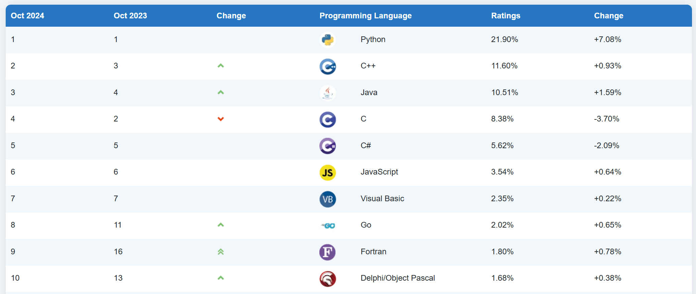

对于常见的编程语言，它们在国内的现状：

- python：全民语言！从开发、运维、网络、安全、测试、数据、分析、可视化、办公、AI...
- c/c++：底层系统开发、嵌入式开发的主流编程语言！
- Java：软件开发行业当之无愧的王牌语言，国内90%以上的程序员都是Java程序员！
- JavaScript：前端界面开发行业的核心语言，2022年之后前端工作由其他岗位兼任！
- Go/Rust：近些年出现的新兴语言，号称性能怪兽！

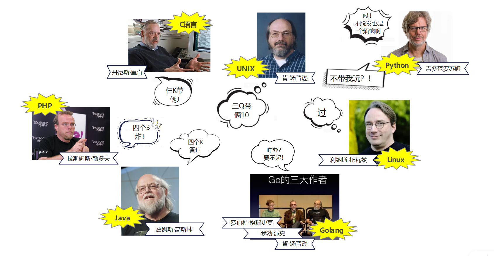

### 1.2、 构建开发环境

#### （1） 官方网站

python官方网站：`https://www.python.org`，菜单中关注两个 导航

- Downloads：下载，下载python解释工具的导航，解释执行代码的工具称为 **解释器**
- **Documentation**：文档，官方第一手学习资料

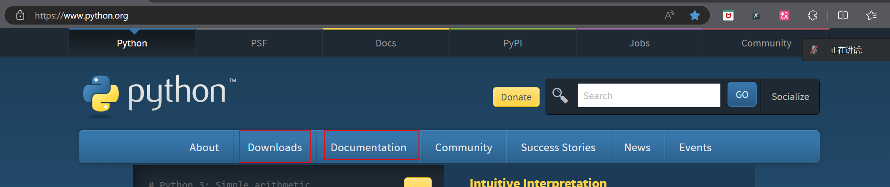

任何软件、工具、技术，官方的资料都是第一手学习资料，任何新的版本出现/新的技术突破，随时了解和学习官方文档是每个修仙人员的必修技能！

- **What's new in Python 3.13：新版本特性介绍**，最新的版本发布，最新的技术变动都包含在该文档中
- Tutorial：教程，官方的程序开发设计 教程
- **Library Reference：标准库参考**，python官方内置模块的说明文档，对应课程第二部分
- Language Reference：语法参考，python官方语法说明文档，对应课程第一部分

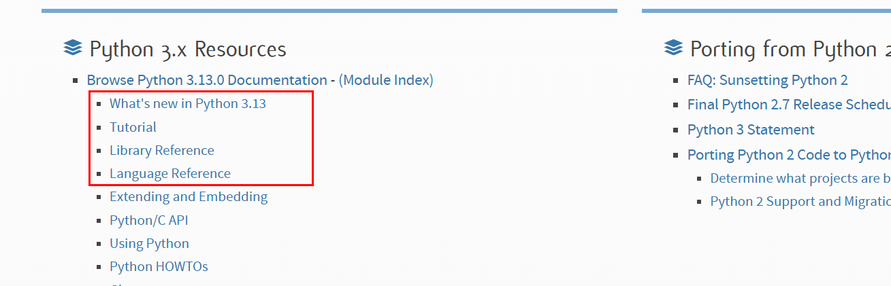

#### （2） 构建环境

python代码，是被一个称为 **解释器** 的工具，解释执行的！


##### 下载解释器

点击官方网站`Downloads下载-> All Release所有版本`

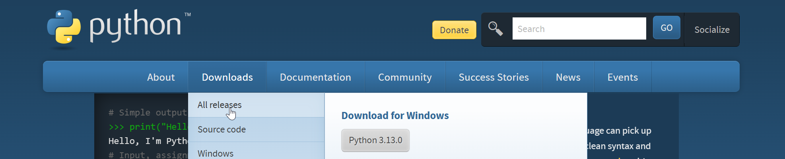

进入的下载页面中，选择合适的版本

- 3.8：市场遗留项目主要版本，并且很多通用项目依然选择使用3.8版本；官方结束支持不代表这个版本淘汰，市场上很多第三方模块依赖python3.8版本并且还没有及时更新到最新版本；
- **3.12：市场新项目开发推荐的版本，**目前各种应用中的工作比较正常，比较稳定！进行**系统学习**、**新项目研发**时可以优先选择该版本进行处理；
- 3.13：当前最新版本，适合新特性研究，新突破技术的学习；不适合系统学习和项目研发，一旦出现新的问题(可能是全网你第一次遇到)，大概率导致学习中断、项目流产！

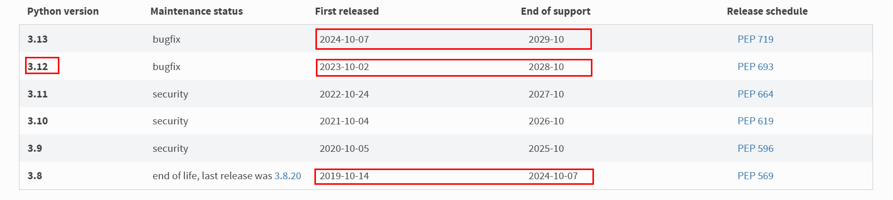

> :warning:注意：通常一个开发人员的计算机上，会同时存在多个版本的python解释器！为了开发不同版本依赖的项目

点击下载时，新进入的页面中，包含多个小版本的python文件，如何选择版本呢？

- 注意：python版本命名规则`a(主版本号).b(子版本号).c(小版本号)`，主版本号更新意味着整个python从底层进行了颠覆式的改造、或者新增、删除大模块功能；子版本号更新通常是大模块功能的升级、或者小模块增加、删除；小版本号更新通常是BUG修复
- 下载文件时，选择小版本号越新，表示该版本中的已知BUG越少

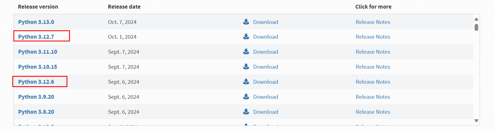

点击对应的版本号进行下载，发现多个文件，如何选择合适的安装文件(从上到下依次①②③④)？

- ① c/c++源代码文件：适合unix/linux中编译安装，或者学习官方底层开发技术
- ② macos安装文件：适合苹果电脑系统安装文件
- **③ windows离线安装包**：下载完整版的离线文件，本地直接点击安装即可
  - **windows installer(64bit):** 适合windows系统 64位操作系统 Intel芯片 安装包
  - windows installer(32bit): 适合windows系统 32位操作系统 Intel芯片 安装包
  - windows installer(ARM64): 适合windows系统 64位操作系统 ARM芯片(开发板常用芯片) 安装包
- ④ windows在线安装包：下载安装启动文件，本地点击执行时需要联网才能安装

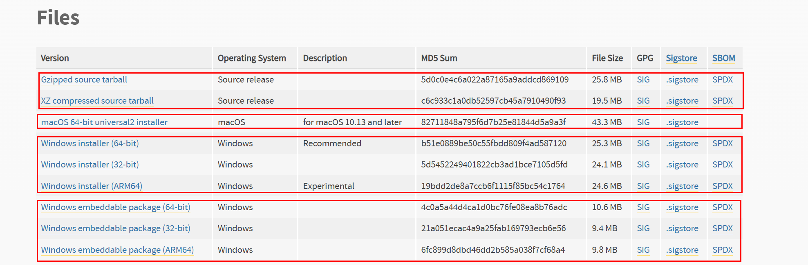

查看自己的电脑的信息：

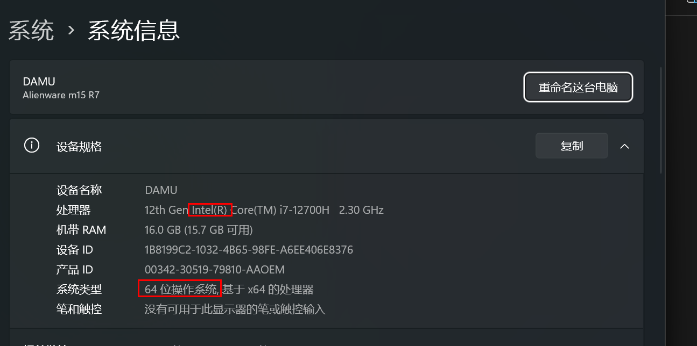

##### 安装解释器

安装解释器过程中，需要注意如下的几个安装步骤

注意一：开始安装时，勾选环境变量复选框，选择自定义安装

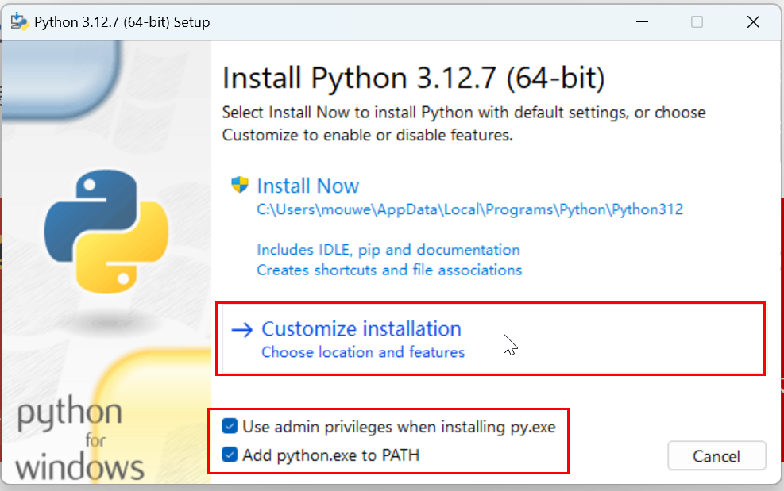

注意二：下面的步骤中，勾选`install for all users(给所有用户安装)`

- 注意：按照图中的复选框进行勾选；可能和你安装的步骤中的勾选情况不一致

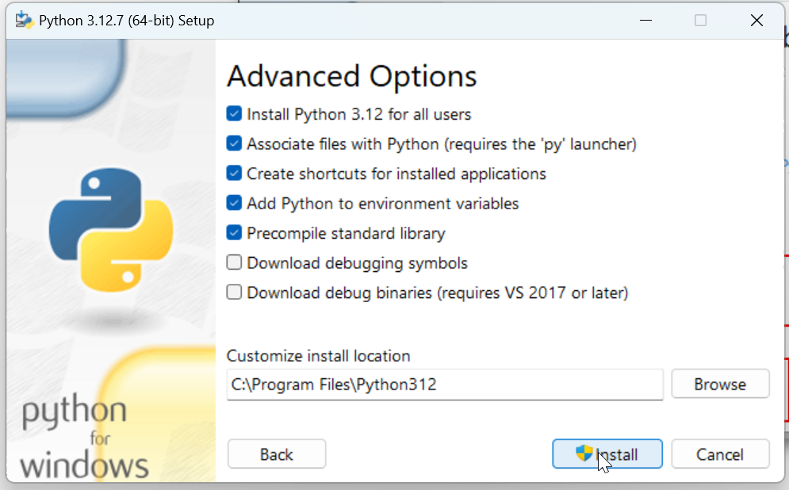


注意三：安装完成后，可能会提示环境变量长度限制；如果出现点击解除限制即可！

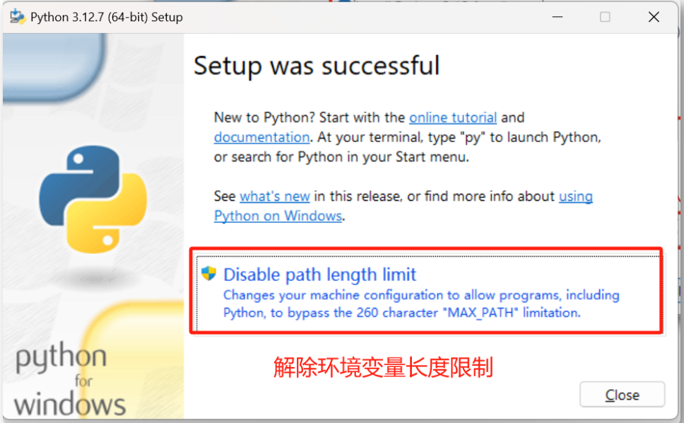

> :warning:注意：如果电脑上已经存在python
>
> ① 如果可以正常使用，直接使用即可！
>
> ② 如果已经损坏，无法正常卸载和安装；推荐下载和电脑上相同的版本python安装包，安装时选择`Repire修复`，修复完成后重新卸载安装即可

#### （3） 验证结果

打开系统命令提示符窗口，执行命令查看python版本信息

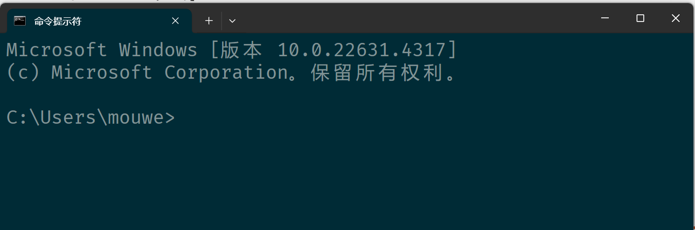

执行命令：`python --version`，查看python版本信息；如果命令执行结果可以正常显示版本信息，说明安装完成

- 注意：执行命令`python --version`，等价于`python -V`,注意命令之间的空格

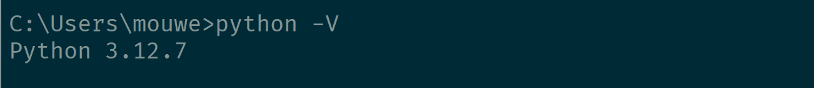


> :memo: 拓展：认识python终端，学会区分windows命令窗口和python终端
>
> ① windows命令窗口
>
> 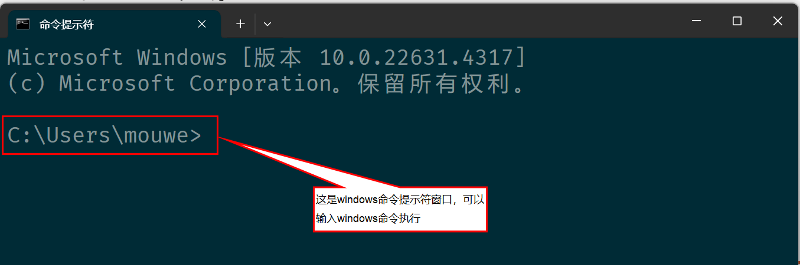
>
> ② python终端：windows命令窗口中输入python直接回车，进入的终端窗口
>
> - 注意：python终端中，输入命令`exit()`退出到windows命令窗口
>
> 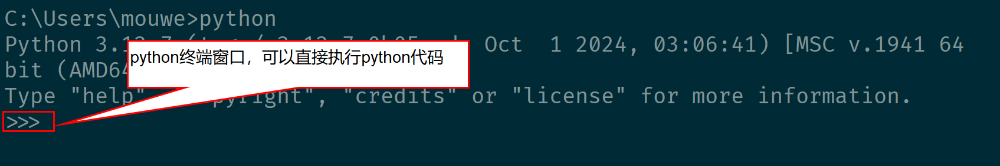


### 1.3、 第一个应用程序

#### （1） 文件整理

课程中，建议大家将所有的课程资料进行规范的统一整理，示例：

将本次课程的所有资料包含在：`D:/PythonProgramming/`目录中

- D:/PythonProgramming202410/`Note/`：存放随堂笔记
- D:/PythonProgramming202410/`Code/`：存放每节课的代码
- D:/PythonProgramming202410/`Video/`：存放每节课的视频
- D:/PythonProgramming202410/`Work/`：存放每节课的作业
- D:/PythonProgramming202410/`Res/`：存放每节课资源文件

- 注意：文件路径中尽量不要包含中文、空格


#### （2） 编写代码

① 创建文件

新建一个记事本文件：`新建文本文档.txt`

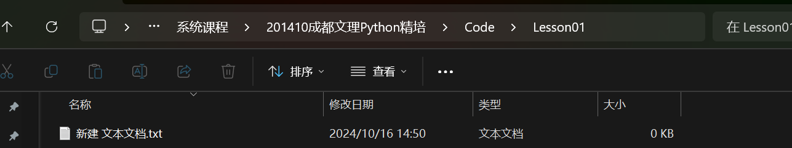

② 编写代码

使用记事本打开这个文本文件，编写如下的代码**并保存**

```python
# 控制台中输出一个提示信息
print("hello python!")
```


③ 重命名文件

保存好代码之后，关闭记事本软件；接下来重命名文件

`新建文本文档.txt` -> `demo01.py`

错误示例：忘记保存导致文件里面没有内容，后续执行的时候没有结果

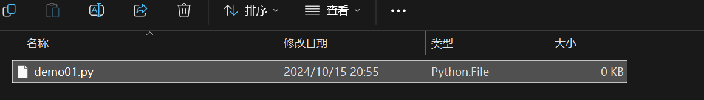

修改后缀名后的正确文件：大小1kb

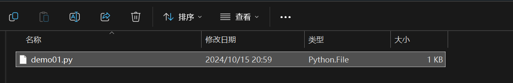

#### （3） 执行代码

在代码文件所在的文件夹中，上面的地址栏输入`cmd`，直接在命令行进入代码所在目录

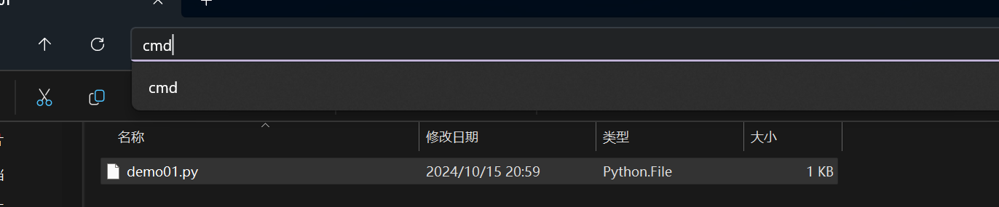

此时打开的命令窗口，观察路径已经在代码文件夹中

命令中输入：`python demo01.py`，让python解释器解释执行代码，得到输出结果

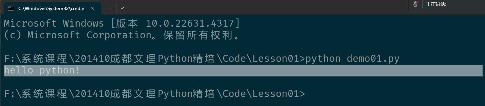

> :memo:  windows中如何在默认路径中切换到代码目录？
>
> ① 直接使用cd命令，切换不同磁盘目录失效
>
> - C:\Users\mouwe>cd F:\系统课程\201410成都文理Python精培\Code\Lesson01
>
> - C:\Users\mouwe>
>
> ② 可以借助`/d`选项，切换目录的同时切换到不同的磁盘
>
> - C:\Users\mouwe>cd /d F:\系统课程\201410成都文理Python精培\Code\Lesson01
>
> - F:\系统课程\201410成都文理Python精培\Code\Lesson01>

### 1.4、 认识开发工具

使用记事本编写代码，也发现了很多问题：

- 代码没有颜色提示，很容易误操作写错字符
- 代码没有智能提示，严重影响大家的发挥
- 代码没有错误提示，严重影响开发效率
- .....

企业开发过程中，一般很少使用记事本编写代码（临时修改配置、少量代码），Python开发中推荐两款工具

- VSCode：微软开发的一款通用编程工具，可以编写任何语法的代码
- Pycharm：jetbrains公司的专用开发工具，可以高效编写python相关代码

#### （1） VSCode

适合人群：高级开发人员、骨灰级开发人员

这是一款定制强度非常高的开发工具，操作过程中需要配合大量的插件和配置使用，对于新手程序员非常不友好！

- Code Insider：内测版本，绿色图标
- Code：稳定版本，蓝色图标（推荐）

官方网站：`https://code.visualstudio.com/`

- 注意：推荐安装，经常使用VSCode编写不同语法的代码，临时修改项目代码

#### （2） Pycharm

适合人群：电脑性能不差的所有人群！

这是一款jetbrains公司推出的专用开发工具，业内知名度非常高！

- Commuinity：社区免费版，可以开发纯python应用；现阶段学习没有任何障碍！
- Professional：专业收费版，可以开发以Python为核心的、主流的各种语法的项目应用！

官方网站：`https://www.jetbrains.com`

- Intellij IDEA：主流的JAVA开发工具
- Phpstrom：主流的PHP开发工具
- **PyCharm：主流的Python开发工具**
- Rider：主流的R语言处理工具
- RubyMine：主流的Ruby开发工具
- WebStorm：主流的前端开发工具之一
- Golang：主流的Go语言开发工具
- Fleet：对标VSCode通用开发工具
- DataSpell:主流的数据分析工具
- DataGrip：主流的数据库操作工具
- ....

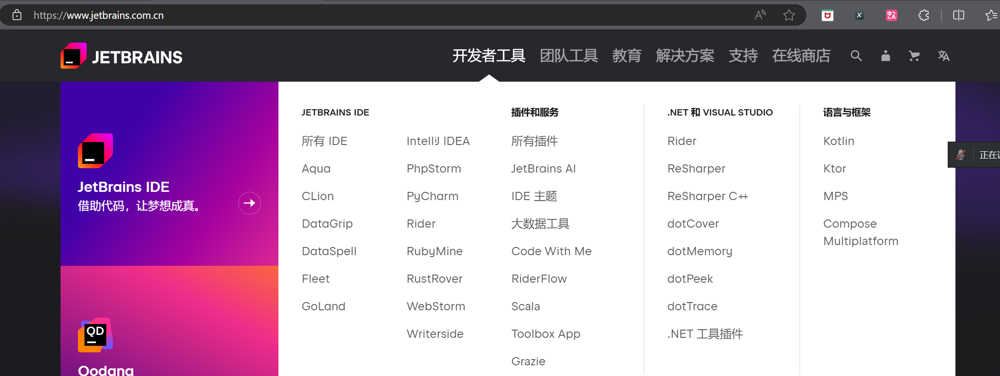

Pycharm工具包含两个不同的版本：

| 版本                 | 说明                                                |
| -------------------- | --------------------------------------------------- |
| Pycharm Professional | 专业收费版本，适合开发数据、Web等高级应用的开发工具 |
| Pycharm Community    | 社区免费版本，适合开发纯Python应用的高级工具        |


### 1.5、 注释

任何编程语言中，都有一种给自然人查看的信息，用于说明代码的作用：**注释**

- 使用自然语言，描述信息
- 代码执行过程中不会执行
- 注意：只要是个人，就要有注释！**注释很重要，后续编写代码的时候，一定要记得写注释！**


#### （1） 单行注释

语法

```python
# 符号开头，当前行就是一行注释内容，主要用于说明一行或者多行代码的作用
```


#### （2） 多行注释

语法1

```python
###############################################################
# 使用多个单行注释组成一个多行注释
# 通常用于描述(很)多行代码的作用
###############################################################
```

语法2：

```python
'''
编写多行注释内容
使用三对单引号包含注释文本
'''
```


#### （3） 文档注释

语法：

```python
"""
编写可以在最终项目文档中出现的说明文字
使用三对双引号包含注释文本；通常文档注释出现在 python 文件的开头位置(第一行)
作者： 大牧老师
时间： 2024-10
备注： ......
联系人：xxxxxx
"""
```

### 1.6、项目任务

附件：Trains-01练习.md

