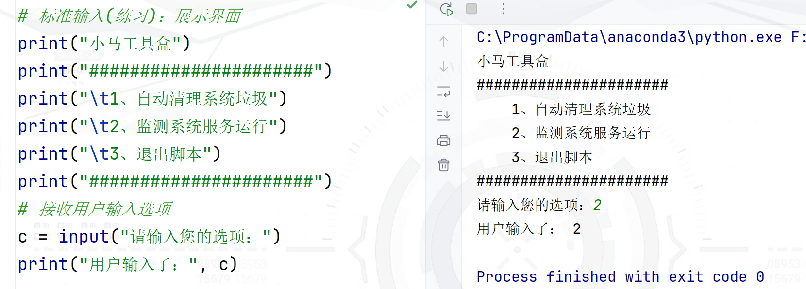
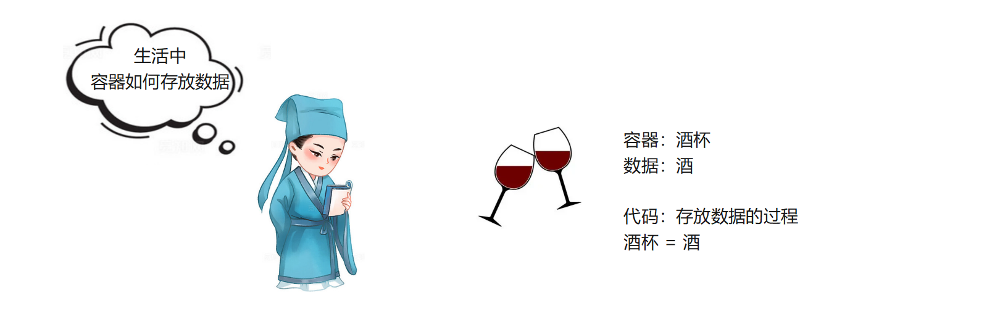
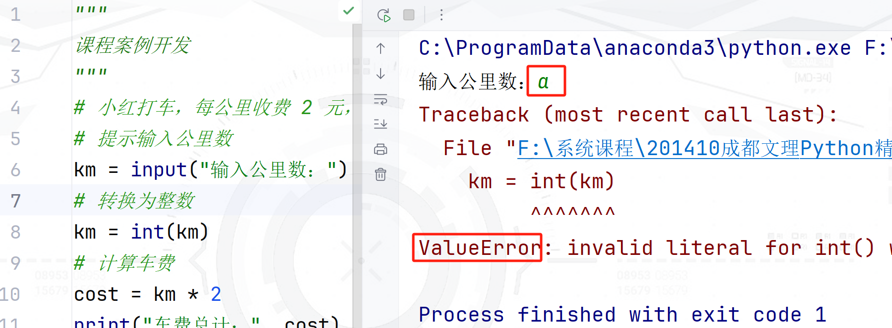
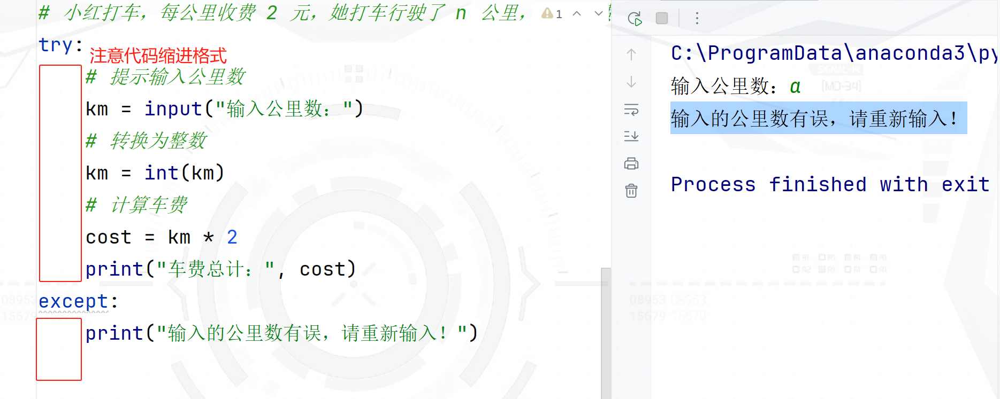
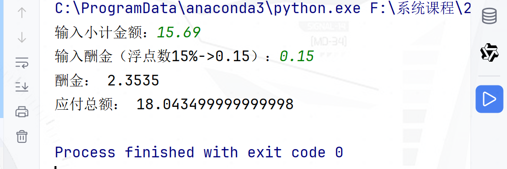
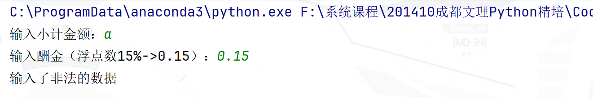

## 第二章：基础语法

> :telescope: 学习目标
>
> 1、掌握基础标准输入、标准输出语法
>
> 2、掌握编程的基础操作语法：变量、数据类型、运算符
>
> 3、熟练分析需求、梳理问题，并编写符合数据处理的代码

### 2.1、 标准输出、标准输入

标准输出：控制台中输出信息，语法

```python
print("输出一段数据，输出数据后自动换行")
print("输出第一段数据(同一行)", "输出第二段数据(同一行)", "输出第三段数据(同一行)")
print("输出一段数据后不换行", end="")
```

**示例**

```python
# 标准输出
print("1")
print("2")
print("3")
print("01", "02", "03")
print("001", end=",")
print("002", end=",")
print("003")
"""
1
2
3
01 02 03
001,002,003
"""
```


标准输入：代码和开发人员交互，开发人员通过键盘输入数据(输入的数据可以保存在变量中)

```
变量 = input("提示信息：")
```

**示例**



### 2.2、 变量

观察下面的代码，说明存在的问题？

- 场景：要使用linux系统的主机名称
- 问题：每次使用这个名称的时候，都需要手工编写很长的主机名称字符


#### （1） 什么是变量

变量：英文描述Variable，表示程序中临时存储数据的容器！


#### （2） 变量赋值

变量赋值：向变量中存放数据

- 生活中：容器中 **装** 物品
- 代码中：变量中 **=** 数据



**示例**

```python
# 使用变量存放班级信息
x = "云计算精培班"
y = 92
z = "python ai课程阶段"
print("班级名称：", x)
print("班级人数；", y)
print("当前阶段；", z)

```

> :memo:注意：关于变量的使用，思考下面的代码输出结果
>
> x = 12
> print("x")     # ① x两侧有引号，这是一个字符信息，直接输出 x字符
> print(x)       # ② x两侧没有引号，这是一个 变量语法，输出变量x中存储的数据：12

#### （3） 命名规范

命名规范的出现，是为了能更高效率的操作代码（编写代码、修改代码）

① 变量名称由字母、数字、下划线组成，其中数字不能开头

② 变量名称由一个或者多个小写英文单词组成，不同的单词之间使用下划线分隔

③ 见名知意

**示例**：思考下面代码中两个变量的含义

- 优先选择英文单词：自己能写最好(哪怕写错了或者含义有歧义....没关系)
- 其次选择使用翻译软件：编写英文单词组成的变量
- 第三-如果实在不想使用英文单词，可以使用拼音替代

```python
# 变量名称的作用
m = 92  
student_count = 92
```

> :question: 思考：变量名称为什么数字不能开头？
>
> 

#### （4） 特殊赋值操作

python中为了让变量操作更加简洁和方便，提供了一些特殊的赋值操作方式

**基本赋值**

```python
name = "大牧"
```

**连续赋值**

```python
x = y = 1    # x = 1; y = 1;
```

**铲式赋值**

```python
name, age = "大牧", 18
# name = "大牧"
# age = 18
```

#### （5） 标识符和关键字

很多编程语言中，将表示一些功能的英文单词称为标识符，如**print** 表示一个输出功能的单词！**name**也是一个标识符-是开发人员编写的变量，所以标识符中一般包含两部分：

- 关键字：编程语言中，内置的一些特殊单词，如**if**、**class**
- 变量：编程语言中，开发人员自定义的单词，如**username**、**student**、**admin**


### 2.3、 数据类型

生活中会用到很多的数据，当我们在超市可以通过 商品展示的名称 表达一个商品数据；通过商品的价格 可以完成商品的交易过程！

- 商品名称：可以用来表示一个商品，一般只是一个信息的传递
- 商品价格：可以用于进行数据交易，这种数据可以用于数学运算
- 问题：变量中存储的数据到底是用于传递的、还是用于运算的？出现了数据类型！


#### （1） 什么是数据类型

数据类型：英文单词datatype，在编程语言中主要用于描述不同类型的数据，表达数据的作用（传递信息、运算）


#### （2） python中的数据类型

python中数据类型，主要包含了两部分：

- **基本类型**：基础语法中的核心内容，主要描述组成事物的基础数据，如人姓名、年龄、体重...
- 复杂类型：通常表示包含大量数据特征的事物，如管理员、商品、垃圾文件...


#### （3） 基本类型

python语法中，将基本类型进行了规范，主要包含这几种：

- string，字符串，信息传递
- int，整数，整数数据运算
- float，浮点数，小数数据运算
- NoneType, 空类型，表示空数据
- bool：布尔类型，表示生活中一些非1即2的数据，取值**True(真)/False(假)**两个值

**示例**：如何使用基本类型的数据，存储到变量中进行使用

```python
"""
数据类型的说明
"""
# 表示一个学员信息
# 姓名(字符串)
name = "汤姆"
# 年龄(整数)
age = 18
# 体重(浮点数)
weight = 75.5

print("姓名：", name)
print("年龄：", age)
print("体重：", weight)

# 第二年国庆7天乐：有些数据会发生变化
print("姓名(信息传递，不会变):", name)
age = age + 1
print("年龄：", age)
weight = weight + 5.2
print("体重：", weight)

```

> :memo: 数据类型的作用
>
> 通过上述代码，认识到数据类型在代码中，就是为了变量中存储的数据，定义数据的作用！


#### （4） 类型转换

有了数据类型的支持，我们可以让变量中的数据进行数据传递或者数据运算

问题：我怎么知道这个变量中存储的是什么类型的数据？如果需要运算但是类型不一致怎么办？

##### 查看类型

python中提供了一个功能单词：type() 可以直接查看变量中的数据的类型

**示例**

```python
# 表示一个学员信息
# 姓名(字符串)
name = "汤姆"
# 性别
gender = True  # True表示男，False表示女
# 年龄(整数)
age = 18
# 体重(浮点数)
weight = 75.5
# 地址
address = None

print("姓名：", name, type(name))   # str
print("性别：", gender, type(gender))  # bool
print("年龄：", age, type(age))        # int
print("体重：", weight, type(weight))  # float
print("地址：", address, type(address)) # NoneType
```


##### 类型转换

需求：录入小明的成绩，因为小明取得了国家整数(奖励8分)，实现这个需求

- 注意1：所有从键盘输入的数据，都是字符串数据
- 注意2：字符串数据不能执行数学加法运算，相加只会拼接到一起
- 注意3：python中，不同类型的数据不能执行数学运算
- **注意4：如果从键盘输入的数据需要执行数学运算，需要进行类型的转换**

```python
# 提示输入成绩信息
score = input("请输入小明成绩：")
print("小明的基础成绩：", score, type(score))

# 将成绩 字符串转换为整数
score = int(score)

# 小明取得证书，奖励8分
score = score + 8
print("小明的最终成绩：", score)
```

> :question: 思考：都有哪些数据的转换方式？我怎么记住它们？
>
> 不同类型的编程语言，初级部分涉及到的数据类型转换都是基本类型转换；python中将一个数据从一个类型转换到另一个类型，可以直接使用类型描述名称，如: int()、float()、str()、bool()...

### 2.4、 运算符

已经学习的语法中，变量可以用于存储数据、数据类型可以用于规范变量中数据的作用

- 如果要解决问题：就需要让数据实现运算过程！


赋值运算符

| 符号 | 描述                             |
| ---- | -------------------------------- |
| =    | 将等号右侧的数据保存到左侧变量中 |

算数运算符

| 符号 | 描述             |
| ---- | ---------------- |
| +    | 加法             |
| -    | 减法             |
| *    | 乘法             |
| /    | 除法             |
| //   | 整除             |
| %    | 取余             |
| **   | 幂方，如2**3 = 8 |

比较运算符

| 符号 | 描述             |
| ---- | ---------------- |
| >    | 判断是否大于     |
| >=   | 判断是否大于等于 |
| <    | 判断是否小于     |
| <=   | 判断是否小于等于 |
| !=   | 判断是否不相等   |
| ==   | 判断是否相等     |

逻辑运算符

| 符号 | 描述                     |
| ---- | ------------------------ |
| and  | 并且关系，其他语言中`&&` |
| or   | 或者关系，其他语言中`||` |
| not  | 取反、其他语言中`!`      |

混合运算符

| 符号 | 描述                    |
| ---- | ----------------------- |
| +=   | a += 2 等价于 a = a + 2 |
| -=   |                         |
| *=   |                         |
| /=   |                         |
| ...  | ...                     |

> :warning: 注意：python中不支持自增/自减运算符：`++`、`--`

### 2.5、 异常处理

#### （1） 课堂实战案例

小红打车，每公里收费 2 元，她打车行驶了 n 公里，计算车费

**输入描述**

输入一个公里数

**输出描述**

输出应付车费

**示例**

> 输入：
>
> 5
>
> 输出：
>
> 10

代码实现

```python
"""
课程案例开发
"""
# 小红打车，每公里收费 2 元，她打车行驶了 n 公里，计算车费
# 提示输入公里数
km = input("输入公里数：")
# 转换为整数
km = int(km)
# 计算车费
cost = km * 2
print("车费总计：", cost)

```

问题：因为用户操作不当，输入的非法数据导致程序崩溃退出，这是软件/脚本中的灾难性问题！

解决方案：**容错**开发、**容灾**演练



#### （2） 异常-容错

代码开发完成后，用户在使用过程中会出现各种奇怪的操作！是每个开发人员都需要考虑在内并且在代码中进行容错，容错代码是软件开发、脚本开发中必须保障的一个环节！


python中提供了一种容错语法：

```python
try: # try后面是一个冒号，下一行代码保持4个空格缩进（强制）
    # 包含可能出现错误的代码()
except: # except后面也是一个冒号，下一行代码保持4个空格缩进（强制）
    # 出现错误后的友情提示
final:  # 不论是否出现错误，都肯定会执行的代码[可选]
    # 一定执行的后续代码
```

代码示例

```python
# 容错开发：添加异常处理代码
# 小红打车，每公里收费 2 元，她打车行驶了 n 公里，计算车费
try:
    # 提示输入公里数
    km = input("输入公里数：")
    # 转换为整数
    km = int(km)
    # 计算车费
    cost = km * 2
    print("车费总计：", cost)
except:
    print("输入的公里数有误，请重新输入！")

```



#### （3） 容错案例实战

以校招为例，答题(编程)过程中，按照如下的逻辑进行处理：

- 读题：读懂题目中的要求，明确输入的数据、格式；以及输出的数据、格式
- 代码实现：编写代码实现题目中要求的功能
- 示例测试：使用题目中提供的示例数据，在已经运行的代码中进行测试是否通过
- 提交代码：示例测试通过的代码，提交到笔试题，进行在线测试(通过率)
- 代码优化：通过率较低的代码，一定是代码中处理的数据的边界出现了问题(数据没有验证)

##### 读题

读取小计和酬金率，然后计算小费以及合计金额。例如客户的小计为10元，酬金率为15%，那么小费是1.5元，合计金额为11.5元

**输入描述**

分别输入小计金额、酬金率

**输出描述**

输出两行，第一行为小费，第二行为合计金额，结果保留两位小数

**示例**

> 输入：
>
> 15.69 15
>
> 输出：
>
> 2.35
>
> 18.04

##### 编码

编写代码实现题目中的逻辑

- 注意：笔试题中添加适当的注释(占有一定的格式分数)

```python
# 输入小计金额、酬金率
sub_total = input("输入小计金额：")
emoluments = input("输入酬金（浮点数15%->0.15）：")

# 数据转换
sub_total = float(sub_total)
emoluments = float(emoluments)

# 计算小费
tip = sub_total * emoluments
# 计算总额
total = sub_total + tip

# 展示结果
print("酬金：", tip)
print("应付总额：", total)
```

##### 示例测试

使用示例中的代码进行测试




##### 完善代码

通过率依然不足，检查代码中对数据的验证是否合理（如-数字是否进行了正负数验证、非数字验证..；程序代码是否进行了容错异常处理）

```python
# 输入小计金额、酬金率
sub_total = input("输入小计金额：")
emoluments = input("输入酬金（浮点数15%->0.15）：")

try:
    # 数据转换
    sub_total = float(sub_total)
    emoluments = float(emoluments)

    # 计算小费
    tip = sub_total * emoluments
    # 计算总额
    total = sub_total + tip

    # 展示结果
    print("酬金：", tip)
    print("应付总额：", total)

except:
    print("输入了非法的数据")
```

进行非法数据测试：程序不会崩溃退出



#### （4） 拓展：异常处理高级语法

异常处理基本语法

```python
try:
    # 包含可能出错的代码
except:
    # 打印友好的错误提醒，保障代码正常运行
```

finally关键字

else关键字

```python
# 容错
try:
    print("卖出1张票")
    # print("卖出1张票" + 2)
    print("卖出1张票")
    print("卖出1张票")
except:
    # 出现异常执行的代码
    print("错误售票")
    print("提前下班")
else:
    # 没有异常执行的代码
    print("正常下班")
finally:
    # 最终都会执行的代码
    print("回家陪媳妇")
```

### 2.6、项目任务

附件：Trains-02练习.md

