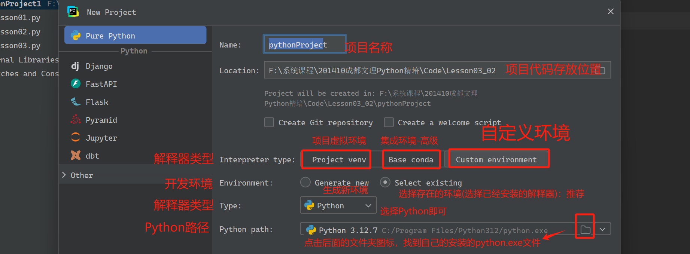

## 第三章：程序语法

程序结构：很多资料中也称为程序控制结构、结构语句、控制语句...

- 程序结构：描述了代码的执行顺序

任何编程语言中，程序结构都区分为三种类型

- 顺序结构：代码从上到下逐行执行，不会跨过任何一行代码
- 选择结构：代码执行过程中出现了条件，根据条件不同可以选择执行一部分代码并且放弃另一部分代码
- 循环结构：代码执行过程中根据某些条件，决定是否重复执行某一段代码

注意：后续进行脚本开发时，选择结构和循环结构是编写代码时使用最频繁的语法，没有之一！

### 3.1、基础语法 - 顺序结构

使用Pycharm构建一个项目：注意运行环境的选择




代码开发：

- 注意：创建的任何新项目，首先执行一次hello world!保障项目代码正常运行！然后再编写其他代码！

```python
# 顺序结构：从上到下逐行执行代码，不会跨过任何一行代码
# 分割四位数，获取每个数字
num = 1234
n1 = num // 1000   # 获取千位数
n2 = num % 1000 // 100 # 获取百位数
n3 = num % 100 // 10   # 获取十位数
n4 = num % 10          # 获取个位数

print(n4, n3, n2, n1)
```

### 3.2、基础语法 - 选择结构

选择结构：根据给定的条件，执行一部分功能的同时，放弃另一部分功能；


Python语法中，设计之初就追求语法的简洁：所以目前的版本中只提供了一种选择结构语法

```python
if 条件表达式:   # 冒号后面的代码，统一的缩进(强制语法)
    # 条件表达式为True执行的代码
else:
    # 条件表达式为False执行的代码
```

**示例**

```python
# 1、 基础语法
gift = input("李家老头给了一亿的彩礼(Y/N)")

if gift == 'Y':
    print("接收彩礼，从此就是李姑娘的人了")
else:
    print("安能摧眉折腰事权贵，和王姑娘双宿双飞..")
```

#### （1） 选择结构其他语法

① 单分支语法

```python
if 条件表达式:
    # 条件为True时执行的代码
```

**示例**

```python
# 2、单分支结构
# 模拟存疑账号；实际情况中往往登录失败两次时标记为存疑账号
is_danger = input("是否存疑账号(Y/N):")

# 登录输入账号
username = input("请输入账号：")
password = input("请输入密码：")
if is_danger == 'Y':
    code = input("请输入验证码：")

print("用户登录")
```

② 双分支结构-标准

```python
if 条件表达式:
    # 条件为True执行的代码
    
else:
    # 条件为False执行的代码
```

③ 多分支结构

```python
if 条件表达式1:
    # 条件1为True执行的代码

elif 条件表达式2:
    # 条件2为True 执行的代码
    
elif 条件表达式3:
    # 条件3为True执行的代码
    ...
else:
    # 条件为False执行的代码
```


综合案例：多分支结构，结合用户成绩进行成绩判定

```python
# 3、脚本-根据学生实际成绩进行标注
# 豆包(抖音)、通义千问
score = float(input("请输入实习成绩:"))

if 90 <= score <= 100:
    print("优秀")
elif 80 <= score < 90:
    print("良好")
elif 70 <= score < 80:
    print("中等")
elif 60 <= score < 70:
    print("及格")
elif 0 <= score < 60:
    print("不及格")
else:
    print("输入有误")
```


#### （2） 选择结构特殊语法

编程语言中，双分支结构是最常见的一种结构被广泛的使用；大部分的编程语言中针对双分支结构都提供了一种优化语法：三元运算符

```java
// 判断账号是否被禁用 status -> 0禁用 1启用
if (stats == 1) 
{
    printf("启用")
}
else
{
    printf("禁用")
}
// 优化语法
string res = status == 0 ? "禁用" : "启用"    // condition ? exp1 : exp2 语法
```

python中针对三元运算符进行了优化

```python
res = '禁用' if status == 0 else '启用'
```

课件练习：

- 重新实现上面的成绩分类（模仿原始代码）
- 扩展：分类之后-使用三元运算符打印展示  通过|不通过 结果信息

### 3.3、基础语法 - 循环结构

编程语言中，根据某些条件是否满足，重复执行多行代码！提高代码的复用性！

#### （1） 基础语法

Python中为了提高语法的简洁性，循环中提供了两种的循环语法分别适用于不同的场景

##### while循环

语法

```python
while 条件表达式:
    条件为True重复执行的多行代码
```

**示例**

```python
# 1、while循环，适合条件判断
# 打印小于10的自然数
idx = 1
while idx < 10:
    print("自然数：", idx)
    idx += 1
```


##### for循环

语法

```python
for 临时变量 in 序列数据:
    从序列数据中依次取出每个数据
```

**示例**

```python
# 2、for循环，适合操作序列数据
# 查询人员名单
lst = ["詹姆斯", "丹尼斯", "利纳斯", "吉多"]
for name in lst:
    print("姓名：", name)
```


##### 总结

python中提供了两种循环语法，分别适合不同的场景（不要尝试去用一种循环去替代另一种循环实现的功能-没有任何实际操作意义）

#### （2） 循环控制

循环：重复的执行多行代码的过程，直到条件为False的情况下循环会自然退出！

但是实际执行场景中往往不会自然退出，很多时候发生一些情况需要提前退出，需要对循环进行控制！

- 提前退出循环
- 中断某些循环过程

Python中针对循环的控制，提供了几个特殊的单词/关键字：

- break：跳出循环，直接结束循环
- continue：中断本次循环过程，直接开始下一次循环
- else：循环条件为False的时候执行一次的代码

##### 自然结束

```python
print("去操场跑步")
i = 1
while i <= 20:
    print("当前圈：", i)
    i+=1
print("结束跑步，回宿舍和未来媳妇聊天")
```

##### 跳出循环-break

```python
print("去操场跑步")
i = 1
while i <= 20:
    print("当前圈：", i)
    if i == 10:
        print("天降暴雨，结束跑步")
        break # 跳出循环(不论条件是否为True)
    i+=1
print("结束跑步，回宿舍和未来媳妇聊天")
```

##### 中断本次循环-continue

```python
# 3、continue 跳过当前循环
print("去操场跑步")
i = 0
while i <= 20:
    i += 1
    if i == 10:
        print("看到未来媳妇，聊天带着一起跑步")
        continue
    print("当前圈：", i)

print("结束跑步，回宿舍和未来媳妇聊天")
```

##### 条件为False执行的代码

```python
# 4. else关键字-条件为False执行的代码
print("去操场跑步")
i = 1
while i <= 20:
    print("当前圈：", i)
    if i == 8:
        print("天降暴雨，避雨-回宿舍")
        break
    i+=1
else:
    print("自然结束，回宿舍")

```

#### （3） 基础案例

##### 读题

**题目描述**

小红打车，起步价8元(3公里), 每公里收费 2 元，她打车行驶了 n 公里，计算车费

**输入描述**

输入一个公里数

**输出描述**

输出应付车费

**示例**

> 输入：
>
> 5
>
> 输出：
>
> 12

##### 编码实现

学习完核心的操作语法之后（变量、数据类型、运算符、程序解构），开发的脚本代码功能性开始复杂化

- 注意：**不要担心**对复杂的代码逻辑考虑不全面
- 实现：首先实现基本功能、考虑数字边界、考虑非数字情况、最后考虑重复输入；所有复杂的功能都是从简单功能一步一步迭代出来！
  - 所有复杂的脚本代码，都是从基础的功能开始实现的

```python
"""
小红打车
起步价8元(3公里内)
超出 2元/公里
"""
while True:
    try:
        # 输入公里数
        km = input("请输入公里数:")
        km = int(km)
        if km > 0:
            # 总价格
            total = 0
            # 计算起步价
            if km <= 3:
                total = 8
            else:
                total = 8 + (km - 3) * 2
            # 打印结果
            print("车费总计：￥", total, "元")
            # 打印小票，放过你
            break
        else:
            print("输入的数据有误,请重新输入")
    except:
        print("输入了非法公里数,请重新输入")
```

