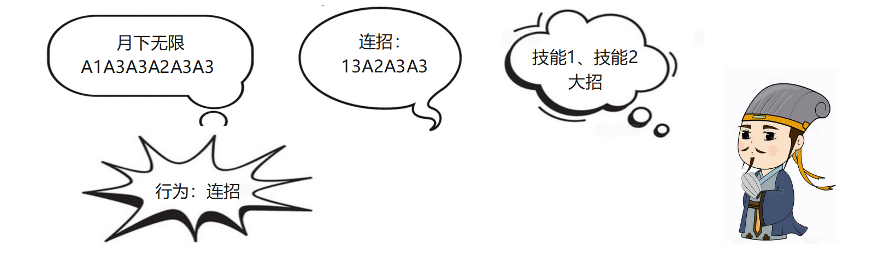
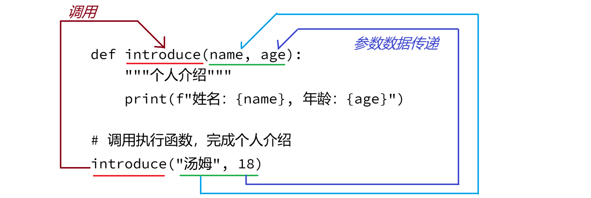

## 第四章：函数式开发

> :telescope: 学习目标
>
> 1、 认识什么是函数，了解为什么要使用函数！
>
> 2、 掌握函数的基本声明语法（关键字、函数名称、函数注释、函数代码、返回值）
>
> 3、 掌握函数的调用执行语法
>
> 4、 掌握函数参数的不同使用方式
>
> 5、 掌握函数返回值的不同操作方式
>
> 6、 常见系统内置函数
>
> 7、 全局变量和局部变量
>
> 8、 案例和作业讲解

### 4.1、认识函数

#### （1） 什么是函数

##### 关于函数

函数，英文单词Function，描述了生活中的一种行为!

> :memo: 回顾关于编程/程序开发
>
> 程序开发，就是通过编写代码的方式还原生活场景，解决生活中遇到的问题！

##### 行为场景

吃早餐的行为：

- 每天早上的早餐都是重复的行为，不需要每次都去重复


玩游戏的快捷操作：

- 了解英雄的3~4个不同的技能(分散)，尝试找到一些出招的规律，将这种规律封装成一个 连招；每次使用技能的时候直接使用 连招 即可！



上述场景中，将重复的一些行为，进行了语言或者操作上的封装，如将早餐吃的所有的东西-> 老样子；将英雄攻击的技能封装成了一个快捷键；这种封装在代码中体现为**函数**！

##### 函数的操作

就吃早餐的行为，通过代码实现的流程如下：

① 直接使用顺序结构实现吃早餐

- 优点：直接编写代码实现
- 缺点：如果需要多次执行，出现大量的重复代码

```python
# 吃早餐行为
print("早上7:30")
print("老板娘")
print("豆浆、油条、小咸菜")

print("执行其他任务")

# 第二天继续吃早餐
print("早上7:30")
print("老板娘")
print("豆浆、油条、小咸菜")
```

② 直接使用循环结构实现

- 优点：减少代码的重复
- 缺点：循环中功能多次执行期间，无法执行其他任务

```python
# 循环-消除重复代码
while True:
    print("早上7:30")
    print("老板娘")
    print("豆浆、油条、小咸菜")
    input("按任意键继续")
```

③ 使用函数实现行为

- 优点：函数封装行为，可以随时通过函数名称执行行为代码；极大程度减少代码重复量；不影响其他任务执行
- 缺点：技术提升【学习函数的语法、学习什么时候该使用函数】

```python
# 函数-减少重复代码，不影响其他任务
def eat_breakfast():
    """吃早餐的行为:声明"""
    print("早上7:30")
    print("老板娘")
    print("豆浆、油条、小咸菜")

# 调用行为-执行行为过程
eat_breakfast()

# 执行其他任务
print("执行其他任务")

# 第二天
eat_breakfast()
```


#### （2） 为什么使用函数

函数，Function，是所有编程语言中一个非常重要的基础语法；实际操作的过程中，函数式开发提升了项目中代码的**效率**

通过上述1.1中的代码，可以从如下两个方面理解为什么要使用函数

##### 统一管理的代码

将项目中功能相同、相似的代码通过函数可以统一进行管理；不会出现不同功能的代码互相交叉导致代码无法阅读的情况

```python
# 编写代码的时候，不同功能代码互相干扰，影响阅读性
a = 12
print("\t网络渗透脚本")
print("1、探测当前网络")
b = 23
print("2、查询网络配置信息")
print("3、查看网络终端联通")
r = 0
r = a + b
print("结果：",r )
c = input("请输入选项：")
```

函数整理代码

```python
def menu():
    """菜单"""
    print("\t网络渗透脚本")
    print("1、探测当前网络")
    print("2、查询网络配置信息")
    print("3、查看网络终端联通")
    c = input("请输入选项：")
    
def add():
    """加法运算"""
    a = 12
    b = 23
    r = 0
    r = a + b
    print("结果：", r)
```


##### 代码的复用性

结合前面讲解的吃早餐的行为过程，需要使用功能代码的时候，可以直接通过函数名称调用执行（通过一个名称[一行代码]可以替代执行多行代码）

- 核心：提高当前需要重复执行的代码的复用性
- 注意：同时不能影响其他功能的代码

```python
# 函数-减少重复代码，不影响其他任务
def eat_breakfast():
    """吃早餐的行为:声明"""
    print("早上7:30")
    print("老板娘")
    print("豆浆、油条、小咸菜")

# 调用行为-执行行为过程
eat_breakfast()

# 执行其他任务
print("执行其他任务")

# 第二天
eat_breakfast()
```


### 4.2、 函数声明语法

函数, Function，描述了生活中的一种行为！

- 注意：代码中声明函数，并不会立即执行函数内部的代码
- 类似：生活中 张三具备唱歌的行为，但是张三不是24小时随时都在吼叫...

#### （1） 基础语法

函数声明语法


结合上述基本语法，需要详细了解函数声明语法中的每个部分规则

##### def

def：**De**fine **F**unction缩写，是声明函数的关键字，固定语法


##### 函数名称

函数名称，是开发人员自定义名称，命名规则参考变量命名规则

- 字母、数字、下划线组成，数字不能开头
- 下划线命名法：一个或者多个小写英文单词组成，不同单词之间使用下划线分隔
- 见名知意

##### 参数序列

函数描述的是生活中的某个行为，生活中的行为执行可能需要资源（如去超市**买水行为-需要钱**），这个行为执行的时候形式上需要一个资源数据，将这个资源数据称为形式数据，也称为形式参数，简称形参

代码中声明函数，函数内部代码执行可能需要数据，将这种数据通过变量定义在声明的括号中，将这种变量称为形式参数，简称形参

##### 函数注释说明

Python标准语法规范中，要求函数内部的第一行 编写三重双引号包含的注释说明，最终会体现在项目说明文档中（非常重要）；企业项目开发/脚本开发中，**强制要求函数内部第一行编写三种双引号包含的注释说明！**

##### 函数体

函数内部包含的多行代码，编写思路和编写风格，参考**基础语法**

##### 返回值

函数，表示了生活中的一种行为，行为执行结束可能需要汇报结果（点名的行为-> 点名结束之后需要**提供迟到人员名单**）代码中函数/行为的执行结果，通过返回值体现

函数中的返回值，就是函数内部代码的执行结果；通过return关键字返回

#### （2） 函数声明

根据函数表示的行为，模拟生活中的一些具有代表性的行为，将这些行为声明为函数

##### 无资源/参数、无汇报/返回值

需求：天冷了，老张关一下门

分析：关门-行为；不需要提供资源数据；不需要汇报结果

```python
def close_door():
    """关门"""
    print("已经关好大门...")
```

##### 需要资源/参数，无汇报/返回值

需求：吃午饭/堂食

分析：吃饭-行为；付款-需要的资源参数；吃完之后撤...不需要给自己汇报结果-我吃撑了..

```python
def eat_lunch(money):
    """吃午饭"""
    if 10 < money <= 20:
        print("砂锅米线")
    elif 20 < money <= 50:
        print("小火锅")
    elif 50 < money <= 100:
        print("大烧烤、大扎啤")
    else:
        print("随缘")

```

##### 无资源/参数，有汇报/返回值

需求：点名的行为

分析：点名-行为；不需要提供资源/参数；需要结果/哪些学员迟到

```python
def call_the_roll():
    """点名的行为"""
    print("点名的过程")
    # 行为/函数执行的结果，通过return关键字返回
    return "全员到齐"
```


##### 有资源/参数，有汇报/结果

需求：代取快递

分析：取快递-行为；需要提供 快递单号；结果-快递

```python
def get_packet(package_no):
    """取快递"""
    print("去小区门口取快递")
    return "收到快递"
```


##### 特殊声明语法：类型描述(了解)

Python语法中为了提升函数声明的可读性，提供了一种类型描述的声明语法，观察下面的代码：

- (a: int, **b: int**)：形式参数的类型描述，表示参数b需要是int整数类型
- (a: int, b: int) **-> int**：返回值的类型描述，表示这个函数执行完成后会返回一个整数数据

```python
def add(a: int, b: int) -> int:
    """加法运算函数"""
    r = a + b
    return r
```

注意：这种类型描述，并不是强制语法，而是提示语法-是为了让开发人员能更好的规避一些问题

```python
result = add(11, 22)  # 完全正确
print(result)  # 33

result = add("a", "b")   # 警告：应为“int”类型，却得到了“str”；但是不会报错
print(result)  # ab

```


### 4.3、 函数调用语法

根据不同的函数声明方式，调用执行的时候包含一些小的差异（参数、返回值）

##### 无参数、无返回值

直接通过函数名称调用执行

- 注意：函数名称后面添加一个括号，表示执行函数代码

```python
# 通过函数名称调用执行函数
close_door()
```


##### 有参数，无返回值

通过函数名称调用函数时，需要给函数的形式参数，传递一个具体的执行数据（具体数据-> 实际数据->实际参数->实参）

```python
# m：实际参数，调用行数传递的实际数据
m = 50
eat_lunch(m)

```


##### 无参数，有返回值

通过函数名称调用执行函数，函数的结果-需要通过变量接收，通过变量使用结果数据

```python
# 通过变量，接收返回数据
result = call_the_roll()
print("点名结果：", result)
```


##### 有参数，有结果

通过实际参数传递数据，通过变量接收函数执行结果

```python
res = get_packet("jd0001")
print("快递：", res)
```

### 4.4、 函数参数的使用

函数参数，英文单词Paramter（web JavaScript参数：Arguments）；参数是函数语法中非常重要的一个组成部分，形式参数直接决定了函数内部代码的执行过程；掌握参数的各种操作方式

#### （1） 位置参数(默认)

通过函数名称调用，执行相同名称的声明函数，执行函数的同时需要给参数传递数据

**位置参数：实际参数根据形式参数的顺序，依次传递数据并且赋值的过程**

**代码示例**



问题：位置参数，在函数参数较多的情况下，可读性较低

- 解决方案：可以通过形式参数名称，给实际参数做一个赋值操作- 可读性提升；但是-这不是强制；问题依然存在

```python
def introduce(name, age, score):
    """个人介绍"""
    print(f"姓名：{name}, 年龄：{age}, 成绩：{score}")

# 可读性较差
introduce("小明", 18, 20)
# 可读性较好
introduce(age=18, score=22, name="小红")
```

#### （2） 关键字参数

关键字参数：python语法中提供的一种**强制语法**，形式参数列表中"*"符号后面出现的形式参数，调用函数的时候，必须使用关键字的方式(key=value)传递实际参数，提高代码的可读性

- 注意：关键字参数、可以和位置参数混合使用；"*"符号前面位置参数，后面是关键字参数

**代码示例**

```python
# 关键字参数(可以和位置参数混用)
def introduce(id, *, name, age, score):
    """个人介绍"""
    print(f"编号：{id}, 姓名：{name}, 年龄：{age}, 成绩：{score}")

# 可读性较好；id位置位置，其他都是关键字参数
introduce(10, age=18, score=22, name="小红")
```

#### （3） 可变参数

生活中的某些行为，执行的过程中无法确认需要多少个数据；python语法中提供了一种可变参数的语法-可以接收0~n个参数进行处理，很方便可以解决参数数量不固定的情况

**语法**

```\
*args：可变参数，可以接收0~n个参数作为形式参数
       args约定俗称的名称，开发人员可以自定义(不推荐)
```

**代码示例**

```python
# 可变参数: args: arguments缩写
def introduce(name, *args):
    """个人介绍"""
    print(f"姓名：{name}")
    print(f"其他信息：{args}")
    for i in args:
        print("信息------>", i)


introduce("马云")
introduce("马化腾", 55, "收入：1个小目标")
introduce("周鸿祎", "男", "梦想：当大网红")

```

#### （4） 可变关键字参数

为了提升复杂场景中可变参数的可读性；python语法中提供了一种可变关键字参数 形式参数语法

**语法**

```python
**kwargs： keyword arguments缩写；使用的时候必须通过 key=value 形式传递数据
           作为函数的形式参数，可以接收0~n个 key=value的参数数据(键值对数据)
```

**代码示例**

```python
def introduce(name, **kwargs):
    """个人介绍"""
    print(f"姓名：{name}")
    print(f"其他信息：{kwargs}")
    for k, v in kwargs.items(): # item: {key:value}一项
        print("信息====>", k, v)


introduce("丹尼斯", job="工程师", language="C")
introduce("尤雨溪", job="作者", language="Vue")
introduce("小张", job="自由职业者")
introduce("王俊凯", intro="我是个演员")
```

#### （5） 特殊参数-万能参数

Python中为了给开发通用函数提供支持，提供了一种万能参数的语法（可以接收符合规则的任意参数形式）

**语法**

```python
def fn(*args, **kwargs):
	# *args, **kwargs：万能参数，可以接收任意参数的组合
    pass
```


#### （6） 默认值参数

python中为了简化函数的调用，提供了一种特殊的参数形式：默认值参数

默认值参数 - 形式参数自带数据，如果调用函数的时候没有给形式参数传递数据，就会使用默认自带的数据参与代码执行

```python
def register(username, password, age=18):
    """注册用户"""
    if age < 18:
        print("年龄不满足注册要求")
    else:
        print(f"注册账号：{username}")
        print(f"注册密码：{password}")
        print(f"注册年龄：{age}")


register("tom", "123456", 20)
register("jerry", "654321")
```

> :bookmark: 总结：关于函数的参数使用
>
> 实际开发中，不论是项目开发、脚本开发(运维、网络、测试..)，函数的参数使用非常重要，一般要求掌握位置参数使用、关键字参数使用；熟练可变参数、可变关键字参数、默认值参数；了解万能参数；

### 4.5、 函数返回值的使用

返回值：Return Value，描述了函数内部代码的执行结果；表达了行为的执行结果！

- 没有结果
- 只有一个结果
- 包含多个结果

#### （1） 没有结果

作为一个功能函数，只需要执行函数内部代码即可，不需要返回任何结果；或者执行的结果没有意义！

函数声明不需要返回任何结果

需求：系统读秒退出函数

```python
# 系统退出函数
import time

def system_exit():
    """系统退出"""
    for i in [3,2,1]:
        print("系统将在 %d 秒之后退出" % i)
        time.sleep(1)
    # 结束程序(内置函数exit())
    exit()
```

#### （2） 只有一个结果

封装函数经常遇到的一种情况，大部分功能都需要一个执行汇报结果进行使用

需求：计算两个数的加法运算

```python
sdef sum(a, b, c):
    """计算三个数求和"""
    r = a + b + c
    return r

result = sum(199, 208, 145)
print("根据返回的结果使用数据：", result)
```


#### （3） 返回多个结果

python中给变量赋值，可以实现一种特殊语法：$a, b = 1, 2$

函数中也可以直接返回多个数据进行处理

需求：计算小张同学三门科目的总成绩和平均成绩

```python
def calculation(ch, es, ma):
    """计算语文、英语、数学总成绩、平均成绩"""
    total = ch + es + ma
    avg = total / 3
    # 同时返回多个结果数据
    return total, avg

# 调用执行，类似 t, b = 264.00, 88.00
t, a= calculation(99, 88, 77)
print(f"总成绩：{t:.2f}， 平均成绩：{a:.2f}")
```


#### （4） return关键字

return关键字经常用于函数中，用于给函数返回一个结果数据

- 注意：函数中只要执行到return关键字，不论任何情况，当前函数结束执行！
- 拓展：函数中可以通过return结束一些异常情况

需求：完善个人资料（功能-可以按照顺序依次完善资料，随时可以中止在任意一项资料上）

```python
def profile():
    """完善个人资料"""
    nickname = input("请输入你的昵称：")
    print(f"完善昵称：{nickname}")

    age = int(input("请输入你的年龄："))
    if age < 18 or age > 120:
        print("年龄输入有误，请重新输入")
        return

    sex = input("请输入性别（男/女）：")
    if sex != "男" and sex != "女":
        print("性别输入有误，请重新输入")
        return
    print(f"完善性别：{sex}")

    print("个人资料完善完成")
    return True
```

### 4.6、 常见内置函数

#### （1） 什么是内置函数

内置函数，就是python解释器安装完成后，可以在代码中直接使用的函数；Python官方内置的功能函数

需求：IP地址"192.168.11.100"，需要将IP地址转换成二进制数据进行处理

- 手工封装函数，实现十进制数据转换二进制数据
- 使用内置函数直接完成数据转换

##### 手工封装实现

通用功能，手工可以实现的

- 花费大量时间

```python
def bin(n):
    """将10进制数据转换成2进制数据"""
    # 存储二进制数据(拼接)
    result = ""
    while True:
        r  = n // 2
        remainder = n % 2
        result = str(remainder) + result
        if r == 0:
            # 返回二进制结果
            return result
        n = r

# 192.168.10.100
ip_4 = bin(100)
print("100对应的二进制数据：", ip_4) # 1100100
```

##### 内置函数：bin()

通过内置函数完成数据的转换

```python
# 2. 使用内置函数
# 192.168.10.100
ip_4 = bin(100)
print("100对应的二进制数据：", ip_4) # 0b1100100
```

> :memo: 什么是内置函数？
>
> 系统中已经存在的，不需要声明就可以直接使用的功能函数，如bin()可以直接实现将十进制数据转换成二进制数据

#### （2） 基础内置函数

python为了提高开发人员的编码效率，提供了两个最基础的内置函数：

- dir()：主要用于查看指定的模块，都包含那些可操作函数
- help()：主要用于查看指定的 函数 的说明文档

> :no_entry_sign: 重要：python学习过程中，不需要背诵记忆大量的函数或者其他语法！


##### dir()

该函数可以直接在python终端执行，查看程序开始执行时加载的所有模块

- `__builtins__`：python解释器开始执行程序时，加载的基础模块；内置模块、内置函数都包含在这个模块中

```
>>> dir()
['__annotations__', '__builtins__', '__doc__', '__loader__', '__name__', '__package__', '__spec__']
```

① 查看内置模块

通过`dir(__builtins__)`查看解释器运行程序时加载的所有数据

- 内置对象模块，如ValueError、TypeError、SyntaxError...
- 内置魔法属性（双下划线开头和结尾的属性，如`__name__`），后续面向对象高级语法中学习
- **内置函数**，如`bin()`

```shell
>>> dir(__builtins__)
['ArithmeticError', ... 'ZeroDivisionError', '_', '__build_class__',...'__spec__', 'abs', ....'vars', 'zip']
```

本节课重点内容：内置函数的认识

```python
'abs', 'aiter', 'all', 'anext', 'any', 'ascii', 'bin', 'bool', 'breakpoint', 'bytearray', 'bytes', 'callable', 'chr', 'classmethod', 'compile', 'complex', 'copyright', 'credits', 'delattr', 'dict', 'dir', 'divmod', 'enumerate', 'eval', 'exec', 'exit', 'filter', 'float', 'format', 'frozenset', 'getattr', 'globals', 'hasattr', 'hash', 'help', 'hex', 'id', 'input', 'int', 'isinstance', 'issubclass', 'iter', 'len', 'license', 'list', 'locals', 'map', 'max', 'memoryview', 'min', 'next', 'object', 'oct', 'open', 'ord', 'pow', 'print', 'property', 'quit', 'range', 'repr', 'reversed', 'round', 'set', 'setattr', 'slice', 'sorted', 'staticmethod', 'str', 'sum', 'super', 'tuple', 'type', 'vars', 'zip'
```

② 查看指定模块的操作

需求：IP地址`192.168.10.100`需要转换成二进制数据，需要将字符串拆分成四个整数分别进行转换

问题：如何拆分？借助dir()函数查看这个字符串都包含哪些操作方式

答案：字符串中包含一个split，可以实现拆分

```shell
>>> dir(ip)
['__add__', ... '__subclasshook__', 'capitalize', 'casefold', 'center', 'count', 'encode', 'endswith', 'expandtabs', 'find', 'format', 'format_map', 'index', 'isalnum', 'isalpha', 'isascii', 'isdecimal', 'isdigit', 'isidentifier', 'islower', 'isnumeric', 'isprintable', 'isspace', 'istitle', 'isupper', 'join', 'ljust', 'lower', 'lstrip', 'maketrans', 'partition', 'removeprefix', 'removesuffix', 'replace', 'rfind', 'rindex', 'rjust', 'rpartition', 'rsplit', 'rstrip', 'split', 'splitlines', 'startswith', 'strip', 'swapcase', 'title', 'translate', 'upper', 'zfill']
```

代码实现：拆分ip地址

- 老师，我也不知道这个split能拆字符串呀！

```python
>>> ip
'192.168.10.100'
>>> ip.split(".")
['192', '168', '10', '100']
```

##### help()

python提供给开发人员的另一个重要的内置辅助函数；Help()函数可以很方便的辅助开发人员查看指定模块的使用帮助，如想要查看字符串对象中的 split 的使用说明，只需要执行`help(str.split)`

```python
>>> help(ip.split)
Help on built-in function split:
built-in模块中split函数的帮助：
    
split(sep=None, maxsplit=-1) method of builtins.str instance
split(sep=None, maxsplit=-1) builtins.str字符串对象的方法
    Return a list of the substrings in the string, using sep as the separator string.
	返回   一个 列表        子字符串        在原字符串 ， 使用sep 作为     分隔      符号
    整理：使用sep参数作为分隔符号，将原始字符串进行拆分得到一个拆分后的子字符串组成的列表
      sep 
        The separator used to split the string.
		这是一个 用来拆分字符串的 分隔符号
        When set to None (the default value), will split on any whitespace
        当没有给sep参数设置字符，使用默认的None；这个函数就会使用默认的空白符号
        character (including \n \r \t \f and spaces) and will discard
                   包含回车、换行、制表符等等进行拆分，并且删除这种拆分的空格
        empty strings from the result.
        最终返回结果
      maxsplit
        Maximum number of splits.
        拆分的次数
        -1 (the default value) means no limit.
        默认值-1，表示无限制拆分(无论包含多少个指定字符全部拆分)
```


#### （3） 常见内置函数

如何查看系统中都提供了哪些常见内置函数呢？使用`dir(__builtins__)`

- 常见的内置函数如下

```python
'abs', 'aiter', 'all', 'anext', 'any', 'ascii', 'bin', 'bool', 'breakpoint', 'bytearray', 'bytes', 'callable', 'chr', 'classmethod', 'compile', 'complex', 'copyright', 'credits', 'delattr', 'dict', 'dir', 'divmod', 'enumerate', 'eval', 'exec', 'exit', 'filter', 'float', 'format', 'frozenset', 'getattr', 'globals', 'hasattr', 'hash', 'help', 'hex', 'id', 'input', 'int', 'isinstance', 'issubclass', 'iter', 'len', 'license', 'list', 'locals', 'map', 'max', 'memoryview', 'min', 'next', 'object', 'oct', 'open', 'ord', 'pow', 'print', 'property', 'quit', 'range', 'repr', 'reversed', 'round', 'set', 'setattr', 'slice', 'sorted', 'staticmethod', 'str', 'sum', 'super', 'tuple', 'type', 'vars', 'zip'
```

内置函数的操作说明：

| 函数            | 说明                                                         |
| --------------- | ------------------------------------------------------------ |
| **abs()**       | 计算参数数据的绝对值                                         |
| aiter()         | 从异步对象中获取对应的异步迭代器                             |
| all()           | 整体判断序列数据中每一项是否都满足要求(True)，类似的还有any  |
| anext()         | 从异步迭代器中获取下一个数据                                 |
| any()           | 整体判断序列数据中任意一项是否都满足要求(True)，类似的还有any |
| ascii()         | 判断参数数据是否一个标准的可打印ascii字符                    |
| **bin()**       | 将参数数据转化成二进制数据                                   |
| **bool**        | 数据类型中的布尔类型关键字，也可以用于将参数数据转换成布尔类型函数 |
| breakpoint()    | 间接调用系统中的钩子函数进行代码调试                         |
| bytearray()     | Python中用来创建字节数组的函数                               |
| bytes()         | 构建字节序列的，类似bytearray、                              |
| callable()      | 判断参数数据是否可以被执行，经常用于编写后门木马时探测目标数据 |
| **chr()**       | **将ascii编码转化成字符编码的函数**                          |
| classmethod     | 面向对象中-用于声明类方法的装饰器函数                        |
| compile()       | 用于将字符串数据编译成可执行脚本，提供给exec()或者eval()函数调用执行 |
| complex()       | 数据处理中用于复数处理的类型                                 |
| copyright()     | python内置的 版本信息 内置函数                               |
| credits（）     | python内置的 贡献者信息 内置函数                             |
| delattr()       | 面向对象中-用于删除对象属性的函数                            |
| **dict**        | 内置模块中的-字典，属于容器模块                              |
| **dir()**       | 内置查询操作对象的模块                                       |
| divmod()        | 用于直接查询整除数据和取余数据的函数                         |
| **enumerate()** | 用于容器模块使用for循环遍历时，支持索引内置函数              |
| **eval()**      | 用于将字符串转换成表达式进行执行的内置函数                   |
| **exec()**      | 类似eval()，也可以将字符串转化成表达式进行执行               |
| **exit()**      | 退出程序的内置函数                                           |
| **filter()**    | 结合容器模块，进行数据过滤的函数                             |
| **float**       | 浮点数类型，可以用于将参数数据转换成浮点数                   |
| format()        | 用于数据格式化的函数                                         |
| frozenset()     | 用于将序列数据进行乱序处理的函数                             |
| getattr()       | 面向对象中-用于获取对象中的属性的函数                        |
| **globals()**   | 用于获取当前作用域中所有全局变量的函数                       |
| **locals()**    | 用于获取当前作用域中所有局部变量的函数，类似vars()           |
| **vars()**      | 用于获取当前作用域中所有局部变量的函数，类似vars()           |
| hasattr()       | 面向对象中-用于判断对象中是否包含某个属性的函数              |
| hash()          | 用于获取参数数据的hash值的函数，底层函数                     |
| **help()**      | 用于获取参数帮助手册的函数，使用非常频繁                     |
| **hex()**       | 将参数数据转换成十六进制数据                                 |
| **id()**        | 获取参数数据在内存中的地址，经常结合hex()使用                |
| **input()**     | 标准输入                                                     |
| **int**         | 整数类型，可以将参数数据转换成整数数据                       |
| isinstance      | 面向对象中-身份运算符，判断某个对象是否属于某种类型，如张三是个人吗？ |
| issubclass      | 面向对象中-身份运算符，判断某个小类型是否属于某个大类型，如男人是人吗？ |
| iter()          | 获取参数数据的迭代器                                         |
| **len（）**     | 获取序列数据的长度，如 len("hello") -> 5                     |
| license（）     | python中的版本信息                                           |
| **list**        | 内置模块-列表，容器模块                                      |
| **map()**       | 内置高阶函数，类似的还有filter、zip等；                      |
| **max()**       | 用于获取序列数据中的最大值                                   |
| **min()**       | 用于获取序列数据中的最小值                                   |
| next()          | 用于获取迭代器下一个数据                                     |
| memoryview()    | 用于获取参数数据的内存数据                                   |
| object          | python中的顶级对象类型                                       |
| **oct()**       | 将参数数据转化成八进制数据                                   |
| open()          | 内置的用于打开并操作系统文件的函数                           |
| **ord()**       | 将字符数据转换成ascii码数据，经常配合chr()函数使用           |
| pow()           | 用于计算幂方运算，pow(2, 3)等价于2**3                        |
| **print()**     | 标准输出                                                     |
| property()      | 面向对象-用于对象属性封装                                    |
| quit()          | 用于退出脚本程序的，参考exit()                               |
| **range()**     | 用于生成序列数据，经常配合for循环使用；range(1,3)-> [1,3)    |
| repr()          | 面向对象-用于输出对象                                        |
| reversed()      | 翻转序列数据的函数                                           |
| **round()**     | 用于四舍五入的函数，如round(3.145, 2) -> 3.15; round(3.195)-> 3.2 |
| **set**         | 内置模块-集合模块，容器模块                                  |
| setattr()       | 面向对象-用于给对象设置属性的函数                            |
| slice()         | 用于阶段拆分字符串的内置函数                                 |
| sorted()        | 用于序列数据简单排序内置函数                                 |
| staticmethod    | 面向对象-用于声明静态方法的装饰器函数                        |
| **str**         | 内置模块，字符串模块                                         |
| sum（）         | 用于求和的函数                                               |
| super           | 面向对象-用于表示继承关系中父类型的关键字                    |
| **tuple**       | 内置模块-元组，容器模块                                      |
| **type**        | python中的顶级模块，可以检测参数数据的类型                   |
| zip()           | 高阶函数，类似filter、map，主要用于数据合并                  |

代码示例

- map()

```python
# 同一行输入两个数据，使用空格分隔
# input("请输入x,y:")   # "3 4"
# input("请输入x,y:").split()将用户输入的数据拆分成两个数据  # [3, 4]
# map(int, ...)，将拆分的每个数据都调用int()转换成整数  # int(3),int(4)
# x, y = map(...)    # x, y = 3, 4
x, y = map(int, input("请输入x,y:").split())
print(f"x: {x}, y:{y}")
```

- max()、min()

```python
>>> max([1,345,2,3,43,34,54,4,2,32,34,45,56,756,4,3,3])
756
>>> min([1,345,2,3,43,34,54,4,2,32,34,45,56,756,4,3,3])
1
```

- ord()、chr()

```python
# ascii -> unicode
print(chr(65)) # A
# unicode -> ascii
print(ord('C')) # 67
```

- bin()、oct()、hex()

```python
# 2进制-> 10进制
print(int(0b11001101)) # 205
# 10进制-> 2进制
print(bin(192)) # 0b11000000

# 8进制-> 10进制
print(int(0o156))  # 110
# 10进制-> 8进制
print(oct(110))  # 0o156

# 16进制-> 10进制
print(int(0xf)) # 15
# 10进制-> 16进制
print(hex(15)) # 0xf
```


### 4.7、 全局变量、局部变量

#### （1） 分析问题

观察下面的代码，分析每个位置的输出结果：

- 位置1：11 12
- 位置2：11 12；**# 结果-编译错误**
- 位置3：21 22
- 位置4：11 12

```python
n1 = 11
n2 = 12

def fn():
    # print(n1, n2)  # 位置2
    n1 = 21
    n2 = 22
    print(n1, n2)  # 位置3

print(n1, n2)  # 位置1
fn()
print(n1, n2)  # 位置4
```

问题1：为什么位置 2的代码是错误的？

问题2：为什么12行代码输出结果是 11 12

#### （2） 全局变量操作

**全局变量**

全局变量，声明在函数外部，可以被当前作用域*任何位置*访问的变量；是所有位置可以共享的数据！

**声明位置**

当前python文件中，声明在*函数外部*的变量，称为全局变量

**访问方式**

- 声明变量之后的任意位置可以访问该变量
- 声明变量之后的任意函数内部可以访问该变量

```python
# 全局变量
max_age = 120
# 访问全局变量
print(max_age)

def fn():
    # 函数内访问全局变量
    print(max_age)

def fn2():
    print(max_age)

fn()
fn2()
print(max_age)
```

**修改方式**

- 函数外部：声明变量之后，可以随时修改全局变量的数据
- 函数内部：不能直接修改全局变量数据（保护全局变量）；除非使用`global 全局变量`引入之后修改

```python
# 全局变量
max_age = 120
# 修改全局变量
# max_age = 100
print(max_age)
def fn():
    # 函数内引入并修改全局变量
    global max_age
    max_age = 90
    print("fn:", max_age)

def fn2():
    print("fn2:", max_age)

# max_age = 100
fn()
fn2()
print(max_age)

```


#### （3） 局部变量操作

**局部变量**

局部变量，是声明在函数内部的变量，主要用于函数内部参与临时运算使用！

**声明位置**

声明在函数的内部，只能被当前函数访问

**访问方式**

- 局部变量，只能被函数内部访问
- 局部变量，就是函数内部临时使用的变量

```python
def fn(a, b):
    """加法运算的函数"""
    # 声明局部变量r用于临时运算
    r = a + b
    # 访问局部变量
    print("函数内部：", r)
    # 使用局部变量r
    return r


result = fn(11, 22)
print("加法结果：", result)
# print("函数外部：", r) # name 'r' is not defined
```

**修改方式**

声明局部变量的函数内部进行修改即可；函数外部无法访问

```python
def fn(a, b):
    """加法运算的函数"""
    # 声明局部变量r用于临时运算
    r = a + b
    # 修改局部变量
    r = r ** 2
    # 访问局部变量
    print("函数内部：", r)
    # 使用局部变量r
    return r


result = fn(11, 22)
print("加法结果：", result)
# print("函数外部：", r) # name 'r' is not defined
```

