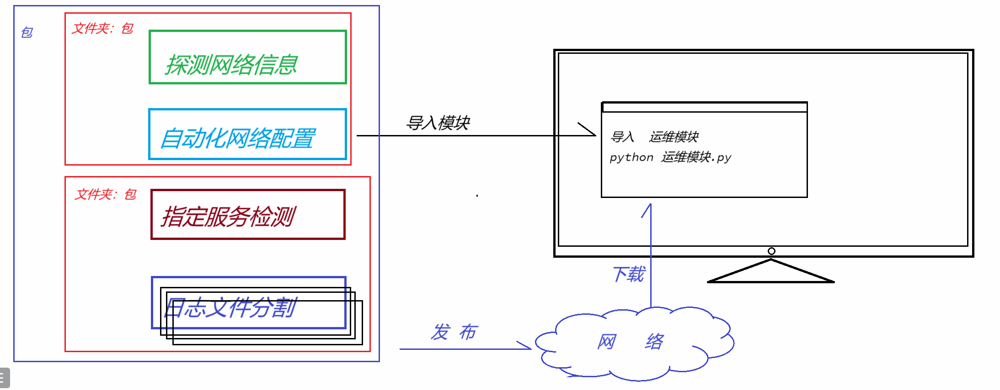
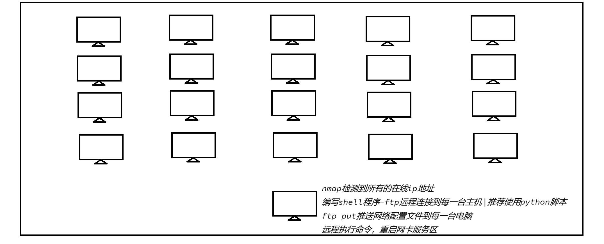
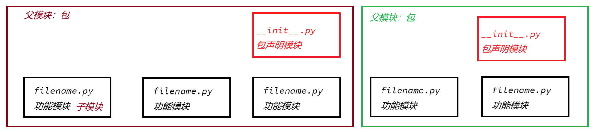
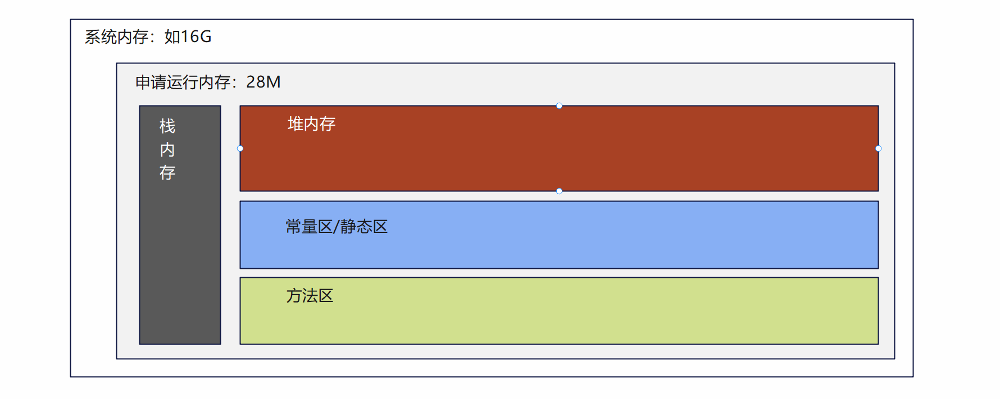
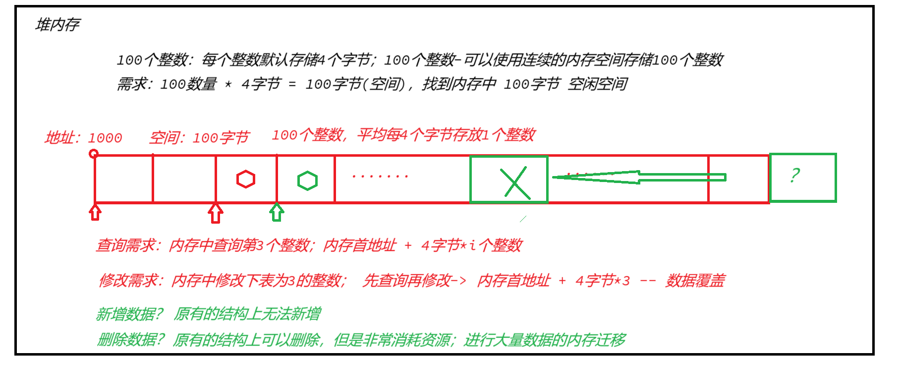
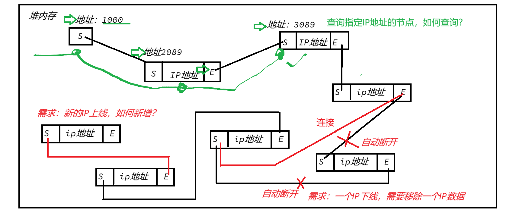
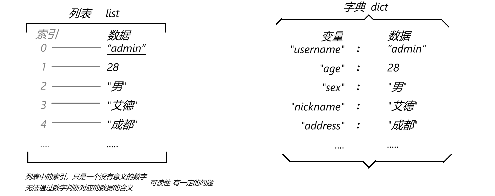

## 第五章：内置模块

> :telescope: 学习目标
>
> 1、认识模块、了解python中模块的意义
>
> 2、学习和掌握(内置)模块/包的导入语法
>
> 3、内置模块 - 容器模块：list列表、tuple元组、set集合、dict字典
>
> 4、内置模块 - 类型模块：datetime日期时间、time时间、str字符串...
>
> 5、内置模块 - 功能模块：hashlib加密、subprocess运维....

### 5.1、 认识模块的意义

Python之所以非常强大，大量的开发人员将自己工作中用到的各种模块，开源发布了

- 任何行业的工作中，需要执行python自动化操作，可以直接下载使用别人开发好的模块



#### （1） 运维工作

检测服务器CPU信息、内存信息、磁盘使用信息、甚至检测网络流量...

- 第三方模块：psutil

避免编写大量的运维代码，通过模块，可以直接检测到指定服务器上的各项指标信息

- CPU使用情况
- 磁盘使用情况
- 内存使用情况
- 网络吞吐量情况
- ......

#### （2） 网络

需要使用python脚本远程执行计划任务，远程执行脚本、远程执行命令、远程各项操作功能

Python执行一些基础脚本任务时，可以用到通用远程操作模块

- paramiko
- fabric
- ...

避免开发人员编写大量的功能性代码（实现通信协议的代码、如何实现远程连接的代码、如何实现远程文件读写的代码）；开发人员只需要掌握模块中支持的操作方式即可，就可以编写少量的代码实现需要的计划任务

- 远程连接
- 文件上传下载
- 远程命令
- 远程网络动态配置
- ...



#### （3） 测试

Python针对自动化测试，不论是C/S软件的测试、WEB(B/S)软件的测试，也提供了大量的模块可以执行测试自动化

需求：开发一个校园内网项目，涵盖了学校教室资源管理、教师资源管理、课程资源管理、学生信息资源管理，课程自动排课系统...大量的功能，开发过程中要执行可用性测试

- 常用的WEB测试模块：selenuim + phantomjs

需求：开发一个移动端APP，进行功能可用性测试

....

如果人工测试，成熟的软件中一般设计到的功能点至少包含上千个，测试的时候还需要测试功能之间的互相影响，人工测试的效率非常低下；借助测试自动化工具,市场上大部分的自动化测试工具都是python实现的，并且针对定制功能需要手工编写测试脚本，python就会体现的非常重要

### 5.2、 模块导入的语法

Python中最强大的功能之一就是：丰富的模块，一般包含了这么几种：

- 启动加载模块
- 内置模块
- 第三方模块

#### （1） 启动加载模块

本地python解释器启动，开始执行程序，这些初始模块就会自动加载执行，如 str字符串模块、int整数模块、type类型模块

自动加载的模块，不需要导入可以直接使用

```python
>>> dir()
['__annotations__', '__builtins__', '__doc__', '__loader__', '__name__', '__package__', '__spec__']
```


#### （2） 内置模块

解释器安装后，已经包含的功能模块，程序在运行的时候可以导入使用

参考官方资料：

常见模块：math、os、sys、random....

> :memo: 关于官方文档资料
>
> - What's new in Python 3.13?：新特性介绍
> - Tutorial：官方教程
> - Library Reference：标准库文档(重点)，包含内置函数、内置常量、内置模块
> - Language Refence：语法文档


#### （3） 第三方模块

Python社区有一个第三方模块发布网站：`https://pypi.org`

下载、导入、使用

```shell
# 下载
$ pip install 第三方模块
```

> :memo: 关于一些术语
>
> `https://pypi.org`： pypi-> python package index （python模块索引）
>
> `pip`： python index packgae，`pip install`-> 使用python安装并索引管理第三方模块


### 5.3、 模块导入语法

不论是内置模块、第三方模块，只要不是启动加载的模块都需要导入之后才能正常使用



#### （1） 导入模块

语法1：直接导入模块

```python
import 模块名称
```

语法2：使用别名导入

- 注意：一旦使用别名导入，原本的模块名称不可用

```python
import 模块名称 as 别名
```

**示例**

```python
>>> import os      # 直接导入
>>> os.listdir("D:/")
['$RECYCLE.BIN', ...., '迅雷 11.1.8.1418']
>>>
>>> import random as rd   # 别名导入
>>> rd.randint(1,5)
4
>>> random.randint(1,5)   # 原本模块名称不可用
Traceback (most recent call last):
  File "<stdin>", line 1, in <module>
NameError: name 'random' is not defined. Did you forget to import 'random'?
```


#### （2） 导入模块中对象

语法

```python
from 模块 import 函数名称,变量名称..
```

语法2：别名

```python
from 模块 import 函数名称 as 别名
```

**示例**

- 不推荐：和容易混淆 randint()函数到底是其他模块的，还是当前文件模块的！
- 少量代码编写(脚本中常见)的时候，可以使用

```python
>>> from random import randint
>>>
>>> randint(1, 5)
2
```


#### （3） 导入包

语法1：直接导入包

```python
import 包名称
```

语法2：使用别名

```python
import 包名称 as 别名
```

**示例**

- 注意：如果要同时使用包本身的一些功能，以及其中子模块的功能，推荐直接导入包
- 注意2：如果仅仅使用包中的子模块，不推荐直接导入包

```python
import os

# 查看D盘中都有哪些文件：直接使用 包 中的功能
print(os.listdir("D:/"))

# 判断某个文件是否存在: 包.模块.函数() ：使用子模块中的 功能
s = os.path.exists("D:/test/")
print(s)  # False 表示不存在这个文件

d = os.path.isdir("D:/Bandicam/")
print(d)  # True 表示这个路径是个文件夹

f = os.path.isfile("D:/Bandicam/bandi.exe")
print(f)  # True 表示这个路径是个文件
```


#### （4） 导入包中模块

语法：

```python
from 包 import 模块
```

语法2：别名导入

```python
from 包 import 模块 as 别名
```

**示例**

```python
>>> import datetime           # 不推荐
>>> datetime.datetime.today()
datetime.datetime(2024, 10, 29, 19, 54, 58, 278235)
>>>
>>> from datetime import datetime  # 推荐：从包中导入需要的模块
>>> d = datetime.today()
>>> d.year
2024
>>> d.month
10
>>> d.day
29
>>> d.hour
19
>>> d.minute
55
>>> d.second
27
```


#### （5） 导入包中模块的对象(不推荐)

语法

```python
from 包.模块 import 函数,变量,....
```

语法2

```python
from 包.模块 import 函数 as 别名
```

**示例**

- 注意：一般导入功能模块，要使用模块中大量的函数(不推荐导入唯一的/多个函数)推荐直接导入整个模块来使用

```python
>>> from os.path import getsize  # 只能使用被导入的函数
>>>
>>> getsize("D:/Bandicam/BandicamPortable.exe")
300170
>>>
>>> isfile("D:/Bandicam/BandicamPortable.exe")  # 其他未导入的函数无法使用
Traceback (most recent call last):
  File "<stdin>", line 1, in <module>
NameError: name 'isfile' is not defined
```

> :memo:总结：关于模块和包的导入
>
> 只需要记住一件事：按需导入(推荐以模块为最小单位)
>
> - import 模块/包
> - from 包 import 模块

### 5.4、 容器模块

#### （1） 认识容器模块

容器，描述了生活中存储数据的事物，存储数据是为了更加方便的使用数据；

代码：变量，这是代码中临时存储数据的容器；基础语法-一个变量中只能存储一个数据

问题：如果开发了一个项目，需要表示当前班级的学生姓名名单，如何处理？


- 基础语法：一个变量表示一个学生姓名；一个班级就需要50个变量；一个项目中如果包含100个班级....
- 解决方案：Python中提供了容器类型，可以允许一个变量中存储多个数据；通过一个变量保存一个班级中所有学员姓名

```python
# 变量中存储学生名单
names = ["tom", "jerry", "shuke", "beita"....]
```

> :question:问题：如果一个变量中存储了大量数据，会不会影响数据的读写操作，间接影响程序的性能？！
>
> 答案：肯定！如何有效的提高批量数据的使用效率？


#### （2） 数据结构

了解脚本程序的运行过程：

- 问题1：-> 硬盘读写速度太慢，需要将数据IO尽心提升，将数据通过总线传输给内存
- 问题2：-> 正在启动运行的软件，软件数据基本都存储在内存中进行准备，随时IO给CPU进行运算
- 问题3：
  - 优化CPU运算：优化代码执行逻辑，减少运算次数
  - 优化内存空间：让程序数据有效的读写，提高读写效率


> 注意：对于执行逻辑的提升
>
> 需求1：计算素数？for i in range(0, n): 判断x是否能被i整除；循环会执行n次
>
> ​               for i in range(0, n//2)：判断x是否能被i整除；循环会执行n//2次

> 注意：对于数据的有效读写
>
> 需求：程序代码中存储100个整数；这些数据经常进行查询和修改，很少执行删除和新增
>
> 需求：程序代码中存储一些网络访问IP数据，这些数据经常进行新增和删除，很少查询和修改
>
> 已知-程序中的户数存储在内存中，内存空间中如何有效的存储这些数据呢？

程序代码，为了有效的利用从系统申请的空间，将申请到的内存空间拆分成了这样几部分

- 栈内存：分配/释放空间速度快，但是存储数据不稳定，经常用来给变量分配空间；
- 堆内存：分配/释放空间速度慢，比较消耗资源；经常用来存放稳定数据，如对象数据；
- 静态区：解释器给通用数据分配空间使用，当前解释器任何代码中都占用相同内存，
- 方法区：解释器给正在运行的程序，保存预编译数据使用，如函数的声明(声明的函数不会立即执行，调用的时候才会执行)
  - 函数声明保存在方法区内存中；通过函数名称调用函数时-> 函数就会从方法区复制一份到堆内存去执行；执行完成后堆内存中的函数占用的空间就会被回收；



需求1：经常查询和修改的整数数据

- 代码语法：内存层面，底层可以通过 **数组** 实现



需求2：经常新增和删除的Ip地址数据

- 代码实现：内存层面，可以通过代码中的 **链表** 进行实现



> :memo: 脚本优化
>
> 有效的处理代码的逻辑结构（算法），有效的管理存储数据（数据结构），都可以提升脚本运行性能！

#### （3） list

**类型描述**

Python中针对 容器中 有顺序的存储多个数据 提供的一种类型，关键字使用 **list** 表示

特点：有顺序的、可以重复的、可以是多种类型的、多个数据

**对象声明**

```python
# list 声明空列表
lst = [] # python脚本开发中推荐
lst2 = list() # python和其他语言混合开发推荐
# [] [] <class 'list'> <class 'list'>
print(lst, lst2, type(lst), type(lst2))

# list声明非空列表
lst3 = ["何坤", "汤姆"] # 推荐
lst4 = list(["杰瑞", "舒克"])
# ['何坤', '汤姆']
# ['杰瑞', '舒克']
print(lst3, lst4)
```

**数据CRUD**

```python
##########################################
# 数据CRUD：容器类型对于数据的操作
# 无非就是添加数据、修改数据、删除数据和查询数据
##########################################
# 声明空列表-存储访问IP地址信息
ips_access = []
# 添加数据：需求-脚本记录访问服务器终端IP地址信息(同一个终端可能多次访问)
ips_access.append("192.168.10.102")
ips_access.append("192.168.10.98")
ips_access.append("192.168.10.202")
ips_access.append("192.168.10.102")
ips_access.append("192.168.10.198")
ips_access.append("192.168.10.32")
ips_access.append("192.168.10.102")
ips_access.append("192.168.10.56")
# ['192.168.10.102', '192.168.10.98', '192.168.10.202',
# '192.168.10.102', '192.168.10.198', '192.168.10.32',
# '192.168.10.102', '192.168.10.56']
print(ips_access)

# 修改数据：需求-服务器访问记录中，98主机-内部测试服务器；需要将它修改成-IP(测试)
# 列表中的数据包含顺序(索引/编号，从0开始排列)
ips_access[1] = "192.168.10.98(内部测试)"
# ['192.168.10.102', '192.168.10.98(内部测试)', '192.168.10.202',...
print(ips_access)

# 删除数据：需求-为了方便IP地址统计，需要将内部测试的98号主机访问记录删除
# 内建关键字删除，结合列表数据的下标删除数据(不推荐)
# del ips_access[1]
# 列表的操作函数-根据数据删除: 推荐-使用较多
ips_access.remove("192.168.10.98(内部测试)")
# 列表的操作函数-根据索引删除：推荐
# ips_access.pop(1)
print(ips_access)

###########################################
# 查询数据：所有容器类型都支持多种查询操作
# 所有的CRUD操作中，查询操作都是比较复杂和频繁的
###########################################
# 1.查询整个列表
print(ips_access)
'''
列表中的索引编号：正向索引(从左到右编号)、反向索引(从右到左编号)
lst       =      ["a", "b", "c", "d", "e"]
正向索引(索引)       0    1    2    3    4 ...
反向索引       ...  -5   -4   -3   -2   -1
'''
# 2.根据单个索引查询单个数据
print(ips_access[2]) # 192.168.10.102
# 3.根据单个(负数)索引查询单个数据
print(ips_access[-1]) # 192.168.10.56
# 4.根据索引查询多个数据(切片),语法： 列表[开始索引:结束索引:间隔数量]
# 开始索引：默认为0；结束索引：默认为列表长度；间隔数量(省略)：默认为1
# 复制列表
ips1 = ips_access # 没有复制-相当于一个人-名字叫 张三，也叫狗子
ips2 = ips_access[::] # 切片语法复制，新数据；- 相当于张三、克隆张三
# 1750797980032 1750800167680 1750797980032
print(id(ips1), id(ips2), id(ips_access))
# 截取部分数据 ['192.168.10.198', '192.168.10.32']
print(ips_access[3:5]) # [3,5)
# 截取第3个数据到末尾(最大索引7)
# ['192.168.10.198', '192.168.10.32', '192.168.10.102', '192.168.10.56']
print(ips_access[3:(7+1)])
print(ips_access[3:])
# 截取偶数位数据['192.168.10.102', '192.168.10.102', '192.168.10.32', '192.168.10.56']
print(ips_access[::2])
# 使用负向间隔-使用负数索引截取数据，也可以翻转列表
# 翻转列表-需求-按照时间顺序，将最近访问IP记录排列在最前面
print(ips_access[::-1])
# 切片
print(ips_access[5:2:-1], "----------")
print(ips_access[-2:-5:-1], "----------")

# for循环遍历
# 列表属于序列数据，所以可以直接使用for循环遍历所有数据
for ip in ips_access:
    print("----->", ip)  # 直接操作数据(没有索引)
# 结合内置函数enumerate()可以给循环的数据添加索引
for index, ip in enumerate(ips_access):
    print(index, "--->", ip)

```

**常见函数**

结合内置函数dir()、help()查看列表中的所有可操作函数

```shell
>>> dir(list)
[..., 'append', 'clear', 'copy', 'count', 'extend', 'index', 'insert', 'pop', 'remove', 'reverse', 'sort']
```

函数说明

| 函数                | 说明                                           |
| ------------------- | ---------------------------------------------- |
| **lst.append(dat)** | 列表的末尾追加一个数据                         |
| lst.clear()         | 清空列表中的所有数据                           |
| lst.copy()          | 复制一个列表                                   |
| **lst.count(dat)**  | 查询列表中某个数据出现的**次数**               |
| lst.extend([...])   | 末尾追加多个数据                               |
| **lst.index(dat)**  | 查询某个数据在列表中的索引                     |
| **lst.pop()**       | 默认删除最后一个数据；也可以删除指定索引的数据 |
| **lst.remove(dat)** | 删除指定的数据                                 |
| lst.reverse()       | 翻转列表，等价于lst[::-1]                      |
| lst.sort()          | 对列表中的数据进行简单的排序                   |

**其他扩展**

结合内置函数，可以对列表进行扩展操作

- len()：查看列表中的元素的个数，统计列表中的数据
- max()：查看数值列表中最大数据
- min()：查看数值列表中最小数据
- sum()：对数值列表进行求和操作
- in运算符：判断某个数据是否在列表中出现

```python
>>> lst = [1,2,34,54,56,5,3,54,65,67,6,45,45,67,8]
>>> len(lst)
15
>>> max(lst)
67
>>> min(lst)
1
>>> sum(lst)
512
>>> 67 in lst
True
```


#### （4） tuple

**类型描述**

Python中针对脚本/应用中，容器中包含多个不可变的数据，提供的一种类型；关键字使用tuple表示

特点：有顺序的、可以重复的、可以是不同类型的、多个数据

注意：数据一旦存储，不允许改动(不能改动数据/并不是修改数据本身)

**对象声明**

```python
# 元组 声明空元组
t1 = ()
t2 = tuple()
# () () <class 'tuple'> <class 'tuple'>
print(t1, t2, type(t1), type(t2))

# 声明包含一个元素的元组
t3 = (2) # int
t4 = (3,) # tuple(推荐)
t5 = tuple([6]) # tuple
# t6 = tuple(7) # TypeError类型错误，没有这种语法
# 2 (3,) (6,) <class 'int'> <class 'tuple'> <class 'tuple'>
print(t3, t4, t5, type(t3), type(t4), type(t5))
```

**数据CRUD**

```python
#########################################
# 元组CRUD操作
# 学习元组数据操作，了解元组使用场景
#########################################
# 声明元组-需求：声明一个类型，存储服务器标签：
# 特点：这些服务器数据一旦声明，要求不可以改变
# 数据服务器DAT，业务服务器SERV，网络服务器NET，存储服务器STO
server_type = ('SERV', 'NET', 'DAT', 'STO')

# 查询数据
print(server_type[0]) # 查询到数据 SERV
print(server_type.index('NET')) # 索引是 1
# for循环遍历
for serv in server_type:
    print(serv)
for idx, serv in enumerate(server_type):
    print(idx, "-->", serv)
# 思考：元组可以切片吗？
print(server_type[1:3])

# 增加数据：无
# 修改数据：无
# server_type[0] = "serv"
#TypeError: 'tuple' object does not support item assignment
# 类型错误     tuple 对象     不    支持        数据项  改动
# 删除数据：无
# del server_type[0]
# TypeError: 'tuple' object doesn't support item deletion
# 类型错误：    tuple  对象   不      支持     数据项  删除
# print(server_type)

```

**常见函数**

结合dir()、help()函数，查看元组的常见操作

```shell
>>> dir(tuple)
[... 'count', 'index']
```

函数说明

| 函数         | 说明                         |
| ------------ | ---------------------------- |
| t.count(dat) | 查询某个数据元组中出现的次数 |
| t.index(dat) | 查询某个数据在元组中的索引   |

**其他扩展**

结合内置函数，可以对列表进行扩展操作

- len()：查看列表中的元素的个数，统计列表中的数据
- max()：查看数值列表中最大数据
- min()：查看数值列表中最小数据
- sum()：对数值列表进行求和操作
- in运算符：判断某个数据是否在列表中出现

> :warning:注意：正式编写脚本时，如果要存储多个数据，优先推荐使用列表！即使元组可能更加适合！
>
> - 脚本代码一般功能简单，代码量少；开发和维护都是作者执行；使用列表会更加灵活！

#### （5） set

**类型描述**

Python中针对 容器中进行数据项统计 的操作类型，提供的一种容器类型，关键字使用 **set** 表示

特点：没有顺序的、不可以重复、可以是多种类型的，多个数据

注意：没有顺序、不可以重复；经常用于数据统计

**对象声明**

```python
# set 非空集合
s1 = {1, 2, 3, 4, 5}
s2 = set([3,4,5,6,7])
# {1, 2, 3, 4, 5} {3, 4, 5, 6, 7} <class 'set'> <class 'set'>
print(s1, s2, type(s1), type(s2))

# 空集合的声明
s3 = {} # 不是集合-字典
s4 = set()  # 空集合，只有这一种语法
# {} set() <class 'dict'> <class 'set'>
print(s3, s4, type(s3), type(s4))

```

**数据CRUD**

```python
#######################################
# set集合 CURD操作
#######################################
# 声明空集合
ips = set()
# 增加：需求-保存登录过的IP地址，判断服务终端的数量
ips.add("192.168.1.100")
ips.add("192.168.1.98")
ips.add("192.168.1.102")
ips.add("192.168.1.89")
ips.add("192.168.1.89")
ips.add("192.168.1.103")
# {'192.168.1.98', '192.168.1.89', '192.168.1.102', '192.168.1.103', '192.168.1.100'}
print(ips)

# 删除数据：需求-测试主机89，需要删除~避免影响数据统计
ips.remove("192.168.1.89")
# {'192.168.1.100', '192.168.1.98', '192.168.1.102', '192.168.1.103'}
print(ips)

# 修改数据：无法直接修改数据;可以耍赖修改-先判断是否存在、存在的话删除、然后在添加
# 需求-100主机，特殊终端-需要备注
if "192.168.1.100" in ips:
    # 存在，先删除，再添加
    ips.remove("192.168.1.100")
    # 添加
    ips.add("192.168.1.100-special")
# {'192.168.1.103', '192.168.1.98', '192.168.1.100-special', '192.168.1.102'}
print(ips)

# 查询数据：集合是无序的，所以无法根据索引查询数据
# 集合中只能遍历数据
for ip in ips:
    print(ip)
# 此处的索引~是内建函数给绑定的，仅适合展示使用
for idx, ip in enumerate(ips):
    print(idx, "==>", ip)
```

**常见函数**

结合dir()和help()查看set的常见函数

```shell
>>> dir(set)
[..., 'add', 'clear', 'copy', 'difference', 'difference_update', 'discard', 'intersection', 'intersection_update', 'isdisjoint', 'issubset', 'issuperset', 'pop', 'remove', 'symmetric_difference', 'symmetric_difference_update', 'union', 'update']
```

**函数说明**

| 函数                              | 说明                                    |
| --------------------------------- | --------------------------------------- |
| **s.add(dat)**                    | 集合中添加一个数据                      |
| s.clear()                         | 清空集合中所有数据                      |
| s.copy()                          | 复制一个集合                            |
| s.difference(s2)                  | 获取差集                                |
| s.difference_update(s2)           | 获取差集，并将差集结果覆盖到s变量中     |
| s.intersection(s2)                | 获取交集                                |
| s.intersection_update(s2)         | 获取交集，并将交集结果覆盖到s变量中     |
| s.union(s2)                       | 获取并集                                |
| s.update(s2)                      | 获取并集，并将并集结果覆盖到s变量中     |
| s.symmetric_difference(s2)        | 获取完整差集                            |
| s.symmetric_difference_update(s2) | 获取完整差集，并将结果覆盖到变量s中     |
| **s.discard(dat)**                | 删除一个数据-如果数据不存在返回None     |
| **s.remove(dat)**                 | 删除一个数据-如果数据不存在报错KeyError |
| **s.pop()**                       | 删除任意一个数据                        |
| **s.isdisjoint()**                | 判断两个集合是否没有交集                |
| **s.issubset(s2)**                | 判断s是否被s2包含                       |
| **s.issuperset(s2)**              | 判断s是否包含s2                         |

**其他扩展**

set本身就是集合，所以支持数学中集合的操作方式

- 熟悉 集合的操作函数；了解 集合的操作符号

```python
########################################
# set集合：可以执行集合运算 - 并集、交集、差集
########################################
# 防火墙配置文件包含两种IP配置：允许列表、禁止列表
allow_ips = {"192.168.1.100", "192.168.1.102", "192.168.1.103"}
deny_ips = {"192.168.1.102", "192.168.1.103", "192.168.1.104"}

# 需求1：获取到所有被配置的IP地址（并集）
#{'192.168.1.100', '192.168.1.102', '192.168.1.104', '192.168.1.103'}
print(allow_ips.union(deny_ips))
print(allow_ips | deny_ips) # 位-或运算符-了解

# 需求2：获取到错误配置IP地址(允许和禁止都配置了数据)(交集)
# {'192.168.1.103', '192.168.1.102'}
print(allow_ips.intersection(deny_ips))
print(allow_ips & deny_ips) # 位-与运算符-了解

# 需求1：获取到能正常访问的终端IP地址(差集)
# {'192.168.1.100'}
print(allow_ips.difference(deny_ips))
print(allow_ips - deny_ips)

# 获取所有正确配置的IP地址，不论是允许/禁止列表
#{'192.168.1.100', '192.168.1.104'}
print(allow_ips.symmetric_difference(deny_ips))
print(allow_ips ^ deny_ips) # 位-异或运算符-了解

```

扩展思考：是否支持列表中哪些扩展的内置函数呢？

#### （6） dict

**类型描述**

Python中针对批量数据的处理，尤其是可读性方面、可操作性进行提升，提供了一种新的容器类型-字典；字典Python中使用关键字dict表示

特点：存储key:value键值对数据、key不能重复、value可以重复

注意：经常脚本中使用字典的特点，完成数据统计的操作



**对象声明**

```python
# 声明空字典
d = {}  # 列表[]  元组()  集合set()  字典{}
d2 = dict()
# {} {} <class 'dict'> <class 'dict'>
print(d, d2, type(d), type(d2))

# 声明非空字典
compute = {"cpu": "i9", "memory": "32G", "disk": "1T"} # 推荐
compute2 = dict([("cpu", "i713"), ("memory", "16G")])
# {'cpu': 'i9', 'memory': '32G', 'disk': '1T'}
# {'cpu': 'i713', 'memory': '16G'}
print(compute, compute2)
# <class 'dict'> <class 'dict'>
print(type(compute), type(compute2))

```

**数据CRUD**

```python
#######################################
# 字典dict CURD操作
#######################################
# 声明空字典
server_info = dict()
# 记录三台服务器(serv01, serv02, serv03)连续3天网络流量
# 如：serv01 - 100M  120M  90M
# 添加数据
server_info['serv01'] = [100, 120, 90]
server_info['serv02'] = [80, 60, 70]
server_info['serv03'] = [30, 0, 0]
# {'serv01': [100, 120, 90], 'serv02': [80, 60, 70], 'serv03': [30]}
print(server_info)
# 修改数据
serv03 = server_info['serv03']  # 获取serv03服务器
serv03[1] = 40
serv03[2] = 35
print(server_info['serv03']) # [30, 0, 0]
print(server_info)

# 删除数据
# 使用内建关键字删除
# del server_info['serv03'] # 不推荐
# 使用pop()函数删除
server_info.pop('serv03')
#{'serv01': [100, 120, 90], 'serv02': [80, 60, 70]}
print(server_info)

#####################################
# 查询数据
#####################################
# 1. 通过key查询value数据
print(server_info['serv01'])  # 方括号语法-常用 [100, 120, 90]
# print(server_info['serv03'])  # 报错KeyError: 'serv03'
print(server_info.get('serv01')) # get()函数-常用 [100, 120, 90]
print(server_info.get('serv03')) # None 不会报错

# 2. 遍历字典
# 遍历所有的Key： keys():dict_keys(['serv01', 'serv02'])
print(server_info.keys())
# 遍历所有的value: values():dict_values([[100, 120, 90], [80, 60, 70]])
print(server_info.values())
# 遍历所有的key:value数据:dict_items([('serv01', [100, 120, 90]), ('serv02', [80, 60, 70])])
print(server_info.items())
# for循环遍历，使用key遍历
for key in server_info.keys():
    print(key, "----> ", server_info.get(key))
for key, value in server_info.items():
    print(key, "=======>", value)

```

**常见函数**

结合dir()、help()查看字典中常见函数

```python
>>> dir(dict)
['....', 'clear', 'copy', 'fromkeys', 'get', 'items', 'keys', 'pop', 'popitem', 'setdefault', 'update', 'values']
```

**函数说明**

| 函数              | 说明                                                       |
| ----------------- | ---------------------------------------------------------- |
| d.clear()         | 清空字典中的所有数据                                       |
| d.copy()          | 复制一个字典                                               |
| d.fromkeys(...)   | 从给定的数据生成一个空值字典                               |
| **d.get(key)**    | 根据key获取对应的value数据                                 |
| **d.items()**     | 获取字典中所有的key:value键值对，经常和for循环配合使用     |
| **d.keys()**      | 获取字典中所有的key数据，经常和for循环配合使用             |
| **d.pop(key)**    | 根据字典中的key删除一个key:value键值对数据                 |
| d.popitem()       | 删除字典中任意一个key:value数据                            |
| d.setdefault(k,v) | 如果key不存在-增加一个key:value数据；如果key存在什么都不做 |
| d.update(k,v)     | key不存在增加一个key:value；如果key存在-修改key的数据；    |
| d.values()        | 获取字典中的所有value数据                                  |

**其他扩展**

笔试题：判断一段描述中，每个英文单词出现的次数

```python
# 笔试案例：统计字符串中每个字符出现的次数
s = 'Python’s standard library is very extensive, offering a wide range of facilities as indicated by the long table of contents listed below. The library contains built-in modules (written in C) that provide access to system functionality such as file I/O that would otherwise be inaccessible to Python programmers, as well as modules written in Python that provide standardized solutions for many problems that occur in everyday programming. Some of these modules are explicitly designed to encourage and enhance the portability of Python programs by abstracting away platform-specifics into platform-neutral APIs.'
# 使用字典统计字符出现的次数
char_count = {}
for ch in s:
    # 判断当前字符ch是否已经包含在字典中
    if ch not in char_count:
        # 如果没有包含，表示第一次出现
        char_count[ch] = 1
    else:
        # 如果包含，表示已经出现过，更新次数
        char_count[ch] += 1
# 统计结果
print(char_count)
'''
{'P': 5, 'y': 17, 't': 47, 'h': 15, 'o': 38, 'n': 35, '’': 1, 's': 35, ' ': 89, 'a': 40, 'd': 19, 'r': 32, 'l': 25, 'i': 40, 'b': 12, 'v': 5, 'e': 50, 'x': 2, ',': 2, 'f': 13, 'g': 10, 'w': 8, 'c': 18, '.': 3, 'T': 1, 'u': 11, '-': 3, 'm': 14, '(': 1, 'C': 1, ')': 1, 'p': 11, 'I': 2, '/': 1, 'O': 1, 'z': 1, 'S': 1, 'A': 1}
'''
```

### 5.5、 类型模块

Python中除了提供的一些基本类型(str、bool、int、float、complex)等等，也提供了一些其他的复杂类型的操作，如时间类型模块、日期时间类型模块、数学模块等等

#### （1） time

Python中提供的时间处理模块

**常见操作**

```python
>>> import time
>>> dir(time)
['_STRUCT_TM_ITEMS', '__doc__', '__loader__', '__name__', '__package__', '__spec__', 'altzone', 'asctime', 'ctime', 'daylight', 'get_clock_info', 'gmtime', 'localtime', 'mktime', 'monotonic', 'monotonic_ns', 'perf_counter', 'perf_counter_ns', 'process_time', 'process_time_ns', 'sleep', 'strftime', 'strptime', 'struct_time', 'thread_time', 'thread_time_ns', 'time', 'time_ns', 'timezone', 'tzname']
```

**函数说明**

| 函数              | 说明                 |
| ----------------- | -------------------- |
| time.ctime()      | 获取当前系统时间     |
| time.localtime()  | 获取当前系统时间对象 |
| **time.sleep(n)** | 让程序休眠n秒        |

#### （2） datetime

Python中提供的专门用于日期时间处理的模块，包括时间格式和字符串展示的转换，都使用该模块实现

注意：`from datetime import datetime`模块

**常见操作**

```python
>>> from datetime import datetime
>>> dir(datetime)
['...', 'astimezone', 'combine', 'ctime', 'date', 'day', 'dst', 'fold', 'fromisocalendar', 'fromisoformat', 'fromordinal', 'fromtimestamp', 'hour', 'isocalendar', 'isoformat', 'isoweekday', 'max', 'microsecond', 'min', 'minute', 'month', 'now', 'replace', 'resolution', 'second', 'strftime', 'strptime', 'time', 'timestamp', 'timetuple', 'timetz', 'today', 'toordinal', 'tzinfo', 'tzname', 'utcfromtimestamp', 'utcnow', 'utcoffset', 'utctimetuple', 'weekday', 'year']
```

**常见函数**

| 函数           | 说明                                           |
| -------------- | ---------------------------------------------- |
| ctime()        | 当前系统时间                                   |
| utcnow()       | 当前UTC世界标准时间-注意和我们的时间差8个小时  |
| **now()**      | 获取当前系统时间                               |
| today()        | 获取当前系统时间                               |
| **strftime()** | 将系统时间 转换成 字符串 在界面上展示          |
| strptime()     | 将字符串时间 转换成时间对象 以后可以存储数据库 |

**示例**

```shell
>>> from datetime import datetime
>>> d = datetime.now()
>>> d
datetime.datetime(2024, 11, 1, 20, 50, 21, 861152)
>>> d.strftime("%Y年%m月%d日 %H:%M:%S")
'2024年11月01日 20:50:21'
```

```shell
>>> from datetime import datetime
>>> from datetime import timedelta
>>>
>>> d = datetime.now()
>>> d
datetime.datetime(2024, 11, 1, 20, 52, 24, 131263)
>>> d2 = d + timedelta(days=3) # 三天后的时间
>>> d2
datetime.datetime(2024, 11, 4, 20, 52, 24, 131263)
```

#### （3） math

Python中提供的一种辅助数学操作的函数

**常见操作**

```python
>>> import math
>>> dir(math)
['__doc__', '__loader__', '__name__', '__package__', '__spec__', 'acos', 'acosh', 'asin', 'asinh', 'atan', 'atan2', 'atanh', 'cbrt', 'ceil', 'comb', 'copysign', 'cos', 'cosh', 'degrees', 'dist', 'e', 'erf', 'erfc', 'exp', 'exp2', 'expm1', 'fabs', 'factorial', 'floor', 'fmod', 'frexp', 'fsum', 'gamma', 'gcd', 'hypot', 'inf', 'isclose', 'isfinite', 'isinf', 'isnan', 'isqrt', 'lcm', 'ldexp', 'lgamma', 'log', 'log10', 'log1p', 'log2', 'modf', 'nan', 'nextafter', 'perm', 'pi', 'pow', 'prod', 'radians', 'remainder', 'sin', 'sinh', 'sqrt', 'sumprod', 'tan', 'tanh', 'tau', 'trunc', 'ulp']
```

**常见函数**

| 函数                     | 说明             |
| ------------------------ | ---------------- |
| **math.ceil(3.4) -> 4**  | 向上取整         |
| **math.floor(3.8) -> 3** | 乡下取整         |
| math.trunc(3.2) -> 3     | 截断获取整数部分 |
| math.pow(x, y)           | 获取幂方运算     |
| math.sqrt(x)             | 获取平方根结果   |
| **math.pi**              | 圆周率，3.14.... |
| math.e                   | 自然数，2.71.... |
| math.gcd(x, y)           | 获取最大公约数   |
| math.lcm(x, y)           | 获取最小公倍数   |
| math.sin/cos/tan...      | 三角函数         |
| math.log/log2...         | 对数函数         |
| ...                      | ...              |

> :warning: 注意：round(x, y)四舍五入，属于内建函数；并不是math模块的函数！

#### （4） random

Python中针对脚本/应用中经常使用的随机数，提供的一个伪随机数模块

**常见操作**

```python
>>> dir(random)
['BPF', 'LOG4', 'NV_MAGICCONST', 'RECIP_BPF', 'Random', 'SG_MAGICCONST', 'SystemRandom', 'TWOPI', '_ONE', '_Sequence', '__all__', '__builtins__', '__cached__', '__doc__', '__file__', '__loader__', '__name__', '__package__', '__spec__', '_accumulate', '_acos', '_bisect', '_ceil', '_cos', '_e', '_exp', '_fabs', '_floor', '_index', '_inst', '_isfinite', '_lgamma', '_log', '_log2', '_os', '_pi', '_random', '_repeat', '_sha512', '_sin', '_sqrt', '_test', '_test_generator', '_urandom', '_warn', 'betavariate', 'binomialvariate', 'choice', 'choices', 'expovariate', 'gammavariate', 'gauss', 'getrandbits', 'getstate', 'lognormvariate', 'normalvariate', 'paretovariate', 'randbytes', 'randint', 'random', 'randrange', 'sample', 'seed', 'setstate', 'shuffle', 'triangular', 'uniform', 'vonmisesvariate', 'weibullvariate']
```

**常见函数**

| 函数                 | 说明                            |
| -------------------- | ------------------------------- |
| random.random()      | 生成一个0~1之间的随机数         |
| random.randint(a, b) | 生成一个[a, b]之间的随机整数    |
| random.choice(seq)   | 在一个序列seq中随机获取一个数据 |
| random.choices(seq)  | 在一个序列seq中随机获取多个数据 |

**示例**

```python
>>> import random

>>> random.random()  # 0~1之间的随机数
# 请求需要分到两台数据处理服务器；根据随机数大于0.5判断发到A/小于0.5发送到B服务器，实现请求均衡
0.6768221585522655

>>> random.randint(1, 3)  # 1.2.3任意一个随机数
2

>>> random.choice(["石头", "剪刀", "布"]) # 从序列中随机获取一个数据
石头

>>> random.choices("abcdefg", k=3)  # 从序列中随机获取k个数据
["b", "f", "g"]

>>> "".join(["b", "f", "g"])  # 字符串拼接函数 join()
"bfg"

>>> ",".join(["b", "f", "g"])  # 字符串拼接函数 join()
"b,f,g"
```

### 5.6、 功能模块 

#### （1） os/sys

##### ① 认识模块

os: Operation System，操作系统，os模块时Python内置的用于和操作系统进行交互的模块，通过os模块提供的函数可以使用脚本完成系统中文件的创建/重命名/删除等等操作

sys：System，Python中提供的和Python解释器交互的模块，通过sys模块实现对脚本中的python对象进行操作的目的

> :warning:注意：os模块和sys模块都属于内置模块，使用的时候需要引入使用

##### ② 常见函数

**os模块**

结合dir()和help()函数

```python
>>> dir(os)
[.....,  'abc', 'abort', 'access', 'add_dll_directory', 'altsep', 'chdir', 'chmod', 'close', 'closerange', 'cpu_count', 'curdir', 'defpath', 'device_encoding', 'devnull', 'dup', 'dup2', 'environ', 'error', 'execl', 'execle', 'execlp', 'execlpe', 'execv', 'execve', 'execvp', 'execvpe', 'extsep', 'fdopen', 'fsdecode', 'fsencode', 'fspath', 'fstat', 'fsync', 'ftruncate', 'get_blocking', 'get_exec_path', 'get_handle_inheritable', 'get_inheritable', 'get_terminal_size', 'getcwd', 'getcwdb', 'getenv', 'getlogin', 'getpid', 'getppid', 'isatty', 'kill', 'linesep', 'link', 'listdir', 'listdrives', 'listmounts', 'listvolumes', 'lseek', 'lstat', 'makedirs', 'mkdir', 'name', 'open', 'pardir', 'path', 'pathsep', 'pipe', 'popen', 'putenv', 'read', 'readlink', 'remove', 'removedirs', 'rename', 'renames', 'replace', 'rmdir', 'scandir', 'sep', 'set_blocking', 'set_handle_inheritable', 'set_inheritable', 'spawnl', 'spawnle', 'spawnv', 'spawnve', 'st', 'startfile', 'stat', 'stat_result', 'statvfs_result', 'strerror', 'supports_bytes_environ', 'supports_dir_fd', 'supports_effective_ids', 'supports_fd', 'supports_follow_symlinks', 'symlink', 'sys', 'system', 'terminal_size', 'times', 'times_result', 'truncate', 'umask', 'uname_result', 'unlink', 'unsetenv', 'urandom', 'utime', 'waitpid', 'waitstatus_to_exitcode', 'walk', 'write']
```

常见函数：结合ai完成模块中常见函数的学习

| 函数                | 说明                                                        |
| ------------------- | ----------------------------------------------------------- |
| os.getcwd()         | 获取当前工作目录                                            |
| os.chdir(path)      | 修改当前工作目录                                            |
| os.listdir(path)    | 列表查看指定目录中的所有子目录/文件                         |
| os.walk(path)       | 查看指定目录中的所有子目录/以及子目录中的所有文件夹(生成器) |
| os.mkdir(path)      | 创建一个目录                                                |
| os.makedirs(path)   | 创建一个多级目录                                            |
| os.rmdir(path)      | 删除一个目录                                                |
| os.removedirs(path) | 删除一个多级目录                                            |
| os.remove(path)     | 删除一个文件                                                |
| os.rename(src, dst) | 重命名文件                                                  |
| os.path             | os模块中子模块 path                                         |

os.path模块常见函数

| 函数                   | 说明                                        |
| ---------------------- | ------------------------------------------- |
| os.path.isdir(path)    | 判断path是否目录                            |
| os.path.isfile(path)   | 判断path是否文件                            |
| os.path.exists(path)   | 判断path是否存在                            |
| os.path.splitext(path) | 拆分path路径中的目录和文件名                |
| os.path.getctime()     | 获取创建文件的时间 ctime-> create time      |
| os.path.getmtime()     | 获取修改文件的时间 mtime-> modify time      |
| os.path.getatime()     | 获取最后访问文件的时间 atime -> access time |
| os.path.getsize()      | 获取文件的大小                              |

**sys模块**

sys模块是python提供的一个和解释器交互的模块，可以让脚本中的数据控制更加灵活

结合dir()/help()函数，查看sys模块常见操作

```python
>>> dir(sys)
['....', 'activate_stack_trampoline', 'addaudithook', 'api_version', 'argv', 'audit', 'base_exec_prefix', 'base_prefix', 'breakpointhook', 'builtin_module_names', 'byteorder', 'call_tracing', 'copyright', 'deactivate_stack_trampoline', 'displayhook', 'dllhandle', 'dont_write_bytecode', 'exc_info', 'excepthook', 'exception', 'exec_prefix', 'executable', 'exit', 'flags', 'float_info', 'float_repr_style', 'get_asyncgen_hooks', 'get_coroutine_origin_tracking_depth', 'get_int_max_str_digits', 'getallocatedblocks', 'getdefaultencoding', 'getfilesystemencodeerrors', 'getfilesystemencoding', 'getprofile', 'getrecursionlimit', 'getrefcount', 'getsizeof', 'getswitchinterval', 'gettrace', 'getunicodeinternedsize', 'getwindowsversion', 'hash_info', 'hexversion', 'implementation', 'int_info', 'intern', 'is_finalizing', 'is_stack_trampoline_active', 'last_exc', 'last_traceback', 'last_type', 'last_value', 'maxsize', 'maxunicode', 'meta_path', 'modules', 'monitoring', 'orig_argv', 'path', 'path_hooks', 'path_importer_cache', 'platform', 'platlibdir', 'prefix', 'ps1', 'ps2', 'pycache_prefix', 'set_asyncgen_hooks', 'set_coroutine_origin_tracking_depth', 'set_int_max_str_digits', 'setprofile', 'setrecursionlimit', 'setswitchinterval', 'settrace', 'stderr', 'stdin', 'stdlib_module_names', 'stdout', 'thread_info', 'unraisablehook', 'version', 'version_info', 'warnoptions', 'winver']
```

常见函数：结合ai查看sys模块常见操作函数

| 函数         | 说明                                  |
| ------------ | ------------------------------------- |
| **sys.argv** | 获取当前脚本执行的额外参数数据        |
| sys.exit()   | 退出程序                              |
| sys.version  | 获取python解释器版本                  |
| sys.platform | 获取python程序运行平台-用于跨平台开发 |
| sys.path     | 获取python代码执行搜索路径            |

##### ③ 示例操作

os模块示例

```python
# os模块，需要引入才能使用
import os

# 查看当前工作目录
# print(os.curdir)  # .
# 查看当前工作目录
# print(os.getcwd()) # F:\系统课程\201410成都文理Python精培\Res\Code\CodeProject10
# 修改工作目录
# os.chdir("C:")
# print(os.getcwd()) # C:\

# 创建目录
# os.mkdir("log")
# 创建多级目录
# os.makedirs("data/images/headers/")
# 删除目录(注意工作目录)
# os.rmdir("log")
# 删除多级目录(注意工作目录)
# os.removedirs("data/images/headers/")

# 查看目录下的文件
# print(os.listdir("C:/"))
# 迭代查看指定目录下的所有文件(包括子目录文件)
# print(os.walk('C:/'))

# 使用os模块迭代查看指定目录中的所有文件[包括隐藏文件]（默认忽略空文件夹）
# for root, dirs, files in os.walk("F:/test"):
#     # 查看所有的文件
#     for file in files:
#         filename = os.path.join(root, file)
#         print(filename)

def list_files(path):
    """列出指定目录中的所有文件"""
    for root, dirs, files in os.walk(path):
        for file in files:
            filename = os.path.join(root, file)
            print(filename)

def list_drive():
    """列出所有驱动器"""
    for drive in os.listdrives():
        print(drive)

list_drive()
list_files("C:/")
```

sys模块示例

需求：python脚本执行的时候需要扫描`192.168.0.2~192.168.0.100`范围内的主机网络情况

执行命令：`python test_ips.py 2 100`，执行命令中附带了参数

```python
import sys

#########################################
# 获取脚本执行的额外的参数
# ['.\\demo02sys.py', '2', '100']
# 列表第一项：脚本路径(包含脚本名称)
# 列表其余项：脚本参数
# print(sys.argv)
#########################################

# 参数简单验证
if len(sys.argv) < 3:
    print('paramater error')
    print('usage: python demo02sys.py [start ip no.] [end ip no.]')
    print('example: python demo02sys.py 2 10')
    sys.exit(1)

# 获取参数数据
start_ip = int(sys.argv[1])
end_ip = int(sys.argv[2])

# 循环探测IP地址是否畅通
import time
for i in range(start_ip, end_ip + 1):
    print("开始测试 192.168.0.", i , " 是否通畅")
    time.sleep(0.5)

print("探测结束")

```

#### （2） hashlib/hmac

##### ① 认识模块

Python中提供的用于 单向加密的 功能模块；针对给定的数据进行单向散列加密/哈希加密；实际开发中经常使用这种单向加面方式实现权限校验、数字指纹

- 权限校验：将操作权限进行单向加密，用户在操作过程中可以针对加密后的数据进行比较，如果加密后的数据一致-权限验证通过；如用户账号密码登录系统，用户的密码就是单向加密的数据保存在系统中，当用户登录时将用户的明文密码进行单向加密-和系统中加密的数据进行比较，如果一致登录成功；很大程度上能保护用户密码的安全性！
- 数字指纹：单向散列加密、单向哈希加密加密算法，可以针对文件进行算法操作得到一组数据（和当前文件绑定），进行文件上传下载时，可以针对下载的文件进行算法操作得到唯一的数据串，和原始文件数据串进行比较，如果一致~说明文件下载或者上传成功，如果不一致-说明文件在下载或者上传过程中损坏！

python中提供了hashlib模块、hmac模块，可以实现单向加密算法！

- 注意：单向加密算法，只能加密不能解密的算法！

##### ② 常见函数

hashlib中常见函数

| 函数             | 说明            |
| ---------------- | --------------- |
| hashlib.md5()    | 单向md5算法     |
| hashlib.sha256() | 哈希SHA-256算法 |

hmac中常见函数

| 函数                        | 说明                   |
| --------------------------- | ---------------------- |
| hmac.new(key,msg,digestmod) | 使用指定的算法进行运算 |

##### ③ 示例操作

hashlib实现基础加密

```python
import hashlib

# 基本加密语法，对 hello world加密
s = "hello world"
print("加密前：", s)

# 加密
ep = hashlib.md5(s.encode())

# 1. 直接获取加密后的数据
# ep = ep.hexdigest()
# print("加密后：", ep)
# 5eb63bbbe01eeed093cb22bb8f5acdc3

# 2. 加强加密结果：盐值混淆
key = "secret key"  # 混淆码/秘钥
ep.update(key.encode())
print("盐值加密：", ep.hexdigest())
# 6153e073bd36d244622772c891bf2693

```

登录校验示例

```python
########### 登录校验
def encrypt(pwd):
    """加密函数"""
    return hashlib.md5(pwd.encode()).hexdigest()
# 系统中的账号
username = "admin"
password = "5eb63bbbe01eeed093cb22bb8f5acdc3"

# 用户输入账号密码
uname = input("请输入账号：")
passwd = input("请输入密码：")

# 验证账号密码是否正确?
if uname == username:
    # 判断密码
    if encrypt(passwd) == password:
        input("账号密码正确，登录成功")
    else:
        print("密码错误")
else:
    print("账号不存在")
```


hmac示例操作

```python
# hmac 也是一个加密模块，结合hashlib使用
import hmac
import hashlib

# 基础加密语法
# 声明一个秘钥
key = "secret key"
# 明文数据
s = "hello world"
# 加密
# ep = hmac.new(key.encode(), s.encode(), hashlib.sha256)
ep = hmac.new(key.encode(), s.encode(), hashlib.md5)
# 获取密文数据
ep = ep.hexdigest()
print("加密后：", ep)
# sha256:c61b5198df58639edb9892514756b89a36856d826e5d85023ab181b48ea5d018
# md5:7ded3b97effe4c5d8549cd802d8fee9e
```

#### （3） logging

##### ① 认识模块

Python中针对脚本/应用操作历史记录，进行记录和展示的模块：称为日志模块

- 使用更加详细的方式，控制台展示脚本/应用运行的信息
- 通过文件的形式将脚本/应用运行的信息记录下来，方便进行复盘

python中提供了logging模块可以执行日志记录操作

##### ② 常见函数

logging中常见的操作函数

- 提示：可以结合AI工具，尝试学习新的各种模块中的各种函数

| 函数                    | 说明                               |
| ----------------------- | ---------------------------------- |
| logging.getLogger(name) | 获取日志对象                       |
| logger.setLevel(level)  | 设置日志记录级别                   |
| logger.debug(msg)       | 记录debug调试级别信息(最详细)      |
| logger.info(msg)        | 记录info普通信息(仅高于debug级别)  |
| logger.warning(msg)     | 记录warning警告信息(高于info级别)  |
| logger.error(msg)       | 记录error错误信息(高于warning级别) |

##### ③ 示例代码

简单日志记录代码

```python
# logging 日志模块
import logging

# 创建日志对象(一般名称为当前文件/模块的名称)
logger = logging.getLogger("demo05_logging")
# 设置日志级别(调试/信息/警告/错误/严重错误..)
logger.setLevel(logging.INFO)
# 创建处理对象-打印到目标地址（存储到文件）
file_handler = logging.FileHandler("log/my_log.log")
# 设置日志中记录数据的格式
formatter = logging.Formatter("%(asctime)s - %(filename)s - %(levelname)s : %(message)s")
file_handler.setFormatter(formatter)
# 添加到日志对象中
logger.addHandler(file_handler)

# 脚本中/应用中就可以使用logger对象记录日志
# 以后替代了print()操作
logger.debug("this is DEBUG message")
logger.info("this is INFO message")
logger.warning("this is WARNING message")
logger.error("this is ERROR message")
logger.critical("this is CRITICAL message")

```

>  :question: 疑问：这种代码太复杂了，我写脚本的时候不想用怎么办？！

#### （4） subprocess

##### ① 认识模块

Python中提供了一个可以和系统进行交互的模块：subprocess，通过该模块可以实现执行系统命令、操作系统进程等功能，在常规维护工作中非常重要


##### ② 常见函数

查看subprocess常见的函数

| 函数                    | 说明                                                         |
| ----------------------- | ------------------------------------------------------------ |
| **subprocess.run()**    | 执行指定的命令，返回执行结果<br />- retruncode：执行结果状态码，0成功/非0失败<br />- stdout：执行结果信息 |
| subprocess.call()       | 执行指定的命令，等待命令完成，并返回命令的退出状态码         |
| subprocess.check_call() | 执行指定的命令，等待命令完成。如果命令的退出状态码不为 0 ，则抛出 `CalledProcessError` 异常 |
| subprocess.Popen()      | 创建一个新的进程，并返回一个 `Popen` 对象，可用于与进程进行交互（如发送输入、获取输出等） |

##### ③ 示例代码

检测目标主机是否畅通

```python
import subprocess

# 基础语法：检测当前主机-百度网络是否畅通
result = subprocess.run(["ping", "www.damumoye.com"], capture_output=True, text=True)

# 打印输出结果returncode表示上一条命令执行结果：0表示成功，非0表示失败
code = result.returncode
if code == 0:
    print("网络畅通")
else:
    print("网络阻塞")

```

> :memo: 提示：可以结合sys模块，实现脚本执行时给定一个ip地址范围，完成批量主机网络探测

#### （5） urllib

##### ① 认识模块

Python中提供了一个用于网络数据访问和采集的模块：urllib；可以实现基于http/https协议通过url地址访问数据的目的，实际工作中可以实现通过网络接口获取服务器运行信息，将这信息进行可视化操作的目的！

- 注意：python2中，提供了urllib模块、urllib2模块；urllib模块主要提供基础的网络访问功能，urllib2模块提供了高级访问功能，可以借助封装好的访问协议直接完成数据的采集
- python3中，将urllib2模块合并到了urllib模块中，对urllib模块进行了重新构建；Python3中可以直接通过urllib完成基于http/https协议的网络数据采集，大量的第三方模块底层都是基于urllib模块实现数据访问


##### ② 常见函数

结合ai工具，查看urllib中常见的操作函数

- 注意：对于熟悉的模块，使用dir()/help()可以随时查看它的使用方式；可以结合截图翻译的效果学习
- 注意：对于不熟悉的模块，推荐使用AI工具，查看这些模块中的常见操作函数

| 函数                     | 描述                                 |
| ------------------------ | ------------------------------------ |
| urllib.request.urlopen() | 打开目标url地址的函数                |
| urllib.request.Request() | 构建请求对象的函数(一般用于请求伪造) |


##### ③ 示例代码

需求：采集网络小说数据

```python
# urllib 基于http/https协议完成网络请求访问
# 导入模块
from urllib.request import Request, urlopen

################################ 准备数据
# 请求url地址
url = "https://www.bqg22.com/book/13252/5726048.html"

################################ 请求伪造
# 请求伪造成浏览器【请求伪造技术】
headers = {
    "User-Agent": "Mozilla/5.0 (Windows NT 10.0; Win64; x64) AppleWebKit/537.36 (KHTML, like Gecko) Chrome/130.0.0.0 Safari/537.36 Edg/130.0.0.0"
}
# 伪造的请求对象
req = Request(url, headers=headers)

################################ 采集数据
try:
    # 通过urlopen向请求地址发起请求，获取服务器的数据
    response = urlopen(req)
    # 读取数据
    data = response.read().decode("gbk")
    print(data)
    # 爬虫技术；筛选数据- 正则表达式、bs4、xpath
    # ...
except Exception as e:
    print("网络访问失败:", e)

```

#### （6） str

##### ① 认识模块

Python中针对项目/脚本/应用中操作频繁的字符串提供的模块，包含了字符串的各种操作方式，可以很方便的完成字符串的截取、拆分、合并、查询等等各种操作；Python语法中使用关键字 **str** 表示


##### ② 常见函数

结合dir()/help()函数，查看字符串的常见操作

```python
>>> dir(s)
['...', 'capitalize', 'casefold', 'center', 'count', 'encode', 'endswith', 'expandtabs', 'find', 'format', 'format_map', 'index', 'isalnum', 'isalpha', 'isascii', 'isdecimal', 'isdigit', 'isidentifier', 'islower', 'isnumeric', 'isprintable', 'isspace', 'istitle', 'isupper', 'join', 'ljust', 'lower', 'lstrip', 'maketrans', 'partition', 'removeprefix', 'removesuffix', 'replace', 'rfind', 'rindex', 'rjust', 'rpartition', 'rsplit', 'rstrip', 'split', 'splitlines', 'startswith', 'strip', 'swapcase', 'title', 'translate', 'upper', 'zfill']
```

函数说明

| 函数                 | 说明                                                         |
| -------------------- | ------------------------------------------------------------ |
| s.capitalize()       | 字符串首字母大写，设置段落第一个单词；类似 s.title()每个单词首字母大写 |
| s.casefole()         | 获取字符串展示信息                                           |
|                      |                                                              |
| s.center()           | 字符串居中对齐，一般用于命令行界面开发                       |
| s.ljust()            | 字符串左对齐                                                 |
| s.rjust()            | 字符串右对齐                                                 |
|                      |                                                              |
| s.strip()            | 剔除字符串两侧空格，如用户输入账号不小心输入了空格           |
| s.lstrip()           | 剔除字符串左侧空格                                           |
| s.rstrip()           | 剔除字符串右侧空格                                           |
|                      |                                                              |
| **s.upper()**        | 将字符串全部转换成大写                                       |
| **s.lower()**        | 将字符串全部转换成小写                                       |
| s.swapcase()         | 将字符串中原本大写字符转换成小写；原本小写字母转换成大写     |
|                      |                                                              |
| **s.startswith(s2)** | 判断字符串是否以指定的字符开头，如判断网址是否正确(http://\|https://) |
| **s.endswith(s2)**   | 判断字符串是否以指定的字符结束，如判断邮箱(qq.com/163.com..) |
|                      |                                                              |
| **s.find(s2)**       | 查询s2在字符串s中出现的索引(从左到右)                        |
| s.rfind(s2)          | 查询s2在字符串s中出现的索引(从右到左)                        |
| **s.index(s2)**      | 查询s2在字符串s中出现的索引(从左到右)，查询不到报错          |
| s.rindex(s2)         | 查询s2在字符串s中出现的索引(从右到左)，查询不到报错          |
|                      |                                                              |
| **s.split(s2)**      | 使用s2完全拆分s字符串(从左到右)                              |
| s.rsplit(s2)         | 使用s2完全拆分s字符串(从右到左)                              |
| s.partition(s2)      | 使用s2拆分一次s字符串(从左到右)，等价于 s.split(s2, maxsplit=1) |
| s.rpartition(s2)     | 使用s2拆分一次s字符串(从右到左)                              |
|                      |                                                              |
| **s.join(seq)**      | 使用指定的字符s将序列数据seq拼接到一起，结合容器模块使用     |
|                      |                                                              |
| s.maketrans()        | 进行字符串移位加密/解密                                      |
| s.translate()        | 进行字符串移位加密/解密                                      |
|                      |                                                              |
| s.replace()          | 替换数据，一般用于敏感数据替换                               |
|                      |                                                              |
| s.removeprefix()     | 移除指定后缀                                                 |
| s.removesuffix()     | 移除指定前缀                                                 |
|                      |                                                              |
| **s.encode()**       | 指定编码对字符串进行编码操作                                 |
|                      |                                                              |
| s.isalnum()          | 判断字符串是否是数字和字母组成                               |
| s.isalpha()          | 判断字符串是否是字母组成                                     |
| s.isascii()          | 判断字符串是否都是可打印ascii字符                            |
| s.isdecimal()        | 判断字符串是否都是可运算数字                                 |
| s.isdigit()          | 判断字符串是否都是0~9数字                                    |
| s.ididentifier()     | 判断字符串是否序列数值                                       |
| s.islower()          | 判断字符串是否都是小写字母                                   |
| s.isupper()          | 判断字符串是否都是大写字母                                   |
| s.isspace()          | 判断字符串是否都是空白符号                                   |
| s.istitle()          | 判断字符串是否标题格式(每个英文单词首字母大写)               |
| s.isnumeric()        | 判断字符串是否都是数值格式                                   |

##### ③ 示例代码

示例代码：需求-用户输入了IP地址，获取IP地址中的范围

- 输入描述："192.168.1.2" "192.168.1.10"
- 程序处理：将192.168.1.2~192.168.1.10所有主机进行遍历

```python
"""
字符串IP地址处理
- 注意：不能直接鼠标右键点击运行，而是通过命令行运行-添加参数
"""
# 用户通过脚本输入IP地址
import sys

############################ 读取参数
# 读取起始IP、结束IP
start_ip = sys.argv[1]
end_ip = sys.argv[2]
# print(start_ip, end_ip)

############################ 组装数据:字符串的操作
# 192.168.0.2获取 192.168.0
root_ip = start_ip.rsplit(".", maxsplit=1)[0]
# 192.168.0.2获取 2
start_ip_no = int(start_ip.rsplit(".", maxsplit=1)[1])
# 192.168.0.10获取 10
end_ip_no = int(end_ip.rsplit(".", maxsplit=1)[1])
# print(root_ip)
# print(start_ip_no)
# print(end_ip_no)

########################### 遍历-探测(模拟，后续可以结合subprocess进行操作)
import time
for ip in range(start_ip_no, end_ip_no + 1):
    print("开始探测：", root_ip + "." + str(ip))
    time.sleep(1)
    print(f"{root_ip}.{ip} 探测完毕，畅通")

```

