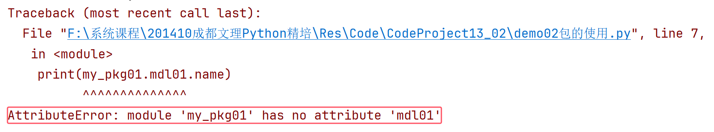
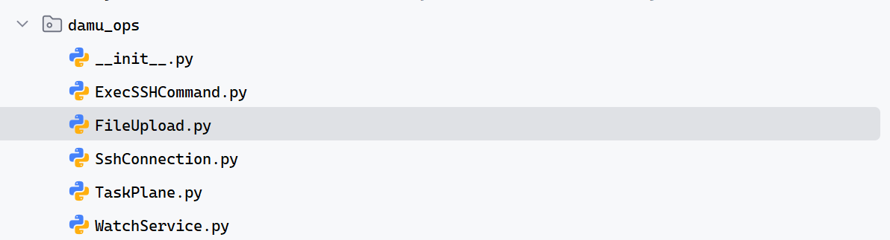
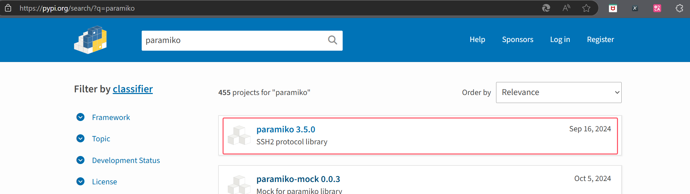
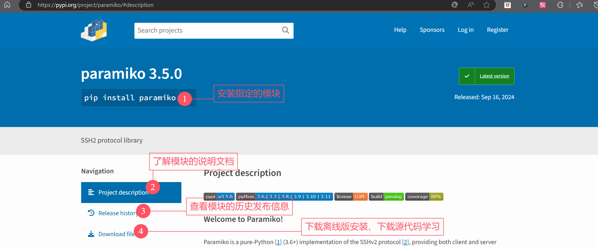
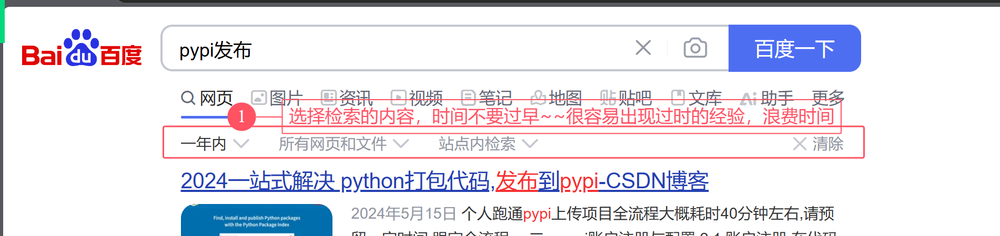

## 第七章：自定义模块

### 7.1、 自定义模块

#### （1） 认识模块

模块：英文单词module，所有编程语言中都有模块的概念，主要是为了提高**业务代码的复用性**！如-远程连接和执行命令的功能，可以将这个功能封装成模块，在需要的地方直接调用！

---

Python中对模块进行了更加友好和精确的定义，需要从两个部分去理解和学习：

① 广义上来说，从**业务层面**，封装了功能的代码文件(1个或者n个)都称为模块，每个独立的功能或者每个集成的功能都可以称为一个模块

- `import random`：封装了和随机数相关的功能，称为 随机数模块
- `import os`：封装了和系统文件、路径等交互的功能， 称为 系统模块
- 和别人讨论的时候，都称为模块，不论是跟不懂技术的人/搞技术的小伙伴，讨论需求实现的时候，不论是封装的单个文件/包含多个文件的文件夹，都直接称为模块即可！

② 狭义上来说，从**语法层面**，Python中将单个`.py`文件称为一个**模块**，将包含了多个`.py`文件的文件夹称为**包**

- 模块，module，描述了一个独立的python文件
- 包，package，包含了相同和相似功能的多个python文件的文件夹
- 自己开发/编写文档的时候，一定要严格的区分包和模块，它们的语法和应用方式有很大的区别

#### （2） 模块和包

##### 模块

模块，module，Python中将一个独立的`.py`文件称为一个独立的模块；模块一般用于封装一个完整的功能，需要使用的时候被导入使用！

**模块封装语法**

- 文档注释：说明模块的作者、版本、开发时间、作者联系方式、模块的用途
- 功能使用的变量：模块的顶部声明当前封装的功能需要的各种变量数据
- 功能需要的函数
- 当前模块的测试代码：测试代码一定要包含在`if __name__== "__main__":`条件中，避免代码错误执行

```python
"""
自定义模块
author: 大牧
version: 1.0.0
dev_time: 2024-11-10
email: damu@aliyun.com
description: 这是一个介绍作者信息的模块
"""
# 声明变量
author = "大牧老师"
# 约定-下划线开头的变量或者函数，都是受保护的；外部尽量不要访问
_version = "1.0.0"

# 声明函数
def say_hello():
    print("大牧老师向您问好")

def get_version():
    return _version

# __name__ 特殊魔法属性
# 当前模块直接运行，__name__的值是"__main__"
# 当前模块被其他模块引用，__name__的值是 模块名(my_module)
# print(__name__)
if __name__ == "__main__":
    # 需要对模块代码进行测试，代码是否可用
    print(author)
    say_hello()
```

**模块的导入语法**

```python
"""
测试模块的语法
"""
# 导入模块（会自动执行模块中的代码）
import my_module

# 使用模块中的变量
print(my_module.author)
# 使用模块中的函数
my_module.say_hello()

```

##### 包

包，英文单词package，Python语法中为了合理的整理多个/大量模块，将功能接近/相似/相同的模块，放到一个文件夹中进行统一管理，方便后期的扩展和维护

**包定义语法和格式**

- 包：本质上是一个普通文件夹，注意-内部包含一个`__init__.py`声明文件，这个文件中的代码在包被导入的时候会自动执行，称为包的声明文件
- 包的创建：可以手工创建普通文件夹(Directory)然后内部创建`__init__.py`文件；也可以直接创建一个python包的格式`Python Package`自动构建一个包
- 包中的模块：就是普通模块，模块语法参考上一节的模块声明语法


**包的引入和使用**

包的引入方式主要有三种，分别有不同的操作注意事项

① 直接引入包

语法

```python
import 包
```

注意

- 要使用包中的模块，必须在包的`__init__.py`中使用`import 包中具体模块`语法，被导入的模块才能在外部代码中访问到，也就是使用`包.模块.变量/函数()`访问

② 引入包中的模块

语法

```python
from 包 import 模块
```

注意

- 要正常的使用模块，必须使用包中的`__init__.py`内部使用`from . import 模块/*`导入，或者使用`__all__`列表中包含要使用模块的名称；才可以在外部代码中访问模块`模块.变量/函数()`

③ 引入包中的所有内容

语法

```python
from 包 import *
```

注意

- 要正常使用包中包含的所有内容，必须在包的声明文件`__init__.py`中使用`__all__`魔法列表包含可以被通配符导入的模块，这些被定义的模块才能在外部代码中正常使用

**包的使用问题总结**

现阶段开发脚本/应用，直接使用高级工具Pycharm，但是需要注意的是-一旦设计到高级开发，自定义模块和包的时候，这些高级工具不一定能访问到你的开发环境，导致应用文件夹中的模块或者包中的模块找不到的情况出现



有必要的时候，需要手工干预：鼠标右键点击 包文件夹，选择`Mark Directory As -> Sources Root`标记过的文件夹会在工具中自动添加到代码模块的搜索队列，就可以找到对应的文件了！

#### （3） 适用场景(总结)

模块：经常用于封装**功能小脚本**

- 示例：封装一个日志记录模块：my_logging

```python
import logging
import datetime
import os

class CustomLogger:
    def __init__(self, log_name):
        self.log_name = log_name
        self.log_folder = "log"
        if not os.path.exists(self.log_folder):
            os.makedirs(self.log_folder)
        self.logger = self.setup_logger()

    def setup_logger(self):
        logger = logging.getLogger(self.log_name)
        logger.setLevel(logging.INFO)

        # 控制台处理器
        console_handler = logging.StreamHandler()
        console_handler.setLevel(logging.INFO)

        # 文件处理器
        file_handler = logging.FileHandler(os.path.join(
            self.log_folder, f"{self.log_name}_{datetime.date.today()}.log"))
        file_handler.setLevel(logging.INFO)

        # 日志格式
        formatter = logging.Formatter(
            '%(asctime)s - %(name)s - %(levelname)s - %(message)s')
        console_handler.setFormatter(formatter)
        file_handler.setFormatter(formatter)

        logger.addHandler(console_handler)
        logger.addHandler(file_handler)

        return logger

    def log_info(self, message):
        self.logger.info(message)

    def log_error(self, message):
        self.logger.error(message)
```

包：经常用于构建自己的**脚本库**

- 从事云原生工作，经常需要远程连接执行命令、远程实现文件上传下载，远程检测服务等等

- 创建一个脚本库：damu_ops/，内部包含了各种功能的模块



### 7.2、 模块发布

Python之所以强大，全球的开发者都在给Python做贡献，将自己业务范围的功能模块开发完成后上传到社区共享，以后的工作中需要的大量功能模块，几乎99%都可以从社区找到，实现用最少的代码实现工作任务！

#### （1） 管理社区

官方模块管理社区：$https://pypi.org$


可以针对搜索到的模块，进行下载、查看说明文档，使用模块实现工作任务



针对搜索到的模块，可以阅读说明文档、可以下载和学习源代码



#### （2） 发布模块

可以检索最近1年左右别人发布模块的经验，借鉴和学习，完成自己的模块/包的发布



检索到的比较可能有用的网页：

- CSDN博客：`https://blog.csdn.net/qq_51116518/article/details/138913856`
- 博客园：`https://www.cnblogs.com/ck-zscs/p/17948705`

学习并完成自己的测试模块的上传

上传结束的模块，测试下载到本地并且引入使用

#### （3） 阶段小考核

需求：某公司因为网站服务经常出现异常，需要你开发一个脚本对服务器上的服务进行监控；检测目标服务器上是否存在nginx软件(提供web服务的软件)，如果不存在则安装(服务器可能的操作系统Ubuntu24/RedHat9)；如果nginx软件存在则检查nginx服务是否启动，如果没有启动则启动该服务(为了确认是否启动成功，需要在自己浏览器中访问服务器ip地址对应的URL：$http://192.168.0.200$ 是否能看到nginx启动页面)

- 提示1：检测服务器操作系统，推荐命令：`uname -a`，从它里面提取关键字检测
- 提示2：unbutn安装命令`apt install 软件名称`，redhat安装命令`yum install 软件名称`
- 提示3：nginx是一个软件，启动之后就会是一个名称为nginx的服务，提供网站服务-启动之后能在80端口访问到一个默认页面`http://192.168.0.200:80`等价于`http://192.168.0.200`，因为`http://`协议默认端口-80端口；需要注意`https://`默认端口-443端口
- 提示4：结合自己训练的智能体，完成部分功能性代码的改造实现

参考代码：

```python
import paramiko
import sys

def check_and_manage_service(service_name, remote_host, username, password):
    # 创建 SSH 客户端
    ssh_client = paramiko.SSHClient()
    ssh_client.set_missing_host_key_policy(paramiko.AutoAddPolicy())

    try:
        # 连接到远程服务器
        ssh_client.connect(remote_host, username=username, password=password)

        ################ 在远程服务器上执行命令 ##################
        stdin, stdout, stderr = ssh_client.exec_command(f"uname -a")
        platform = stdout.read().decode('utf-8').strip()

        # 判断平台是 Ubuntu 24 还是 Red Hat 9
        if 'Ubuntu' in platform and '24' in platform:
            distro = 'Ubuntu 24'
        elif 'Red Hat' in platform and '9' in platform:
            distro = 'Red Hat 9'
        else:
            print("不支持的平台")
            return
        ################ 在远程服务器上执行命令 ##################
		
        ################ 检查软件是否存在 ################
        stdin, stdout, stderr = ssh_client.exec_command(
            f"sudo {distro} -c \"which {service_name}\"")
        if stdout.read().decode('utf-8').strip():
            print(f"{service_name} 已安装")

            ################ 检查服务是否运行 ################
            stdin, stdout, stderr = ssh_client.exec_command(
                f"sudo {distro} -c \"systemctl is-active {service_name}\"")
            service_status = stdout.read().decode('utf-8').strip()

            if service_status == 'active':
                print(f"{service_name} 服务正常")
            else:
                # 启动服务
                stdin, stdout, stderr = ssh_client.exec_command(
                    f"sudo {distro} -c \"systemctl start {service_name}\"")
                print(f"已启动 {service_name} 服务")
        else:
            # 软件不存在，进行安装
            print(f"{service_name} 未安装，正在安装...")
            if distro == 'Ubuntu 24':
                stdin, stdout, stderr = ssh_client.exec_command(
                    'sudo apt-get update')
                stdout.read()  # 等待命令执行完成

                stdin, stdout, stderr = ssh_client.exec_command(
                    f"sudo apt-get install {service_name}")
                stdout.read()  # 等待命令执行完成
            elif distro == 'Red Hat 9':
                stdin, stdout, stderr = ssh_client.exec_command(
                    f'sudo yum install {service_name}')
                stdout.read()  # 等待命令执行完成

            # 安装完成后启动服务
            stdin, stdout, stderr = ssh_client.exec_command(
                f"sudo {distro} -c \"systemctl start {service_name}\"")
            print(f"已安装并启动 {service_name} 服务")
    except Exception as e:
        print(f"连接远程服务器时发生错误: {str(e)}")
    finally:
        # 关闭 SSH 连接
        ssh_client.close()

if __name__ == "__main__":
    if len(sys.argv)!= 4:
        print("请提供服务名称、远程主机、用户名和密码作为参数")
        print("命令格式：python desrv.py 服务名称 主机IP 账号 密码")
        sys.exit(1)

    service_name = sys.argv[1]
    remote_host = sys.argv[2]
    username = sys.argv[3]
    password = sys.argv[4]

    check_and_manage_service(service_name, remote_host, username, password)
# python 脚本名称  服务名称  远程主机IP  登录账号  登录密码
# python desrv.py nginx 192.168.0.200 root root
#
# nginx 软件名称，服务名称一致；上述脚本可以直接进行操作
# mysql数据库  软件名称、服务名称不一致，思考-应该如何处理？
```

