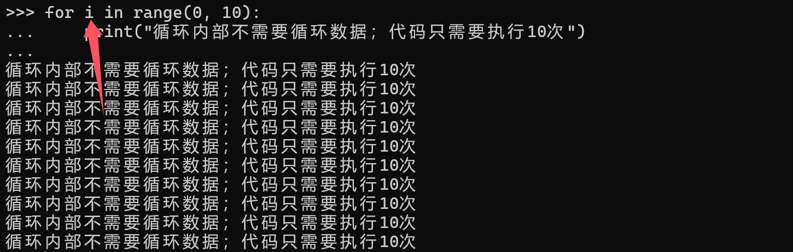

## 第九章：高级语法进阶

### 9.1、 基础语法拓展

#### （1） 单下划线

Python语法中的一个特殊的保留字符：`_`，在不同的应用场景中起到了一些关键的作用

##### 终端-临时变量

脚本开发时，对一些语法经常会用到Python命令终端，对简单的代码/语法进行可用性测试

① 启动命令终端：运行窗口中输入`python`


② 进入命令终端，可以直接使用python代码


③ `_` 特殊保留字符，在命令终端中用于保留最后一次表达式执行的结果

- 进行代码测试的时候非常好用，当我们测试的代码并没有进行变量赋值时，如果要使用上一次表达式运行的结果，可以直接使用`_`获取上一次表达式执行的结果
- 注意：命令终端中，只有执行了某个表达式，`_`符号中才会存储对应的数据；否则会提示未定义


##### 数据占位

如果从序列数据中提取部分数据使用，最基础的操作就是将序列数据同时赋值多个变量


此时可以使用`_`符号进行占位，该符号占位的数据约定是被忽略的数据


##### 临时变量

有些场景中，被循环的数据不重要，需要的是循环的次数！

为了让循环的代码可读性更好，可以使用 `_` 占位当成临时变量，表示循环的数据可以忽略/不参与业务！



编码规范中，只要声明的变量都应该被使用！为了提到代码的可读性 - 明确代码结构，循环中不需要循环的数据，可以使用单下划线`_`替代，表示该数据被忽略


##### 约定私有

进行模块代码封装时，单下划线可以和变量、函数组合使用；代码规范中约定了单个下划线开头的变量、函数或者其他数据都是当前模块私有的，外部尽量不要访问！

```python
# my_module.py
name = "功能模块"  # 可以被外部使用
_message = "消息信息"  # 约定不能被外界使用

def say_hello():   # 可以被外部使用
    pass

def _get_info():   # 约定不能被外界使用
    pass
```

模块具体的导入使用时，会看到如下的访问警告信息：


##### 数值分隔

Python语言的一个非常重要的场景是用于数据处理，当出现数值较大的数据时，可以借助 `_` 用于提高数值的可读性


#### （2） is和==

Python中操作数据时，经常需要判断两个变量中存储的数据是否一致，会出现两种情况

- 两个变量，是独立的两个数据，它们的值相同
- 两个变量，存储的是同一个数据，所以它们值也想通

脚本开发中，很多场景中需要判断两个变量中仅仅是值相同，还是同一个数据

- 值相同：操作符号- 等值判断符号 $==$
- 同一个对象：操作符号- 身份运算符 $is$

##### 数值等值判断

**终端执行**


终端执行的内存分析

- n1和n2因为数据的特殊性，所以 值相等，同时 n1和n2是同一个对象数据
- n3和n4赋值的时候，n3=1000就会在静态起申请内存赋值1000(因为在终端运行，终端中每行代码都会申请一个独立的内存空间)；n4=1000的时候在一个新的内存空间-静态区赋值1000；n3和n4值相同(`==`)；但是n3和n4不是同一个对象(`is`)


**Pycharm执行**


Pycharm执行内存分析

- python一个模块运行时，这个模块中的代码共享同一份内存；
- n3=1000时，会在当前内存空间静态区(为了提高数值复用性)申请内存空间赋值1000；
- n4=1000时，首先会在当前内存空间静态区搜索是否有空间存储了1000；如果没有-创建新的空间；如果存在一个空间已经存储了1000数值，就直接将这个内存地址赋值给n4
- n3==n4判断值是否相等得到结果True，n3 is n4判断是否同一个对象得到结果也是True


结果总结：

- Python中针对整数数据进行了优化，脚本中经常用到的-5~256的整数在同一个解释器中，不论在什么地方运行代码，它们在内存中提前被保存在静态区；
- Python终端运行代码，每行代码都是一个独立的执行单元；Pycharm中运行python代码-执行了一个python模块，每个运行的独立模块是一个独立的执行单元

##### 复杂数据等值判断

不论是终端，还是Pycharm，运行结果是一致的：


内存分析：复杂数据，在内存中是创建在堆内存中的！

- 注意：复杂数据的多样性，无法确认哪些复杂数据是可以被复用的，所以被创建在堆内存中
- 列表对象，被创建在堆内存中，每次声明一个新列表-都会在堆内存中重新创建一个新对象
- ls1 == ls2：只要列表中的数据相等，这个结果就是True
- ls1 is ls2：只要是复杂数据，不论是否是列表，每次声明的结果都是新的对象，所以结果False


##### 字符串等值判断

任何编程语言中，字符串都是被频繁使用的，所以近代编程语言-内存模型大同小异(都包含栈内存、堆内存、静态区...)

字符串因为被复用的频率很高，所以一般都是在静态区/常量区分配内存；

Python中，终端执行字符串、Pycharm中执行的字符串，执行结果竟然出现了一致性！！

**第一种情况**：存在差异性


**第二种情况**：竟然出现一致的结果


思考：为什么字符串的操作，会出现这样的差异？

##### 总结

等值判断，是脚本/应用开发中，使用数据的一个非常频繁的操作，只需要关注

- `==`：判断的是符号两侧的数据，数据值是否相同
- `is`：判断的是符号两侧的数据，内存中地址是否相同

#### （3） 深浅拷贝

Python中(任意编程语言中)，都需要实现数据复用！复用一个数据，通过多个变量操作数据的时候，会产生如下的情况：

- 某个变量操作一个数据，导致保存这个数据的所有变量都发生了变化
- 某个变量操作一个数据，其他保存这个数据的变量不受影响

上面的情况都会遇到，不同的需求中上面的两种情况都需要掌握！

Python语法中，提供了三种数据复用的语法：

- 引用赋值：多个变量存储的是同一份数据
- 浅拷贝：多个变量存储的数据 - 第一层不同，深层数据相同
- 深拷贝：多个变量存储的数据，是完全独立的数据

##### 引用赋值

**概念**

通过变量的赋值方式，将一个变量中存储数据的内存地址，赋值给另一个变量；

多个变量可以操作同一个内存地址中的数据

**特点**

多个变量，任意变量操作的数据，都会对其他变量产生直接影响

**代码**

```python
a = 12
b = a  # 引用赋值(不可变数据 不受影响)
b = 100
```

```python
x = [1,2,3]
y = x   # 引用赋值(可变数据受影响)
y.append(4)
print(x) # [1,2,3, 4]
print(y) # [1,2,3, 4]
```

**内存**

引用赋值：内存层面，让多个变量指向同一个对象

- 不可变数据-多个变量修改数据不会互相影响
- 可变数据-多个变量修改数据-互相影响


##### 浅拷贝

**概念**

浅拷贝，就是复制数据，将数据单独复制一份进行操作；

- 拷贝：复制

**特点**

被复制的数据，只**复制数据内部**的**内存地址**

一旦被复制的数据(包含可变数据)通过内存地址修改数据，多个变量之间就会产生影响

**代码**

```python
ls1 = [1, 2, ["a"]]
# 浅拷贝
ls2 = ls1.copy()
# ls2操作不可变数据 - 不会互相影响
ls2.append(3)
print(ls1) # [1, 2, ["a"]]
print(ls2) # [1, 2, ["a"], 3]
# ls2操作可变数据，- 互相影响
ls2[2].append("b")
print(ls1) # [1, 2, ["a", "b"]]
print(ls2) # [1, 2, ["a", "b"], 3]
```

**内存**

浅拷贝发生时，复制了数据内部的内存地址，堆内存中创建一个新的数据赋值给lst2新的变量，新的数据内部保存的都是数据的内存地址；

- 新的变量lst2操作不可变数据(lst2.append(3))时，对原有的lst1不会影响
- 新的变量lst2操作可变数据(lst2[2].append("b"))时，对原有的lst1 产生影响


##### 深拷贝

**概念**

深拷贝：将目标数据进行深度赋值，完全赋值一个独立的数据进行操作

**特点**

被拷贝/复制的的数据赋值给不同的变量，多个变量之间操作数据互相之间完全没有影响

- 一旦考虑数据的复用，并且包含可变数据的情况下，要实现多个复制的数据互相完全没有影响，需要使用深拷贝

**代码**

```python
# 导入内置 深拷贝函数
from copy import deepcopy

ls1 = [1, 2, ["a"]]
# 深拷贝
ls2 = deepcopy(ls1)

# 操作不可变数据
ls2.append(3)
print(ls1)  #  [1, 2, ["a"]]
print(ls2)  #  [1, 2, ["a"], 3]
# 操作可变数据
ls2[2] . append("b")
print(ls1)  #  [1, 2, ["a"]]
print(ls2)  #  [1, 2, ["a", "b"], 3]
```

**内存**

深拷贝模式下，将目标数据复制一份；检测数据内部被复制的内存地址，将内存地址指向的数据也会独立复制一份；保持被复制的数据和原本的数据之间完全的独立性！

- 被复制的数据ls2操作不可变数据，不会对原有数据产生影响
- 被复制的数据ls2操作可变数据，不会对原有数据产生影响


#### （4） 推导式

##### 什么是推导式

概念：按照指定的规则或者条件，生成序列数据保存到列表中！

特点：满足条件的数据，避免了手工操作，而是通过推导式语法，可以自动生成

示例：自动扫描192.168.0.2~192.168.0.5 这个IP地址段

```python
# 手工操作
ips = ["192.168.0.2","192.168.0.3","192.168.0.4","192.168.0.5"]
```

```python
# 推导式操作
>>> ips = [f"192.168.0.{x}" for x in range(0, 20)]
>>> ips
['192.168.0.0', '192.168.0.1', '192.168.0.2', '192.168.0.3', '192.168.0.4', '192.168.0.5', '192.168.0.6', '192.168.0.7', '192.168.0.8', '192.168.0.9', '192.168.0.10', '192.168.0.11', '192.168.0.12', '192.168.0.13', '192.168.0.14', '192.168.0.15', '192.168.0.16', '192.168.0.17', '192.168.0.18', '192.168.0.19']
```


##### 推导式语法

基本语法：通过循环和条件判断，循环/重复生成多个数据保存到列表中，成为列表推导式

- 思考：有没有字典推导式？有没有集合推导式？有没有元组推导式？

```python
变量 = [ 临时变量 for 循环 if 条件]
```

代码示例：

```python
# 1. 基本语法：直接循环生成目标数据
>>> n1 = [x for x in range(0, 10)]
>>> n1
[0, 1, 2, 3, 4, 5, 6, 7, 8, 9]
>>>
# 2. 扩展语法：通过if条件，提取符合条件的数据
>>> n2 = [x for x in range(0, 10) if x % 2 == 0]
>>> n2
[0, 2, 4, 6, 8]
>>> 
# 3. 高级语法：生成数据-和其他字符组合使用
>>> n3 = [f"test_{x}" for x in range(0, 10)]
>>> n3
['test_0', 'test_1', 'test_2', 'test_3', 'test_4', 'test_5', 
 'test_6', 'test_7', 'test_8', 'test_9']
>>>
# 4. 特殊语法：组合循环
>>> n4 = [(x,y) for x in range(1,4) for y in ["a", "b", "c"]]
>>> n4
[(1, 'a'), (1, 'b'), (1, 'c'), (2, 'a'), (2, 'b'), (2, 'c'), (3, 'a'), (3, 'b'), (3, 'c')]
```

#### （5） 生成器

##### 什么是生成器

生成器，按照一定的规则或者条件，得到一个获取数据的对象！这个对象就成为生成器！

生成器 - 推导式 代码: 从使用角度，生成器和推导式结果是一致！

```python
>>> s1 = [x for x in range(0, 10)]
>>> s2 = (x for x in range(0, 10))
>>>
>>> s1
[0, 1, 2, 3, 4, 5, 6, 7, 8, 9]
>>> s2
<generator object <genexpr> at 0x000001E4A56CF4C0>
>>>
>>> for i in s1: print(i, end="  ")
...
0  1  2  3  4  5  6  7  8  9  
>>>
>>> for i in s2: print(i, end="  ")
...
0  1  2  3  4  5  6  7  8  9  
>>>
```

生成器 - 推导式 - 差异

- 需求1：需要10个IP地址进行测试，选择推导式？生成器？
- 需求2：需要20000000(2KW)数据用于测试，选择推导式？生成器？

- 选择的依据：谁消耗内存少就选谁！

需求1的情况：

- 少量数据：推导式占用184字节；生成器占用200字节
- 推荐使用推导式


需求2的情况：

- 推导式占用内存：160552600字节；生成器占用内存200字节
- 推导式将数据，直接生成后保存在列表中，每个数据-占用了具体内存空间，数据越多占用内存越多
- 生成器是一个获取数据的对象，和当前解释器环境有关，堆内存中分配这个基础对象需要多少个字节~不论生成器最终生成的结果数据是0个还是n个，这个对象占用的内存空间都是固定的，如上述代码中就占用了200字节
- 海量数据测试数据/不明确数量的数据使用：推荐使用生成器；如`os.walk(path)`查看指定目录中的所有文件(包括子目录中的文件，不明确这个目录中到底有多少个文件，为了节省内存使用了生成器)


##### 生成器语法

生成器语法

参考 列表推导式语法！

思考：有木有字典生成器？集合生成器？

#### （6） 迭代对象和迭代器

问题：为什么for循环能遍历字符串？列表？序列数据？为什么不能遍历整数？

- 字符串数据、列表数据、其他序列数据，都属于Iterable类型，也就是可迭代类型，所以可以被for循环遍历；这些可以被for循环遍历的对象数据，统称为 **可迭代对象**，属于 `collections.abc.Iterable`类型
- 整数数据，不属于可迭代类型，所以不能被 for循环遍历


> :memo: 扩展：类型运算符 instance(a, A)：判断对象a是否属于A类型

##### 可迭代类型

Python中内置类型：`colllections.abc.Iterable`

- 字符串s，属于可迭代类型
- 整数i，不属于可迭代类型


可迭代类型可以被for循环遍历，是因为可迭代类型的对象，内部包含了一个**迭代器**

- 迭代器，可以获取下一个对象数据！
- 迭代器-就类似序列数据中的一个计数器，才能将序列数据中的每个数据依次取出进行遍历

##### 迭代器

Python中内置类型：`colllections.abc.Iterator`

每个可迭代对象中，都会包含一个迭代器(对象)，获取迭代器的语法

```python
# 内置函数
迭代器 = iter(可迭代对象)

# 魔法函数
迭代器 = 可迭代对象.__iter__()
```

代码示例

```python
>>> s = "abcdef"
>>> d1 = iter(s)
>>> d2 = s.__iter__()
>>>
>>>
# Iterable ：可迭代类型
# Iterator：迭代器类型
>>> from collections.abc import Iterable, Iterator 
>>>
>>> isinstance(d1, Iterator)
True
>>> isinstance(d2, Iterator)
True
```

##### 适用场景

迭代器用法

- **next()内置函数**，获取下一个数据(**状态记录**，可以记录已经获取到的位置)
- for循环遍历，和可迭代对象没有差异

```python
>>> next(d1)
'a'
>>> next(d1)
'b'
>>> for x in d1:print(x , end = "  ")
...
c  d  e  f  
>>>
```

适用场景

- 如果只是数据遍历数据，直接使用可迭代对象
- 如果需要记录状态进行精确控制，推荐获取迭代器对象并应用
- **注意：高级开发中-需要自自定义可迭代对象！**

|     可迭代对象     | 迭代器对象             |
| :----------------: | ---------------------- |
|  for循环可以遍历   | for循环可以遍历        |
|     包含迭代器     | 属于可迭代对象         |
|   无法做状态记录   | **可以记录当前状态**   |
| 无法获取下一个数据 | **可以获取下一个数据** |


### 9.2、 函数语法拓展

#### （1） 函数参数引用传递

##### 问题分析

观察下面的代码，猜测输出结果，并说明原因！

- 位置1：**1200 ["A"]**
- 位置2：1000  ["A", "B"];   1200  ["A"];  **1200  ["A", "B"]**

```python
# 声明了两个变量
a = 1200
b = ["A"]

# 函数修改值操作
def fn(x, y):
    # 修改了全局变量的数据
    x = 1000
    y.append("B")

# 打印输出结果
print(a, b)  # 位置1
# 调用函数修改数据
fn(a, b)
# 打印输出结果
print(a, b)  # 位置2

```


##### 参数引用传递

上述代码中，通过调用函数修改数据，得到的结果-a的数据没有变化；b的数据发生了变化；内存中到底发生了什么事情才能得到这样的一个结果？

① 完成a和b变量的赋值，调用函数时需要将a,b变量的数据传递给函数fn(x,y)中的形式参数x,y

- 语法：x,y属于位置参数：实际参数按照参数顺序，依次将自己的数据赋值给x,y变量
- 内存：调用函数fn(a,b)时，内存中是将a,b变量中存储的内存地址，传递给了x,y参数变量；可以在函数中通过x访问变量a的数据，通过y可以访问变量b的数据


② 函数内部修改数据

- x变量和a变量存储的内存地址一致；当x=1000的时候-x变量对应的内存地址无法修改内部的数据(整数不可变数据)底层只能创建一个新的内存空间(存1000)，将新的内存地址赋值给x变量；期间-并没有操作过a变量-a变量中存储的原地址不变
- y变量和b变量存储的内存地址一致；当y.append("B")-y对应的内存中存储的列表对象-新增了一个数据(列表属于可变类型)，修改完数据之后y变量中的内存地址并没有发生变化，和b变量内存地址还是一致的！y修改数据影响了b变量对应数据


观察上述代码的执行结果，Python中函数参数的传递情况如下：

- 函数参数传递数据，实际参数 本质上是将数据的内存地址 传递给了形式参数
- 函数内部-通过形式参数访问数据，访问的是内存地址
- 有影响：传递的参数数据是可变类型
- 无影响：传递的参数数据是不可变类型


③ 修改函数中的代码，思考输出结果

```python
# 声明了两个变量
a = 1200
b = ["A"]

# 函数修改值操作
def fn(x, y):
    # 修改了全局变量的数据
    x = 1000
    # y.append("B")  # 修改y对应的内存地址中的数据 - 对b有影响
    y = ["A", "B"]   # 创建了新的列表-对应新的内存地址，复制给y；对b没有影响

# 打印输出结果
print(a, b)  # 位置1
# 调用函数修改数据
fn(a, b)
# 打印输出结果
print(a, b)  # 位置2

```

对应的内存分析如图所示：如果函数内部`y = ["A", "B"]`的操作，就是下面内存分析图中的y对应的绿色线条建立，同时断开红色线条；所以y值的变化对b变量不会产生影响


##### 总结

Python中函数中的参数数据传递的时候：

- 将实际参数的数据对应的内存地址，传递给形式参数！
- 函数内部可以通过形式参数，访问实际参数的数据！

所以，Python中函数调用时，实际参数将数据传递给形式参数的方式只有一种：引用传递

- 引用：表示内存地址

> :warning: 注意：关于值专递和引用传递
>
> Java语言中，内存模型和Python内存模型有点差异；Java中将基础类型的数据直接保存在栈内存中，Java中调用方法/函数实际参数给形式参数传递数据，出现了两种情况：
>
> - 值传递：传递基础数据
> - 引用传递：传递对象数据
>
> 

#### （2） 函数递归调用

##### 认识递归调用

递归，英文单词recursion，描述了一种函数的特殊调用方式；

- 在一个函数的内部，调用自身！
- 目的：**实现函数内部业务逻辑复用**！

代码示例：重复输入的问题

```python
def reg_username():
    username = input("请输入账号(长度6~12)：")
    if not 6 <= len(username) <= 12:
        input("账号长度不合法，按任意键请重新输入")
        # 递归调用：函数内部调用自己
        return reg_username()
    print("合法的注册账号：", username)

reg_username()
```

代码示例：求解斐波那契数列

- 数列特点：1， 1， 2， 3， 5， 8， 12，... (n-1)+(n-2)...
- 通过递归方式解决问题，尤其是有规律的问题，语法上非常简单！

```python
# 2. 递归解决问题
# 斐波那契数列：1，1，2，3，5，8，13，21，34，55，89...
def fib(n):
    if n == 1 or n == 2:
        return 1
    else:
        return fib(n-1) + fib(n-2)

print(fib(3))
print(fib(10))
print(fib(20))

```

##### 递归的好处

递归，能让重复的业务流程，编写代码的时候更加**容易理解和编写**

如：计算n的阶乘

- n! = n * (n-1) * (n-2) .. 2 * 1
- 梳理计算逻辑：n阶乘 = n * （n-1）阶乘

```python
def fac(n):
    if n == 1:
        # 注意：当n为1的时候，直接得到结果1；不需要继续计算
        return 1
    # n的阶乘 = n*(n-1)阶乘
    return n * fac(n-1)

print(fac(2))
print(fac(3))
print(fac(4))
```

##### 认识递、归过程

函数递归调用，区分了两个过程：

- 递：将数据依次传入的过程
- 归：将结果依次返回的过程

以计算n的阶乘为例，递归过程如图所示：


计算斐波那契数列的递归过程如图所示：


注意：递归函数的调用，如果没有控制好递归过程，非常消耗**计算资源**和**内存空间**

##### 递归内存分析

递归过程 也会大量消耗内存资源，如上述计算n阶乘的操作，内存中的对象数据分布情况如图所示：


再如上述斐波那契数列的计算过程，内存操作过程如图所示；

- 一旦控制不好递归的操作界限，和容易造成严重的问题(内存被消耗光，程序直接挂死)


##### 递归适用场景

通常对于实际需求而言，如果一个数据结果的计算是需要执行重复的流程，首先推荐循环实现，但是如果这个计算过程比较繁琐~可以考虑递归，但是一定要明确这个重复过程一般不超过10次！

- 递归：可以简化业务流程，让代码的实现和阅读都大幅度提升
- 注意：一定要注意递归导致的计算资源和内存空间的严重浪费，不同的项目组对递归有严格的要求

注意：在Python中除了项目规范对递归有要求，也可以通过代码对递归进行限制

```python
>>> import sys
>>> sys.getrecursionlimit()
1000
>>> sys.setrecursionlimit(10)
>>> sys.getrecursionlimit()
10
```


#### （3） 偏函数的效益

##### 脚本需求

需求：某公司小李开发了一个功能函数，可以将目标数据转换成对应的进制

```python
def covert_num(x, base):
    """进制 转化"""
    if base == 2:
        return bin(x)
    elif base == 8:
        return oct(x)
    elif base == 16:
        return hex(x)
    else:
        return "没有这个进制"

print(covert_num(10, 16))
print(covert_num(8, 2))
print(covert_num(255, 2))
print(covert_num(19, 8))

```

上述代码的功能性正常，但是企业要求更高：

- 问题1：每次转换进制，都需要手工输入对应的进制，调用麻烦
- 问题2：每次调用这个函数，需要了解一下参数的含义才能明确要传递什么数据
- 问题3：函数使用的时候，2进制转换比较多的，其他进制转换比较少；2进制转换也需要传递base=2比较麻烦


##### 认识偏函数

解决问题3：对于经常使用2进制转换，可以通过函数参数的默认值进行解决

```python
def covert_num(x, base=2):
    """进制 转化"""
    if base == 2:
        return bin(x)
    elif base == 8:
        return oct(x)
    elif base == 16:
        return hex(x)
    else:
        return "没有这个进制"

print(covert_num(10, 16))
print(covert_num(8)) # 默认转换2进制
print(covert_num(255,)) # 默认转换2进制
print(covert_num(19, 8))

```

对于问题1和问题2：需要将函数进行改造才能实现

- 手工封装多个函数，实现对原有函数的扩展！

```python
def covert_num(x, base):
    pass

def covert_num_2(x):
    return covert_num(x, base=2)
def covert_num_8(x):
    return covert_num(x, base=8)
def covert_num_16(x):
    return covert_num(x, base=16)

print(covert_num_16(10))
print(covert_num_2(8)) # 默认转换2进制
print(covert_num_2(255,)) # 默认转换2进制
print(covert_num_8(19))

```

功能：偏函数，解决函数调用多样性的问题，通过给函数添加额外的参数，解决函数的可用性、可读性！

```python
# 偏函数的扩展
from functools import partial

covert_num_2 = partial(covert_num, base=2)
covert_num_8 = partial(covert_num, base=8)
covert_num_16 = partial(covert_num, base=16)

print(covert_num_16(10))
print(covert_num_2(8)) # 默认转换2进制
print(covert_num_2(255,)) # 默认转换2进制
print(covert_num_8(19))

```

> :memo: 如果用lambda表达式改造？
>
> - 原本的转换代码：covert_num_16 = partial(covert_num, base=16)
> - lambda表达式：covert_num_16 = lambda x: covert_num(x, base=16)

#### （4） 闭包和装饰器

##### 问题分析

需求：某公司员工小张，开发了自己的脚本库，但是最近脚本运行出现了一些问题，需要对脚本中的函数进行监控，记录函数执行的状态、记录函数执行的时间；

```python
# 小张脚本
def serv_01():
    # 记录开始状态、开始时间
    print("serv_01处理功能")
    # 记录结束状态，结束时间
    # 计算总耗时

def serv_02():
    print("serv_02处理功能")

def serv_03():
    print("serv_03处理功能")

def serv_04():
    print("serv_04处理功能")


serv_01()
serv_02()
serv_03()
serv_04()

```


##### 解决方案

常规解决方案，就是逐个函数进行编码

- 事情紧急的情况下，没有更好的方案，手工操作也是一种折中的方案！先动起来！

```python
# 小张脚本
import time
def serv_01():
    start = time.time()
    print("记录开始状态")
    print("serv_01处理功能")
    time.sleep(0.5)
    print("记录结束状态")
    print(f"总耗时：{time.time() - start}ms")

def serv_02():
    print("serv_02处理功能")

def serv_03():
    print("serv_03处理功能")

def serv_04():
    print("serv_04处理功能")


serv_01()
serv_02()
serv_03()
serv_04()

```


##### 认识闭包

**闭包**：英文单词closure，Python函数式开发中的一种高级语法

- 特点：函数的内部声明的函数！

**基本语法**

```python
def outer():
    """外部函数"""
    msg = "外部函数局部变量"
    
    def inner():
        """内部函数：闭包函数"""
        print("msg:", msg)
       
    # 返回内部函数的引用
    return inner
```

**闭包特点**

- 函数内部声明的函数
- 内部函数使用了外部函数的局部变量
- 外部函数最后返回了内部函数的引用

**闭包作用**

- 延长局部变量作用域，让局部变量不再局限于一个函数内部
  - 局部变量：局部变量只能在当前函数内部访问，当前函数执行完成，局部变量立即销毁
  - 闭包 - 局部变量在函数执行期间被保留，可以在函数外部访问局部变量
- 闭包可以在不修改目标函数的情况下，给函数添加新的功能
  - 闭包的一种特殊语法：称为装饰器

##### 闭包应用-装饰器

**装饰器语法**

```python
def  装饰器名称(fn):
    """参数fn，是一个函数类型，表示目标函数"""
    def wrapper():
        print("目标函数执行之间添加的功能")
        # 执行目标函数
        fn()
        print("目标函数执行之后添加的功能")
    return wrapper
```

```python
@装饰器名称
def serv_01():
    print("执行serv_01功能")
    
serv_01()
```


**装饰器应用**

```python
import time
def timer(fn):
    """给目标函数计时的装饰器"""
    def wrapper():
        # 记录开始时间
        start = time.time()
        # 执行目标函数
        fn()
        # 记录结束时间
        end = time.time()
        print(f"总耗时：{end -start}ms")
    return wrapper

def status(fn):
    """记录状态装饰器"""
    def wrapper():
        print("开始执行")
        fn()
        print("执行完毕")
    return wrapper

```

```python
import time
# 小张脚本
# serv_01函数，添加了计时、记录状态功能
@status
@timer
def serv_01():
    time.sleep(0.5)
    print("serv_01处理功能")

# serv_02函数，添加了计时功能
@timer
def serv_02():
    print("serv_02处理功能")

# serv_03函数，添加了记录状态的功能
@status
def serv_03():
    print("serv_03处理功能")

def serv_04():
    print("serv_04处理功能")


serv_01()
print("-------------------------")
serv_02()
print("-------------------------")
serv_03()
print("-------------------------")
serv_04()

```

##### 闭包应用-延长作用域

小红打车，3公里内8元；超过3公里每公里2元，如果停车等待每分钟1.5元；

下面是小红的行程：行驶了5公里、等1分钟红灯、行驶2公里、堵车等待8分钟；继续行驶4公里到达目的地；

**① 使用传统语法，编写代码实现，通过全局变量实现**

```python
total = 0  # 总价格

def texi(k=0, t=0):
    """计费价格，k公里数，t分钟数"""
    global total
    # 此处编写代码.....
    
texi(k=5)
texi(t=1)
texi(k=2)
texi(t=8)
texi(k=4)
print("总费用：", total)
```

② 使用闭包语法，通过局部变量记录总费用(闭包-延伸了局部变量作用范围)

```python
def texi(k=0, t=0):
    """计费价格，k公里数，t分钟数"""
    total = 0  # 记录总费用
    # 此处编写代码
    ...
    
c = texi()
c(k=5)
c(t=1)
c(k=2)
c(t=8)
money = c(k=4)
print("总费用：", money)
```

#### （5） lambda匿名函数

##### 认识lambda表达式

Lambda表达式，是Python中提供的一种高级语法，可以将一些包含简单处理逻辑的函数，通过表达式进行提现，减少一些业务无关的代码，如：

```python
###################### 基础函数式实现
def addition(x, y):
    """计算x和y的和"""
    return x + y

s = addition(10, 20)
print(s)

###################### 表达式实现
# lambda表达式，赋值给add变量
add = lambda x, y: x + y

s2 = add(11, 22)
print(s2)

```


##### 匿名函数 & lambda表达式

很多编程语言中都包含了一个特殊语法：匿名函数

- 匿名函数：就是没有名称的函数
- 其他语言中有很多的称呼，如JavaScript中称为匿名函数也称为箭头函数

Python中本身没有匿名函数的概念，统一称为lambda表达式；后期版本中逐渐的将匿名函数的称呼引入到官方资料，所以Python中所谓的匿名函数表示的就是lambda表达式！

**lambda表达式基本语法**

```python
变量 = lambda 参数列表: 需要执行的代码，默认return返回
```

代码示例

```python
add = lambda x, y: x + y
```

**疑问：**

- 既然是单行代码的函数的简化语法，为什么我不直接写函数呢？

##### lambda表达式 和 高阶函数

lambda表达式，可以将函数直接放在一个表达式中呈现，所以可以和很多高阶函数一起使用

- 高阶函数：函数的参数中，可以接收函数的函数

需求1：获取指定列表中满足软件要求的账号

```python
s# lambda的应用(6<=账号<=12)
accounts = [
    "damu", "admin", "administrator",
    "manager", "xiaolizi", "dawang",
    "laoliu", "jianhouu", "lilixiu"
]
# 普通实现
# act = [] # 存放满足要求的账号
# for account in accounts:
#     if 6 <= len(account) <= 12:
#         act.append(account)
# print(act)


# lambda结合filter内置函数
act = [x for x in filter(lambda x: 6<=len(x)<=12, accounts)]
print(act)
```

需求2：获取到服务器的一系列指标数据，需要对这些指标数据进行排序

```python
# lambda表达式 结合 sort()使用
import random

nums = random.sample(range(10, 50), 30)
print(nums)

nums.sort(key=lambda x: -x)
print(nums)
```

需求3：对指定范围的列表数据进行求和，如计算0~100的和是多少？

```python
# lambda表达式 结合 reduce()
from functools import reduce
# [0,1,2....100]
nums = range(0, 101)

# 普通方式
t = 0
for i in nums:
    t += i
print(t)
# labmda表达式 结合 高阶函数
t2 = reduce(lambda x,y:x+y, nums)
print(t2)
```

#### （6） 总结

关于脚本的编写，大量封装功能函数，函数的可用性包含了很多的规范

- 见名知意：通过函数名称，能猜测到函数的基本功能，编写的代码的基础要求
- 结合业务：处理对应的功能时，函数往往和对应的业务有关联，需要将业务信息最好也包含到函数名称中，提高函数在脚本和应用中可读性/可用性；
- 函数冗余：相同功能的函数没有必要声明多个，但是相同功能的函数名称可以有多个，最好将频繁使用的函数，通过参数进行区分定义多个结合业务名称的函数，可以在脚本和应用中应用更加广泛！

如偏函数：就是一种函数名称冗余的操作，提高函数在脚本和代码中的可用性

- 任何高级语法，都是有底层基础语法实现的，即使没有这个高级语法，我们也可以通过基础语法实现对应的功能！
- 注意1：不要过渡依赖高级语法
- 注意2：学会对每个新学习的语法进行评估(优点、缺点)，才能选择更加合适的语法