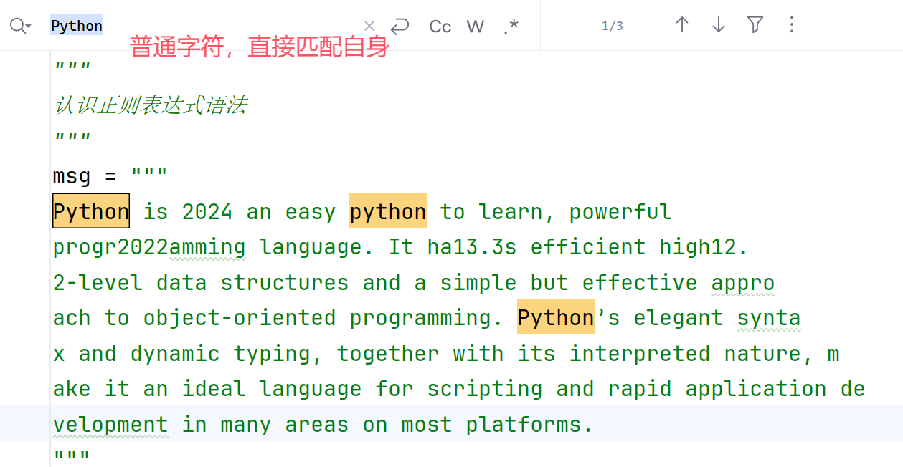
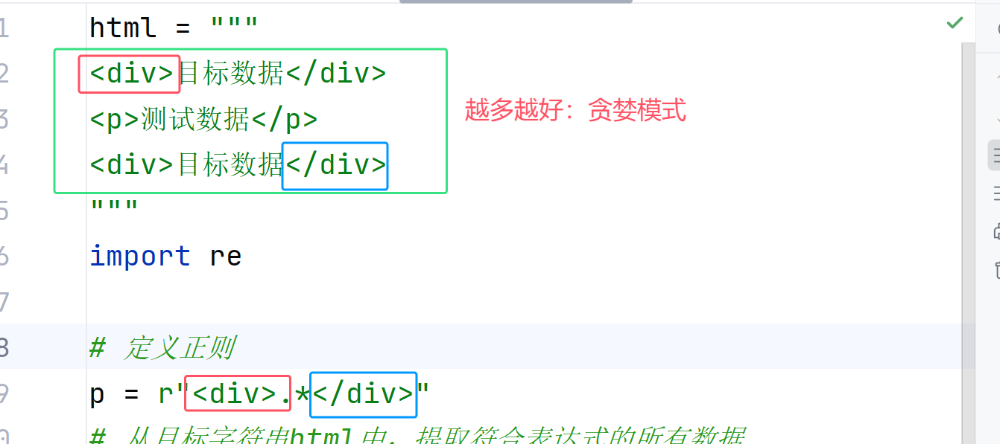

## 第十章：文件IO、正则

### 10.1、文件IO

#### （1） 概述

文件IO：编程语言中非常重要的语法之一，通过该语法实现和操作系统之间进行文件读写的操作！

- 文件IO：文件 Input / Output
- Input：输入，表示将文件中的数据输入到内存中，称为输入流
- Output：输出，表示将内存中的数据保存到文件中，称为输出流


#### （2） open()

Python中提供了一个内置函数`open()`实现了操作系统中文件的读写操作

##### 文件分类

任何操作系统中根据文件中内容的组成方式，通常将文件区分为两种类型：

- 字符类文件：内容数据底层通过字符组成；校验方式-使用记事本打开文件不会出现乱码！
  - 任何编程语言编写的源代码、各种文本配置文件、记事本文档...
- 字节类文件：内容数据底层通过字节/二进制组成；校验方式-使用记事本打开文件会出现乱码！
  - 图片、音频、视频...


##### 认识函数

open()函数可以用来操作字符/字节文件

```python
>>> help(open)
Help on built-in function open in module _io:

open(file, mode='r', buffering=-1, encoding=None, errors=None, newline=None, closefd=True, opener=None)
    打开一个文件 并且 返回一个 数据流(输入流或者输出流)； 如果打开失败会报错-OSError
    Open file and return a stream.  Raise OSError upon failure.

    file is either a text or byte string giving the name (and the path
    file参数 可以给定一个字节或者字符串的 文件路径，用于打开指定的文件

    mode is an optional string that specifies the mode in which the file
    mode参数 指定了文件的操作选项(如何操作文件)，操作选项如下表所示
    使用的时候：mode="wb" 表示打开一个字节文件并且向字节文件写入数据
    ========= ===============================================================
    Character Meaning
    操作字符   含义说明                                                      
    --------- ---------------------------------------------------------------
    'r'       open for reading (default)
              打开并且读取一个文件(默认)                                             
    'w'       open for writing, truncating the file first
              打开并且准备向文件写入数据；每次打开会清空文件内容                
    'x'       create a new file and open it for writing
              创建一个新的文件     并且准备向文件写入数据
    'a'       open for writing, appending to the end of the file if it exists
              打开/创建一个文件，并且向文件尾部追加写入内容
    -------------------------------------------------------
    'b'       binary mode
              操作二进制/字节文件
    't'       text mode (default)
              操作文本文件(默认)
    '+'       open a disk file for updating (reading and writing)
              打开一个磁盘文件进行更新操作(读取数据、写入数据)
    ========= ==============================================================
```

#### （3） 操作字符文件

① 打开一个字符文件，写入数据

```python
"""
文件IO
    打开字符文件，并且写入数据
"""
# 准备字符串数据
s = "hello python!"

# 1. 打开文件open("文件路径", "操作方式", "字符编码")
file = open("test01.txt", mode="wt", encoding="UTF-8")

# 2. 写入数据
file.write(s)

# 3. 关闭文件
file.close()

```


② 打开一个字节文件，读取数据

```python
"""
文件IO
    打开一个字符文件，读取字符文件数据
"""
# 1. 打开文件
# file = open("test01.txt", mode="rt", encoding="UTF-8")
# file = open("test01.txt", mode="r", encoding="UTF-8")
file = open("test01.txt", encoding="UTF-8")

# 2. 读取数据
c = file.read()
print(c)

# 3. 关闭文件
file.close()

```


③ with语法

python中很多模块都包含了一个固定的操作流程：打开、操作、关闭；

如paramiko远程ssh连接并操作远程服务器、ftputil连接远程服务器并完成文件上传下载、文件IO打开操作文件；最后的一部都是需要执行关闭操作`close()`！

Python中提供了一种高级语法：with语句，可以将打开的操作和关闭的操作进行封装

```python
"""
with语法
"""
# 向文件中写入数据
# 自动打开文件，将打开的文件赋值给as后面的变量file
# 内部代码中执行文件内容操作；内部代码执行完毕，自动close()关闭文件
with open("test02.txt", mode="wt", encoding="UTF-8") as file:
    file.write("你好，世界！")

# 读取文件数据
with open("test02.txt", encoding="UTF-8") as file:
    c = file.read()
    print(c)
```


#### （4） 操作字节文件


① 打开一个字节文件，读取内容

```python
"""
文件IO
    读取字节文件数据
"""
# 操作字节文件，不需要指定编码
with open("test.jpg", mode="rb") as file:
    # 读取内容
    content = file.read()
    print(content)

```


② 将一部分字节数据，写入到文件中

Python中代码中表示字节数据，提供了一个特殊语法：通过字节字符串表示字节数据

```python
# info中保存的是字节数据  b''-> bytes/binary''
info = b'hello python'
```

```python
"""
写入字节数据
"""
# 准备数据
# msg = '你好，世界'.encode("UTF-8")
msg = b'hello world!'

# 向字节文件中写入数据
with open("test03.bat", mode="wb") as file:
    file.write(msg)

```

> :warning: 关于字节、字符文件的校验
>
> 前面描述了字节、字符文件的简单校验方式，是否可以使用记事本正常打开并且不会出现乱码，需要注意这个校验方式并不是完全准确！

#### （5） 综合案例-文件复制

为了保障所有的文件都能被正常复制，代码中选择通过字节读写的方式完成文件复制的操作


① 文件的基础复制代码

```python
"""
文件复制基础代码
"""
def copy_file(source, target, size=1024*1024):
    """
    复制文件
    :param source: 要复制的原文件
    :param target: 复制到的目标文件
    :param size: 每次读取文件的大小 1M
    :return:
    """
    # 同时打开两个文件，打开并且读取source，打开并且写入target
    with open(source, "rb") as src, open(target, "wb") as tgt:
        # 循环读取，知道文件全部读取完毕
        while True:
            # 每次读取1M
            data = src.read(size)
            if data == b'':
                print("文件复制完成")
                return
            # 写入目标文件
            tgt.write(data)


if __name__ == "__main__":
    s = "F:/BaiduNetdiskDownload/ubuntu-24.10-desktop-amd64.iso"
    t = "D:/bat/ubuntu.iso"
    # 复制文件
    copy_file(s, t)

```

② 复制文件，添加进度提示

- 读取文件大小：`os.path.getsize(filename)`

```python
"""
文件复制基础代码
    添加复制进度提示
"""
import os

def copy_file(source, target, size=1024*1024):
    """
    复制文件
    :param source: 要复制的原文件
    :param target: 复制到的目标文件
    :param size: 每次读取文件的大小 1M
    :return:
    """
    # 读取总的文件的大小
    total_size = os.path.getsize(source)

    # 同时打开两个文件，打开并且读取source，打开并且写入target
    with open(source, "rb") as src, open(target, "wb") as tgt:
        # 循环读取，知道文件全部读取完毕
        while True:
            # 每次读取1M
            data = src.read(size)
            if data == b'':
                print("文件复制完成")
                return
            # 写入目标文件
            tgt.write(data)
            # 读取目标文件的大小
            target_size = os.path.getsize(target)
            # 提示复制进度
            print(f"当前已复制：{target_size/total_size*100:.2f}%")


if __name__ == "__main__":
    s = "F:/BaiduNetdiskDownload/ubuntu-24.10-desktop-amd64.iso"
    t = "D:/bat/ubuntu.iso"
    # 复制文件
    copy_file(s, t)
```

③ 扩展：关于进度提示

- Python中，第三方模块中提供了进度条的操作模块，可以友好的展示进度条信息

```python
"""
进度条：第三方模块tqdm
pip install tqdm
"""
from tqdm import tqdm
import time

# 模拟一个需要一定时间完成的任务
def long_running_task(total_items):
    for i in tqdm(range(total_items), desc="当前进度："):
        time.sleep(0.1)  # 模拟耗时操作

# 示例用法
long_running_task(50)

```


#### （6） 文件IO总结

问题1：文件路径的问题

> :memo:windows操作系统和unix/linux操作系统，文件路径中包含一个分隔符
>
> - windows默认分隔符：\\\\，如`C:\\Users\\Desktop\\test.png`
> - unix/linux默认分隔符：/，如`/home/damu/test.png`
>
> ```python
> # 错误路径，无法使用
> s = "D:\bat\ubnutu.iso"
> # 正常windows路径
> s = "D:\\bat\\ubnutu.iso"
> # 使用正斜杠路径
> s = "D:/bat/ubnutu.iso"
> ```

问题2：文件IO中写入文件的操作

复制文件时，需要待复制的源文件`source`，要复制到的目标文件`target`，需要注意不要被自己想象的文件复制干扰(源文件是一个完整的文件路径`f:/dat/ubuntu.iso`，这个路径没有问题)；目标文件路径`target`(把文件复制到目标文件夹：`d:/dat`，错误的路径！)

- `source`：文件IO打开文件，读取文件中的数据，open("f:/dat/ubuntu.iso"...)..
- `target`：文件IO打开文件，向文件中写入数据，文件路径必须包含文件名称 - open("d:/dat/**test.iso**")

问题3：权限问题

进行代码测试时，经常会用到桌面上的文件或者C盘的文件；C盘文件操作需要管理员权限，如果普通的方式打开pycharm工具编写的代码，无法对C盘文件进行操作的，会报错：`OSError: Permission denide`；需要使用管理员身份打开pycharm

问题4：结合tqdm编写一个带有复制进度条的功能函数

- 提示：结合自己创建的智能体
- 通过智能体生成复制文件的代码，需要结合代码中的注释，看懂/读懂代码的运行结构

```python
"""
进度条：第三方模块tqdm
pip install tqdm
"""
# from tqdm import tqdm
# import time
#
# # 模拟一个需要一定时间完成的任务
# def long_running_task(total_items):
#     for i in tqdm(range(total_items), desc="当前进度："):
#         time.sleep(0.1)  # 模拟耗时操作
#
# # 示例用法
# long_running_task(50)


############################
from tqdm import tqdm
import os


def copy_file(source_path, destination_path, chunk_size=1024 * 1024):
    if not os.path.exists(source_path):
        raise FileNotFoundError(f"Source file {source_path} not found")

    file_size = os.path.getsize(source_path)
    copied_bytes = 0

    with open(source_path, 'rb') as source_file, 
    	 open(destination_path, 'wb') as destination_file:
        with tqdm(total=file_size, unit='B', 
                  unit_scale=True, 
                  desc=f"Copying {os.path.basename(source_path)}") as progress_bar:
            while True:
                chunk = source_file.read(chunk_size)
                if not chunk:
                    break
                destination_file.write(chunk)
                copied_bytes += len(chunk)
                progress_bar.update(len(chunk))

    print(f"File copied successfully from {source_path} to {destination_path}")

if __name__ == "__main__":
    s = "F:/BaiduNetdiskDownload/ubuntu-24.10-desktop-amd64.iso"
    d = "d:/bat/test.iso"
    # 文件复制
    copy_file(s, d)

```

#### （7） 抽象对象-IO操作

就操作系统而言，文件大致就分为字符文件、字节文件两种；但是对于编程语言而言，可以有字符数据(字符串)、可以有字节数据也同时存在其他数据，如列表、字典、元组、时间对象...

将代码中不属于字符、字节的数据，文件IO操作中称为**抽象数据**

Python中针对抽象数据提供了对应的模块，可以实现抽象数据和文件之间的IO操作

- 序列化——将完整数据，拆分标记后进行保存
- 反-序列化——将拆分标记的数据进行组合

Python提供的内置模块：

- 将抽象数据序列化成字节文件：pickle（掌握）
- 将抽象数据序列化成字符文件：json（掌握）
- 将抽象数据序列化成字节文件：marshal（了解）
- 将抽象数据进行数据字典保存：shvlve（了解）

##### pickle模块

① 将字典数据，序列化到文件中

```python
# 账户字典
import pickle
user_dict = {
    "admin": {"username": "admin", "password": "123", "nickname": "艾德"},
    "manager": {"username": "manager", "password": "123", "nickname": "曼妮"}
}

with open("open-edu.dat", mode="wb") as file:
    # 将字典数据序列化到文件中存储
    pickle.dump(user_dict, file)

```

② 将文件中的数据，反-序列化到代码中

```python
# 2. 反-序列化 读取
import pickle
with open("open-edu.dat", mode="rb") as file:
    # load()函数，反序列化数据
    user = pickle.load(file)
    print(user, type(user))
```

##### json

① 将代码中的抽象数据，序列化存储到字符文件中

```python
"""
json模块：序列化到字符文件
"""
# 准数据
user_dict = {
    "admin": {"username": "admin", "password": "123", "nickname": "艾德"},
    "manager": {"username": "manager", "password": "123", "nickname": "曼妮"}
}

# 1. 将抽象数据序列化到字符文件中
import json
with open("open-edu02.txt", mode="wt") as file:
    # 将数据序列化存储到字符文件
    json.dump(user_dict, file)
```


② 将字符文件中的数据，反-序列化到代码中

```python
# 2. 反-序列化到代码中
import json
with open("open-edu02.txt") as file:
    # 反-序列化：将文件中的数据反序列化到代码中
    user = json.load(file)
    print(user, type(user))
```


##### marshal

① 将代码中的抽象数据，序列化存储到字节文件中

```python
# 准数据
user_dict = {
    "admin": {"username": "admin", "password": "123", "nickname": "艾德"},
    "manager": {"username": "manager", "password": "123", "nickname": "曼妮"}
}

# 1. 将数据序列化到二进制文件中
import marshal
with open("open-edu03.bat", mode="wb") as file:
    # 序列化操作，将数据写入到文件中
    marshal.dump(user_dict, file)
```


② 将字节文件中的数据，反-序列化到代码中

```python
# 2. 反-序列化
import marshal
with open("open-edu03.bat", mode="rb") as file:
    # 反-序列化操作，将文件中的数据读取到代码中
    user = marshal.load(file)
    print(user, type(user))

```

##### shelve

唯一一个文件IO操作中，对抽象数据进行存储的高级模块

- **如果需要将抽象数据保存到文件中，优先推荐使用该模块**
- shelve模块的操作方式，是所有序列化模块中最简洁、最清晰

① 将抽象数据，序列化到文件中

```python
"""
shelve模块：类字典的方式存储数据，也经常称为数据库模块
"""
import shelve

# 账户
user_dict = {
    "admin": {"username": "admin", "password": "123", "nickname": "艾德"},
    "manager": {"username": "manager", "password": "123", "nickname": "曼妮"}
}
# 账号
user_set = {"admin", "manager"}

# 通过shelve模块存储数据
with shelve.open("user_data") as db:
    # 类似字典存储数据
    db['user_dict'] = user_dict
    db['user_set'] = user_set

```


② 将文件中的数据，反序列化到代码中

```python
import shelve

with shelve.open("user_data") as db:
    # 直接读取需要的数据
    user_set = db['user_set']
    print(user_set, type(user_set))
    # 字典
    user_dict = db['user_dict']
    print(user_dict, type(user_dict))

```


#### （8） 总结

文件IO的作用

- 通过代码，操作文件内容，可以实现代码中的数据和文件中的数据之间交互！

文件IO的用途

- 所有文件操作的底层实现模块，一般脚本/应用开发不需要编写！直接使用封装的模块，如ftputil；如果某公司要建设自己的底层脚本库，可以使用文件IO封装功能模块（高级开发）
- 文件IO实现文件备份，如定时将指定目录的文件(如一个重要的业务运行日志)，按照日期进行保存归档，方便后期复查
- 文件IO编写脚本时，可以用于读取加载/写入配置文件信息

关于配置文件：很多脚本编写的时候，一些服务器信息、一些固定操作信息通常不要求写到脚本中，不方便脚本的维护

代码示例：目标主机探测**

```python
# ip.config 配置了需要探测的ip地址信息
{
    "net_ips": [
        "192.168.0.10",
        "192.168.0.14",
        "192.168.0.22",
        "192.168.0.23",
        "192.168.0.40",
        "192.168.0.55",
        "192.168.0.100"
    ],
    "mng_ips": [
        "192.168.10.100",
        "192.168.10.101"
    ]
}
```

```python
# net_ips.py  探测目标ip地址的脚本文件
# 读取ip.config中的ip地址进行网络探测
```

### 10.2、正则表达式

#### （1） 了解正则表达式的由来

正则表达式，英文单词 Regular Expression，简称RegExp(RE)

由来：正则表达式最初是50年代M国两个科学家研究人类认识世界的方式，提出的概念；后来由一个数学家将这种人类认识世界的概念进行了公式化的表示，第一次让抽象的认知变得可实现；后来Unix操作系统中第一次引入使用-通过这种表达式公式可以很好的处理信息数据，正式命名为正则表达式！被后来的各种编程语言引入使用！

作用：通过表达式语法，有效的查询匹配/替换 **字符串数据**！


#### （2） 脚本代码中正则的好处

需求：某网站注册的账号必须是手机号码，指定158/188开头的手机号码！

##### 常规验证操作

```python
"""
手机号码验证
"""
def verify_phone(phone):
    """验证手机号码是否合法"""
    if len(phone) != 11:
        print("手机号码不合法")
        return False

    if not (phone.startswith("158") or phone.startswith("188")):
        print("手机号码不合法")
        return False

    if not phone.isdigit():
        print("手机号码不合法")
        return False

    print("手机号码合法，可以注册")
    return True

print(verify_phone("16888880000"))
print(verify_phone("15899880099"))
print(verify_phone("1889a880099"))

```

##### 正则进行验证

```python
"""
正则 验证合法的手机号码
"""
import re

def verify_phone(phone):
    """验证手机号码是否合法"""
    # 声明一个验证手机号码的表达式
    p = r"^(158|188)\d{8}$"
    # 校验是否合法
    if re.match(p, phone):
        print("手机号码合法，可以注册")
        return True
    print("手机号码不合法")
    return False
    # return True if re.match(r'^(158|188)\d{8}$', phone) else False

print(verify_phone("16888990099"))
print(verify_phone("15888990099"))
print(verify_phone("1588899009_"))

```


#### （3） python正则函数

Python语法中提供了一个内置模块**re（Regular Expression）**用于操作正则表达式

re模块中提供了正则表达式操作字符串数据的常用函数：

##### 查询字符串

re模块中提供了一些常用的用于查询目标字符串的函数

- match()：匹配开头
- fullmatch()：完整匹配
- **search()**：搜索
- **findall()**：搜索所有符合规则-列表
- finditer()：搜索所有符合规则-生成器

```python
def match(pattern, string, flags=0):
    """Try to apply the pattern at the start of the string, returning
    a Match object, or None if no match was found."""
    """
    使用正则表达式 去匹配字符串的开头位置的字符
    如果匹配上就返回匹配的字符串；否则返回None
    """
    return _compile(pattern, flags).match(string)

def fullmatch(pattern, string, flags=0):
    """Try to apply the pattern to all of the string, returning
    a Match object, or None if no match was found."""
    """
    使用正则表达式 去尝试匹配整个字符串是否满足规则
    如果匹配成功返回字符串；否则返回None
    类似 match(r"^...$")从开头匹配到结尾
    """
    return _compile(pattern, flags).fullmatch(string)

def search(pattern, string, flags=0):
    """Scan through string looking for a match to the pattern, returning
    a Match object, or None if no match was found."""
    """
    使用正则表达式 去字符串中依次遍历，查询是否有匹配的字符串数据
    如果查询到匹配的数据-不论在任意位置，返回第一次查询到的目标字符串
    如果没有查询到返回None
    """
    return _compile(pattern, flags).search(string)

def findall(pattern, string, flags=0):
    """Return a list of all non-overlapping matches in the string.
    If one or more capturing groups are present in the pattern, return
    a list of groups; this will be a list of tuples if the pattern
    has more than one group.
    Empty matches are included in the result."""
    """
    使用正则表达式 到目标字符串中依次查询匹配到的字符串
    如果查询到1~n个匹配的数据，就返回匹配数据的列表
    否则返回None
    """
    return _compile(pattern, flags).findall(string)

def finditer(pattern, string, flags=0):
    """Return an iterator over all non-overlapping matches in the
    string.  For each match, the iterator returns a Match object.
    Empty matches are included in the result."""
    """
    类似findall，使用正则表达式 获取匹配到的所有数据；返回生成器！
    """
    return _compile(pattern, flags).finditer(string)
```


##### 替换和分割

re模块中，也提供了用于字符串中一些字符的替换函数和分割函数

- sub()：替换
- subn()：替换
- split()：分割

```python
def sub(pattern, repl, string, count=0, flags=0):
    """Return the string obtained by replacing the leftmost
    non-overlapping occurrences of the pattern in string by the
    replacement repl.  repl can be either a string or a callable;
    if a string, backslash escapes in it are processed.  If it is
    a callable, it's passed the Match object and must return
    a replacement string to be used."""
    """
    pattern正则去匹配目标字符串string中的数据，将匹配到的字符串替换为repl(replace)字符串
    """
    return _compile(pattern, flags).sub(repl, string, count)

def subn(pattern, repl, string, count=0, flags=0):
    """Return a 2-tuple containing (new_string, number).
    new_string is the string obtained by replacing the leftmost
    non-overlapping occurrences of the pattern in the source
    string by the replacement repl.  number is the number of
    substitutions that were made. repl can be either a string or a
    callable; if a string, backslash escapes in it are processed.
    If it is a callable, it's passed the Match object and must
    return a replacement string to be used."""
    """
    pattern正则去匹配目标字符串string中的数据，将匹配到的字符串替换为repl(replace)字符串
    """
    return _compile(pattern, flags).subn(repl, string, count)

def split(pattern, string, maxsplit=0, flags=0):
    """Split the source string by the occurrences of the pattern,
    returning a list containing the resulting substrings.  If
    capturing parentheses are used in pattern, then the text of all
    groups in the pattern are also returned as part of the resulting
    list.  If maxsplit is nonzero, at most maxsplit splits occur,
    and the remainder of the string is returned as the final element
    of the list."""
    """
    使用pattern正则表达式，去分割原字符串string；得到分割后的字符串列表
    """
    return _compile(pattern, flags).split(string, maxsplit)s
```

##### 代码示例

```python
"""
re中常用的函数
查询
- match
- fullmatch
- search
- findall
- finditer
替换-分割
- sub
- subn
- split
"""
# 目标字符串
msg = "Python is 2024 an easy python to learn, powerful progr2022amming language. It ha13.3s efficient high12.2-level data structures and a simple but effective approach to object-oriented programming. Python’s elegant syntax and dynamic typing, together with its interpreted nature, make it an ideal language for scripting and rapid application development in many areas on most platforms."

# 操作函数
import re

# 1. match(): 测试目标字符串的开头是否匹配表达式
# 普通字符串(属于正则表达式，表示匹配它自身的意思)
print(re.match('Python', msg))
print(re.match('python', msg))

# 2. fullmatch()：测试目标字符串是否完全匹配表达式
phone = "16878789900"
print(re.fullmatch(r'[0-9]{11}', phone))
print(re.fullmatch(r'[0-9]{4}', phone))

# 3. 常用search()：遍历搜索字符串，查询第一个匹配的目标字符串
print(re.search(r'\d+', msg))

# 4. 常用findall()：遍历字符串，将匹配的字符串全部提取到列表中
print(re.findall(r"\d+", msg))

# 5. 常用finditer()：遍历字符串，将匹配的字符串全部提取到生成器(迭代器)
print(re.finditer(r"\d+", msg))
# for item in re.finditer(r"\d+", msg):
#     # 使用函数group()可以提取到匹配到的数据
#     print(item.group())

# 6. 常用替换
# flags参数：表示正则匹配方式
# re.I: 忽略大小写
# re.X：忽略空白字符
# re.S：单行匹配
# re.M：多行匹配
# re.DOTALL：尝试匹配所有数据
print(re.sub(r"Python", "Java", msg, flags=re.IGNORECASE))

# 7. 常用分割
print(re.split(r" ", msg))

```

#### （4） 表达式语法

##### 基础语法

Python中，正则表达式的声明，有两种方式

```python
# 方式一：常用的方式，直接使用防止转义的字符串
pattern = r"正则表达式"

# 方式二：使用正则表达式对象
# pattern = re.RegExp("正则表达式")
```

任意字符串，都是基础正则表达式，表示匹配自身

```python
# 正则表达式：在目标字符串中查询 Python 字符串
pattern = r"Python"
```



##### 特殊位置匹配

正则中，通过符号指定开始和结束的位置

| 符号 | 说明                   |
| ---- | ---------------------- |
| ^    | 匹配目标字符串开头位置 |
| $    | 匹配目标字符串结束位置 |

匹配开头位置：检测开头字符串数据


匹配结束位置：检测结束字符串


##### 元字符匹配

正则表达式中，用于匹配任意一个单个字符的语法：称为**元字符**语法

| 符号 | 描述                                                   |
| ---- | ------------------------------------------------------ |
| .    | 匹配任意一个字符                                       |
| \d   | 匹配任意一个0~9之间的数字(d: decimal：十进制数)        |
| \D   | 匹配任意一个非0~9之间的字符                            |
| \s   | 匹配任意一个空白符号(s: space：空白)，如`\n、\r、\t..` |
| \S   | 匹配任意一个非空白符号                                 |
| \w   | 匹配任意一个数字、大小写字母或者下划线                 |
| \W   | 匹配任意一个非数字/字母/下划线的任意字符               |

匹配任意数字、字母、下划线


匹配任意数字


匹配任意空白字符


##### 范围匹配

正则语法中，提供了一种指定范围的匹配方式，可以让我们很方便的进行抽象数据的提取

| 符号         | 描述                                       |
| ------------ | ------------------------------------------ |
| **[0-9]**    | 匹配任意一个0~9的数字，等价于\d            |
| [2-5]        | 扩展：匹配任意一个2~5的数字                |
| [6-82]       | 扩展：匹配2或者6~8的任意一个数字           |
| [123]        | 扩展：匹配1或者2或者3单个字符              |
| **[a-z]**    | 匹配任意一个小写字母                       |
| **[A-Z]**    | 匹配任意一个大写字母                       |
| **[a-zA-Z]** | 匹配任意一个字母                           |
| [a-zA-Z0-9_] | 匹配任意一个字母、数字或者下划线，等价于\w |
| **[afh]**    | 匹配字符a或者字符f或者字符h                |

语法示例：


##### 量词匹配

正则表达式中，用于对指定的单个字符，进行n次匹配的指定

- 将表达式字符，指定连续匹配n次(量词匹配)

| 符号：对数字进行匹配 | 说明                                                         |
| -------------------- | ------------------------------------------------------------ |
| **\d***              | 对数字进行0~n次的匹配<br />-说明：数字在当前位置出现了0次或者n次 |
| **\d?**              | 对数字进行0~1次的匹配<br />- 说明：数字在当前位置出现了0次或者1次 |
| **\d+**              | 对数字进行1~n次的匹配<br />- 说明：数字在当前位置出现了1次或者n次 |
| **\d{m,n}**          | 对数字进行至少m次最多n次的匹配<br />- 说明：数字在当前位置出现了至少m次，最多n次 |
| \d{n}                | 对数字进行n次的匹配<br />- 说明：数字在当前位置出现了n次     |
| \d{m,}               | 对数字进行至少m次的匹配                                      |
| \d{,n}               | 对数字进行最多n次的匹配                                      |

- 注意：花括号中\d{m,n}的语法时，逗号两侧不能添加空格，否则匹配失败

量词符号匹配目标数据


量词范围匹配目标数据


##### 分组匹配

正则中为了能更加准确的从目标字符串中提取数据，提供了分组语法

- 通过分组符号，将一部分数据作为一个整体进行匹配

| 符号            | 描述                                                         |
| --------------- | ------------------------------------------------------------ |
| (abc)           | 在目标字符串中匹配abc整体/分组出现一次                       |
| (\\d+)          | 在目标字符串中匹配至少出现1次的数字，作为一个分组/整体进行提取 |
| (?P\<name\>\d+) | 在目标字符串中匹配至少出现1次的数字，作为一个分组(组名-name)进行提取 |

查询示例


##### 贪婪匹配

正则中，匹配目标数据默认-使用定义的表达式匹配的越多越好，讲这种语法/匹配方式称为贪婪匹配

- 实际应用中，贪婪匹配往往很容易匹配到错误数据！
- 应用中，需要区分贪婪匹配和非贪婪匹配特点，才能在语法中更好的使用正则表达式


① 贪婪匹配模式

```python
html = """
<div>目标数据</div>
<p>测试数据</p>
<div>目标数据</div>
"""
import re

# 定义正则
p = r"<div>.*</div>"
# 从目标字符串html中，提取符合表达式的所有数据
# 提取到错误数据：p标签的数据
#'<div>目标数据</div>\n<p>测试数据</p>\n<div>目标数据</div>'
print(re.findall(p, html, re.DOTALL))

```

贪婪匹配原理：



② 非贪婪匹配：也称为懒惰模式

```python
html = """
<div>目标数据</div>
<p>测试数据</p>
<div>目标数据</div>
"""
import re

# 定义正则
p = r"<div>.*?</div>"
# 从目标字符串html中，提取符合表达式的所有数据
# ['<div>目标数据</div>', '<div>目标数据</div>']
print(re.findall(p, html, re.DOTALL))

```

非贪婪模式的匹配原理：


- 注意：任意正则表达式默认都是贪婪模式(使用最广泛)，任意表达式后面添加`?`都会直接转换成非贪婪模式！

- 扩展学习：`https://www.jianshu.com/p/11f0160d3a7b`

#### （5） 扩展：爬虫

##### 什么是爬虫

爬虫，英文单词Spider

工作在网络上，专门用于采集网络数据的应用程序！

**爬虫常规应用**

| 爬虫分类 | 应用方向                                                     |
| -------- | ------------------------------------------------------------ |
| 通用爬虫 | 从网络上无差别采集数据的搜索引擎<br />- 百度、360搜索等等，用到的爬虫应用，称为通用爬虫 |
| 聚焦爬虫 | 针对特定任务，编写的针对性爬虫程序<br />- 数据公司/企业，根据用户需求编写的定向爬虫程序 |

**聚焦爬虫应用分类**

| 聚焦方式 | 说明                                                         |
| -------- | ------------------------------------------------------------ |
| 累积爬虫 | 爬虫程序的目标采集历史数据；如采集淘宝双11订单数据；         |
| 增量爬虫 | 爬虫程序的目标采集增量数据，采集目标接口的新数据，实现数据增量分析<br />如采集某个指定商品在不同平台上每天的售价 |

所有爬虫技术的学习，一般都是从聚焦爬虫中的累积爬虫开始！

##### 爬虫常见技术

爬虫：Spider，本质上是**模拟正常用户**发起url请求，得到响应数据的过程！

- 针对通用爬虫，网站提供了robot.txt协议，约定限制通用爬虫可以采集的数据
- 针对聚焦爬虫，可以通过添加验证码、验证访问次数等等手段进行校验，判断客户端请求是否爬虫行为(反-爬虫技术)，无法精确判断客户请求是否正常客户；最终只能通过法律手段进行维权

爬虫常见应用技术：

- 请求伪造技术
- 请求代理技术
- 反-爬虫验证技术
- ......

Python语法中提供的爬虫常规技术：

- 底层：urllib.request模块
- 基础爬虫：requests模块
- 高级爬虫：scrapy模块
- 分布式爬虫：可视化(如gerapy) + scrapy模块


##### requests模块

需求：下载网页小说内容

模块：requests模块，第三方模块

过程：通过requests模块，模拟正常用户的浏览器请求，让小说网站正常返回小说内容数据；对数据进行筛之后保存到文件中，完成小说下载

**第三方模块**

```python
$ pip install requests
```

**模拟发起请求**

- 浏览器中通过地址栏发起的请求、通过点击超链接发起的请求：统称为-get请求/delete请求
- 浏览器中通过填写表单(如登录)发起的请求，一般是-post请求/put请求
- get请求：向服务器发起请求获取数据的
- post请求：向服务器发起请求新增数据的，如注册用户
- put请求：向服务器发起请求更新数据，如完善个人资料
- delete请求：向服务器发起请求删除数据

```python
requests.get(url)： 向服务器地址url发起get请求
requests.post()
requests.put()
requests.delete()
```

**伪造请求技术**

互联网早期发展，很多的浏览器厂商，为了让服务器返回给浏览器的数据，可以在浏览器中正常的进行展示；需要给服务器发一个身份信息，包含在请求头中(`User-Agent` - 用户身份)

- 请求头中的`User-Agent`，描述了请求的源头是谁
- 爬虫：可以自定义`User-Agent`模拟浏览器请求，请求伪造！

```python
# 声明一个身份代理信息
headers = {
    "User-Agent": "Mozilla/5.0 (Windows NT 10.0; Win64; x64) AppleWebKit/537.36 (KHTML, like Gecko) Chrome/130.0.0.0 Safari/537.36 Edg/130.0.0.0"
}

# 发起一个伪造请求
requests.get(url, headers=headers)
```

**获取数据**

```python
response = requests.get(url, headers=headers)
# response 就是服务器返回的数据
```

##### 综合案例

① 需求分析

测试某个小说网站，下载网络数据

目录采集地址：`https://www.jubiquge.com/14572/`

内容采集地址：`https://www.jubiquge.com/14572/2077408.html`

查看每个章节是否有下一页（否）

② 采集目录

目录数据采集脚本

- 将目标小说的目录数据，采集筛选之后，保存到指定文件`chapter.txt`中

```python
"""
采集目录爬虫
pip install requests
"""
import requests
url = "https://www.jubiquge.com/14572"
headers = {
    "User-Agent": "Mozilla/5.0 (Windows NT 10.0; Win64; x64) AppleWebKit/537.36 (KHTML, like Gecko) Chrome/130.0.0.0 Safari/537.36 Edg/130.0.0.0"
}
# 发起伪造请求
response = requests.get(url, headers=headers)
# 设置响应编码
response.encoding = "UTF-8"
# 查看响应数据
content = response.text

# 正则提取章节名称和连接
import re

# 正则表达式
p = r'<a title="(第.*?)"\s+href="(.*?)">'
# 全部匹配的方式提取数据
chs = re.findall(p, content, re.DOTALL)

chapter = dict()
for ch in chs:
    chapter[ch[0]] = "https://www.jubiquge.com" + ch[1]
# 最终章节和链接数据
# print(chapter)

# 文件IO中保存目录数据
import json
with open("chapters.txt", mode="wt", encoding="utf-8") as file:
    json.dump(chapter, file)

```

③ 采集章节

```python
"""
采集章节数据
"""
import requests, re
import time, random
import json

# 1. 加载需要采集的目录
with open("chapters.txt", encoding="UTF-8") as file:
    chs = json.load(file)
    # print(chs)

# 2. 循环遍历，发起伪造请求
headers = {
    "User-Agent": "Mozilla/5.0 (Windows NT 10.0; Win64; x64) AppleWebKit/537.36 (KHTML, like Gecko) Chrome/130.0.0.0 Safari/537.36 Edg/130.0.0.0"
}
for title, url in chs.items():
    print(f"准备采集: {title}")
    # 发起伪造请求
    response = requests.get(url, headers=headers)
    # 设置编码
    response.encoding = "UTF-8"
    # 分析数据格式
    html = response.text
    print(html)
    print("----------------------")
    # 定义正则，匹配数据
    p = r'<div id="content">(.*?)</div>'
    content = re.search(p, html, re.DOTALL)
    # 数据筛选
    content = content.group(1).strip()
    # 数据清洗
    p2 = r'<p>(.*?)</p>'
    content = re.findall(p2, content, re.DOTALL)
    content = "\n".join(content)
    print(content)
    with open("逆天神妃.txt", mode="at", encoding="utf-8") as file:
        # 保存到文件
        file.write("\n\n-----------------------\n\n")
        file.write("\n\n" + title + "\n\n") # 标题
        file.write(content) # 内容
   
    # 模拟用户请求，每次请求完成休眠3~5S
    time.sleep(random.randint(3, 5))
    print(f"{title} 章节采集完成")
    # 测试，采集一次数据
    # break

```

