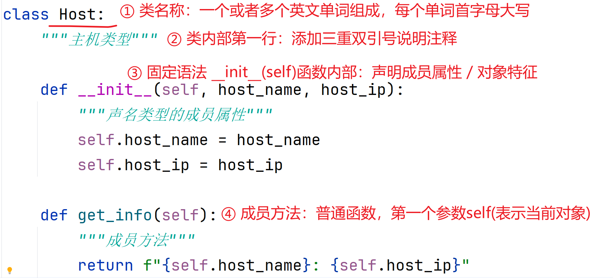
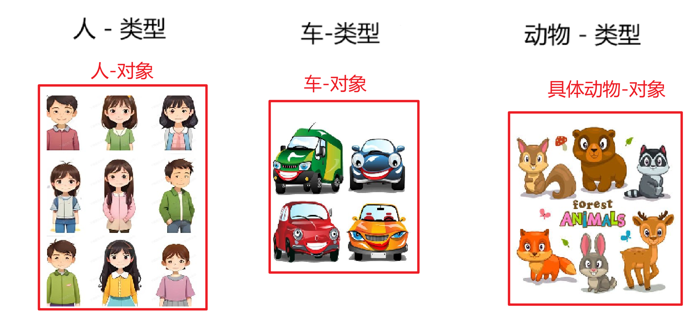
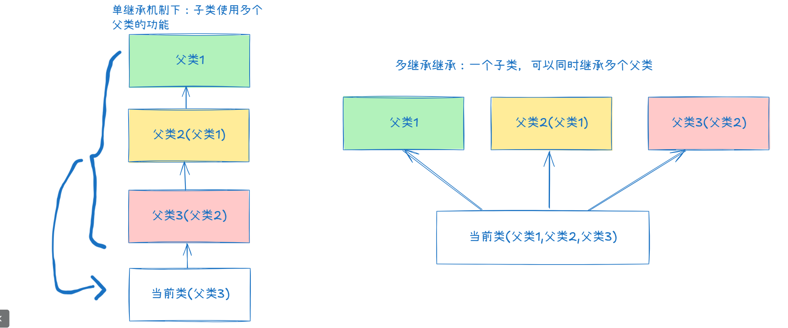
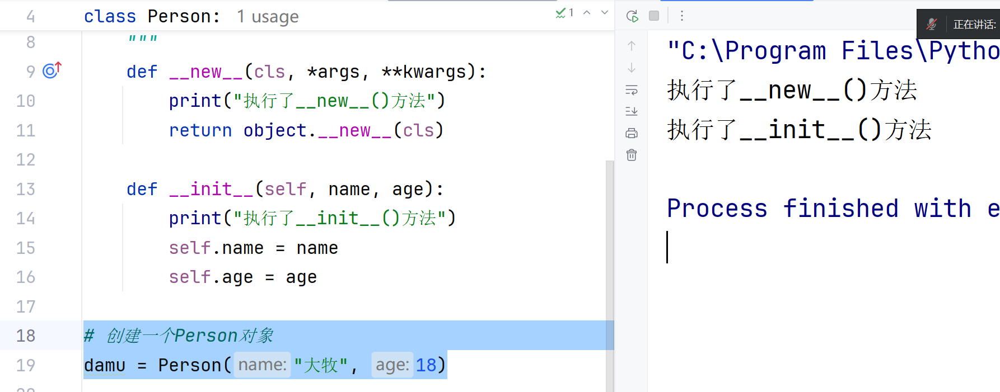

## 第十一章：面向对象

### 11.1、 认识面向对象

#### （1） 问题的分析和解读

核心：理解面向对象编程和生活之间的关系，方便理解面向对象编程的思想！

场景：屈真约了未来的女朋友，约定去爬山(常规行为)；屈真对流程进行了设置

- 第一步：起床，喊女朋友起床，洗漱收拾
- 第二步：到食堂，某个店面，吃早餐
- 第三步：汇合点等车，准备出发
- 第四步：出发，爬山

##### 稳定性好

情况1：两人风雨无阻，每天爬山；场景1-陈玲某天早上喊屈真去跑步，屈真-一定定好了爬山，等爬山回来再去跑步；场景2-某天早上早餐店关门，屈真为了赶时间~直接说换一家吃完就出发，屈真女朋友-你不懂我！

- 某个事情执行非常稳定的情况下，往往**重视/关注事情本身**，而不是发生的某个事情背后的对象

- 任何额外的事情，**不会影响两人爬山的需求**！优点-稳定性非常好
- 任务额外的扩展，都会影响两人爬山的计划！缺点：扩展性较差

需求：屈真计划减肥增肌-做女朋友心中的型男！给自己制定了一个季度计划(3个月训练周期)

##### 扩展性好

情况2：两人风雨无阻，每天爬山；场景1-陈玲某天早上喊屈真去跑步，屈真-告诉陈玲明天一起跑步，今天已经有了计划；场景2-某天早上早餐店关门，屈真询问了女朋友~你不是想吃xxx很久了吗今天改善一下口味；两个人开开心心换家早餐店，吃完早餐爬山；

- 任何额外的事情，都会被考虑是否执行，会对当前的爬山的需求产生影响(爬山计划可能中断)！缺点-稳定性较差！
- 任何额外的扩展，既不会影响当前计划的执行；同时也**扩展了现有计划的功能**；优点-扩展性相当好

需求：屈真要给自己制定大学剩下时间的任务规划，要实现某些任务！


#### （2） 什么是面向对象

##### 什么是思想

**思想，**本质上就是解决问题的**思路**；

当生活中发生了大量的问题，我们会对这些问题进行分类归纳总结，制定一些解决问题的方式；当解决问题的方式较多的情况下，将相同或者相似的解决方式总结起来形成思路；当解决问题的思路开始衍生到将来可能发生的问题找到对应的解决方案，这种解决思路就会上升为思想；思想-就是对已经发生的和即将发生的问题的解决方案的指导！

##### 什么是面向对象

面向对象：本质上就是站在对象的角度看待问题，模拟了生活中自然人的看待问题的方式！

- 注意：生活中解决问题，往往执行的核心是人！将发生问题背后的所有对象都会当成事物看待，通过这些事物之间交互完成问题的处理

面相对象编程思想：其实就是站在对象的角度，看待问题，通过参与解决问题的对象，他们的特征以及行为的协作，完成问题的处理

- 注意：面向对象，就是站在对象的角度考虑问题
- 注意2：面向对象思想，是一种思路，所有的思路都是经过大量实践才能体会和理解！


#### （3） 总结-面向过程/对象

长期的代码编程，逐渐发展成熟了两种编程思想：

- 面向过程的编程思想
- 面向对象的编程思想

##### 面向过程

面向过程的编程思想，是一种解决问题的思路！重点关注解决问题的过程和步骤；通过声明函数的方式定义每个步骤；通过函数之间互相调用的方式实现这个解决过程；最终实现问题的处理；

语法实现：函数式编程

优点：开发的系统稳定性非常好；

缺点：开发的系统扩展性较差；

适合场景：操作系统的研发！

##### 面向对象

面向对象的编程思想，也是一种解决问题的思路！重点关注的解决问题时参与的对象，以及对象的特征和行为；通过这些参与的对象的行为互相协作完成问题的处理；不仅可以解决当前的问题；通过这次参与的对象可以解决更多场景的问题！

语法实现：类和对象

优点：开发的平台扩展性相当好；

缺点：开发的凭条稳定性较差，需要额外的技术进行维稳！

适合场景：电商平台的开发！如淘宝...


> :memo: 关于编程语言和编程思想
>
> - 支持面向过程的编程语言，称为函数式语言或者面向过程的语言，如C语言...
> - 支持面向对象的编程语言，称为纯面向对象的编程语言，如Java语言...
> - 思考：既支持面向过程，也支持面向对象的编程语言，应该怎么称呼？如Python、JavaScript...

### 11.2、 类 和 对象

#### （1） 类和对象基础语法

需求：开发一个脚本，需要有一个主机信息（包含主机名称、主机IP地址），希望代码中出现一个**主机类型**

##### 类的声明

类，类型的简称，数据类型的简称，python语法中可以通过`class`关键字自定义类型！

-  注意：通过自定义各种类型，就可以编写支持任何场景的脚本

```python
class Host:
    """主机类型"""

    def __init__(self, host_name, host_ip):
        """声名类型的成员属性"""
        self.host_name = host_name
        self.host_ip = host_ip

    def get_info(self):
        """成员方法"""
        return f"{self.host_name}: {self.host_ip}"
```

关于类的声明的编码规范



#### （2） 创建对象

对象：表示生活中看得见摸得着（具有特征和行为）的真实存在的事物；

代码中，通过类型-创建属于该类型的对象，对象内部包含了需要使用的数据

- 创建对象语法：`对象的引用变量 = 类型(参数)`
- 访问对象属性：`对象的引用变量.属性名称`
- 访问对象方法：`对象的引用变量.方法名称()`
- 注意：方法(英文单词`Method`)，本质上就是函数(英文单词`Function`)，当函数声明在类的内部并且只能通过该类的对象调用时，将这样的函数称为对象的方法；约定的称呼！

```python
if __name__ == '__main__':
    # 创建一个主机对象
    host100 = Host("host100", "192.168.0.100")
    host101 = Host("host101", "192.168.0.101")
    print(host100)
    print(host101)
    """
    <__main__.Host object at 0x0000017BC9A34BC0>
    # __main__运行 host100对象 在内存 0x0000017BC9A34BC0
    <__main__.Host object at 0x0000017BC9A34C20>
    # __main__运行 host101对象 在内存 0x0000017BC9A34C20
    """
    # 访问对象中的数据：特征/属性，行为/方法
    print(host100.host_name) # host100
    print(host100.get_info()) # host100: 192.168.0.100
    print(host101.host_name) # host101
    print(host101.get_info()) # host101: 192.168.0.101

    # 判断host100和host101是否同一个对象
    print(host100 is host101) # False
    # 判断host100和host101是否同一个类型
    print(isinstance(host100, Host)) # True
    print(isinstance(host101, Host)) # True

```

#### （3） 总结：类和对象的关系

类，表示自定义类型，本质上就是生活中分门别类的类，如生活中的房子、人、学校、奶茶店这些称呼都是类型！

- 生活中的类型：一堆实际存在的、具有共同特征和行为的，事物的统称；如动物、电脑...
- 代码中的类型：将实际存在具有特征和行为的事物，将共同特征抽取为成员属性，将共同的行为抽取为成员方法，通过class关键字可以定义成一个自定义类型，通过这个自定义类型表示生活中的类型！
- 生活中的类型、代码中的类型：都是一个声明，并没有实际存在的事物！

对象，表示具有具体特征和行为的事物，实际存在的事物！如生活中(人类型的实际存在的对象)屈真、(电脑类型实际存在的对象)alienware电脑

- 生活中的对象：属于某个类型，具有具体的特征、行为的事物；屈真-特征(男性、18岁、黑衣服)-行为(学习)
- 代码中的对象：属于某个类型，创建出来的具有具体属性/行为的实例/对象/成员；host100-属性(host_name:"host100",host_ip:'192.1688.0.100')，行为-get_info()->返回主机名称和主机ip地址

类和对象的关系：

- 通过一个类型，可以创建多个互相独立的对象；多个对象互相独立-它们各自的属性和方法可以是不同的数据；
- 多个对象，可以属于同一个类型；多个互相独立的对象-属于同一个类型，它们的属性名称、方法名称都是相同的！



> :bookmark: 目标：学习并熟练声明一个类型，并且通过类型创建多个对象，对象中包含需要使用的数据！
>
> - 任务：脚本开发中需要一个文件类型(文件名称、文件路径、文件属性)，应该如何声明？现在有一个软连接文件`python3.12`，这个软连接文件应该如何被创建成对象？

### 11.3、 静态属性/方法

#### （1） 问题分析

需求：某公司小李开发了自己的一个脚本，脚本中包含大量的功能函数，现在小李进行脚本维护的时候发现添加功能的时候代码不好整理，甚至会出现一些代码重复；请帮小李整理脚本代码并提高代码的可用性！

- 如下代码：我们使用代码中的某个功能函数时，请问是否可以很方便的找到需要的函数呢？

```python
"""
服务器维护脚本：磁盘、内存、CPU处理、网络处理等
"""
disk_max_usage = 0.8

def disk_io():
    """磁盘读写维护函数"""
    pass

net_max_d = 1000
def net_io():
    """网络吞吐量监测函数"""
    pass

def net_d_min():
    """网络下行测试最小阈值"""
    pass

disk_min_usage = 0.9
def disk_usage():
    """磁盘使用空间监测脚本"""
    pass

memory_max_w = 0.9
def memory_warning():
    """内存监测告警函数"""
    pass

def cpu_usage():
    """CPU监测函数"""
    pass

def disk_clean():
    """磁盘清理函数"""
    pass

```


#### （2） 代码实现

解决方案1：使用Python中的注释，将不同功能的代码进行简单的空间隔离，方便不同的代码之间进行有意义的区分！

```python
"""
服务器维护脚本：磁盘、内存、CPU处理、网络处理等
"""
##############################################
# 磁盘整理函数
##############################################

disk_max_usage = 0.8
disk_min_usage = 0.9

def disk_io():
    """磁盘读写维护函数"""
    pass

def disk_clean():
    """磁盘清理函数"""
    pass

def disk_usage():
    """磁盘使用空间监测脚本"""
    pass

##############################################
# 网络整理函数
##############################################

net_max_d = 1000

def net_io():
    """网络吞吐量监测函数"""
    pass

def net_d_min():
    """网络下行测试最小阈值"""
    pass

##############################################
# 内存整理函数
##############################################

memory_max_w = 0.9

def memory_warning():
    """内存监测告警函数"""
    pass

##############################################
# CPU整理函数
##############################################

def cpu_usage():
    """CPU监测函数"""
    pass


```

解决方案2：将不同功能的函数，封装在类的内部（面向对象开发），实现功能函数在逻辑上的隔离！

```python
"""
服务器维护脚本：磁盘、内存、CPU处理、网络处理等
"""
##############################################
# 磁盘整理函数
##############################################
class Disk:
    """磁盘整理"""
    disk_max_usage = 0.8
    disk_min_usage = 0.9
    # 声明变量，检测磁盘的最大使用率(阈值)
    percent = 0.8
    @staticmethod
    def disk_io():
        """磁盘读写维护函数"""
        pass

    @staticmethod
    def disk_clean():
        """磁盘清理函数"""
        pass

    @staticmethod
    def disk_usage():
        """磁盘使用空间监测脚本"""
        pass

##############################################
# 网络整理函数
##############################################
class Net:
    # 声明变量监测网络上行阈值
    percent = 0.6

    net_max_d = 1000

    @staticmethod
    def net_io():
        """网络吞吐量监测函数"""
        pass

    @staticmethod
    def net_d_min():
        """网络下行测试最小阈值"""
        pass

##############################################
# 内存整理函数
##############################################
class Memory:
    memory_max_w = 0.9

    @staticmethod
    def memory_warning():
        """内存监测告警函数"""
        pass

##############################################
# CPU整理函数
##############################################
class Cpu:
    @staticmethod
    def cpu_usage():
        """CPU监测函数"""
        pass


```

通过解决方案2的隔离（面向对象的处理），函数的可用性更好

```python
if __name__ == '__main__':
    # 调用磁盘管理函数
    Disk.disk_io()
    print(Disk.percent) # 0.8
    # 调用网络管理函数
    Net.net_d_min()
    print(Net.percent) # 0.6
```

#### （3） 静态属性/方法

**语法**

```python
class Person:
    """自定义人类型"""
    # 声明在类的内部；方法的外部变量：静态属性
    max_age = 120  # 静态属性
    
    @staticmethod
    def say_hello():
        """静态方法，本质上就是一个函数"""
        print("静态方法就是声明在类的内部的功能函数")
```

**使用**

- 静态属性：通过 **类名称.静态属性**
- 静态方法：通过 **类名称.静态方法()**

```python
# 使用静态属性
print(Person.max_age)
# 使用静态方法
Person.say_hello()
```

**注意**

- 静态属性，本质上就是原来的全局变量；静态方法，本质上就是原来的功能函数；
- 通过面向对象的语法，将不同功能的全局变量/功能函数，封装在类型的内部，方便代码的维护和使用！
- **注意：静态属性、静态方法，也可以被当前类型创建的对象调用，被当前类型的所有对象共享；不推荐通过对象使用静态属性和静态方法**


### 11.4、 类属性/类方法

#### （1） 认识类属性/方法

需求：某应用中，需要自定义一个需要发表的文章类型，文章的要求-最大字数2000字、每一篇文章都可以得到出版社信息(成都文理出版)；

① 关于对象

可以声明一个文章类型，通过文章类型可以创建多个文章对象

- 文章类型：标题、内容、作者；最大字数、出版社信息
- 文章对象1：**活着、写了1200字、余华**；*2000、成都文理出版*
- 文章对象2：Python从入门到放弃、写了1800字、大牧；*2000、成都文理出版*

② 属性和行为的差异

通过一个类型，创建的多个对象，发现一个现象：

- 每个对象都是独立的，互相没有影响：每个对象的属性、行为都是独立的！可以通过成员属性、成员方法声明
- 问题-所有的对象也会包含一些相同值的属性和方法！Python中提供了类属性、类方法！

#### （2） 类属性/方法语法

基本语法

- 注意：一般语法中很少涉及到静态属性，一般将静态属性直接称为类属性！一般要求类属性使用全部大写的英文单词

```python
class Article:
    """文章类型"""
    # 类属性
    MAX_WORDS = 2000

    # 类方法
    @classmethod
    def get_publish_info(cls):
        """获取出版信息：cls参数-class的缩写- cls==Article"""
        print("成都文理出版，最大字数：", cls.MAX_WORDS, Article.MAX_WORDS)
        return "成都文理出版"
```

使用类属性、类方法：

- 类属性：`推荐-类名称.类属性`、`对象引用变量.类属性`
- 类方法：`推荐-类名称.类方法()`、`对象引用变量.类方法()`

```python
if __name__ == '__main__':
    # 类名称调用
    print(Article.MAX_WORDS) # 2000
    Article.get_publish_info()# 成都文理出版，最大字数： 2000 2000
    # 对象调用
    a = Article()
    print(a.MAX_WORDS)   # 获取最大字数
    a.get_publish_info() # 获取出版信息
```


#### （3） 使用场景

类属性、类方法的使用：

- 需要通过一个自定义类型，创建多个对象
- 多个对象如果需要共同的属性：声明类属性
- 多个对象如果需要执行结果相同的方法：声明类方法


### 11.5、 成员属性/成员方法

#### （1） 认识成员属性/方法

**成员**：就是通过某个类型创建的**对象**，也称为**实例**

**成员属性和成员方法**：通过类型创建的多个对象，自身独立的属性和方法，称为成员属性、成员方法；如人的类型创建的对象（陈玲[成员属性-姓名-陈玲、成员属性-年龄-20；成员方法-学习-熬夜]、屈真[成员属性-姓名-屈真、成员属性-年龄-18；成员方法-学习-通宵]）

#### （2） 成员属性/方法语法

基本语法：

```python
class Person:
    """人类型"""

    def __init__(self,name,age):
        """声明成员属性的固定位置"""
        # self关键字：表示当前对象，类似生活中的"我"关键字
        self.name = name
        self.age = age

    def study(self, msg):
        """成员方法"""
        print(f"{self.name} 学习方式：", msg)
```

使用方式：

```python
if __name__ == '__main__':
    # 创建对象
    cl = Person("陈玲", 18)
    qz = Person("屈真", 16)
    # 使用对象属性，方法
    print(cl.name, cl.age) # 陈玲 18
    cl.study("熬夜") # 陈玲 学习方式： 熬夜
    print(qz.name, qz.age) # 屈真 16
    qz.study("通宵") # 屈真 学习方式： 通宵

```

#### （3） 使用场景

成员属性和成员方法(类属性/类方法)，是软件应用开发中(中大型应用)，应用最频繁的语法；

静态属性/静态方法，是脚本开中(不超过200行)，使用最频繁的语法；


### 11.6、 面向对象的特征

面向对象，它是一种编程思想，是一种拟人化的解决方案；

将遇到的问题，参与解决问题的对象全部进行抽象(抽象思想)，抽象成具体的事物(包含特征属性和行为方法)；通过事物之间的协作完成问题的处理！

抽取的对象，将它们的特征进行私有化处理，不允许外部直接访问对象的属性，代码中通过方法间接的访问数据，就可以在方法中实现授权行为；将这种特征称为：**封装：目的就是保护私有数据**

拟人化的操作行为，包含了生活中另一种非常重要的特征-子承父业，每个人除了对象本身之外，可能从其他地方(某些干爹)继承了更多的资源，就可以当成对象的资源进行使用，有些人出生就在罗马/有些人出生就是牛马！代码中进行资源共享和资源复用的时候，实现了另一个重要的特征：**继承：目的是实现资源复用**

生活中每个对象在不同的场景中，往往扮演了不同的角色，同一个Person：妻子面前-丈夫角色、儿子-爸爸角色、父亲-儿子角色、公司内部-职员角色...，代码中将同一个对象在不同的执行环境中表现出不同的行为的方式，抽象出了第三个非常重要的特征：**多态：目的是实现对象的多样化**

> :memo: 关于面向对象的代码表现
>
> 一个思想：抽象
>
> 三个特征：封装、继承、多态

Python编程语言的特殊性（本身是弱类型语言），Python企业项目开发中，使用面向对象开发最多的语法是**继承相关的语法**！封装的语法对于弱类型开源的语言没有太大的意义，同时弱类型语言本身具备多态的特性！


### 11.7、 继承的基础语法

继承的语法：是面向对象中使用最多的一种特殊语法

继承的目的：实现资源的复用

① 普通类型的声明方式，如果继承自object，可以省略继承语法

② 所有类型，都是直接或者间接继承自object类型

```python
# 面向对象编程：一切皆对象
# python中的所有类型，都是直接或者间接继承自object类型

# 数值i继承自谁？继承自object
# class int(object)
i = 12
print(i)

# Person继承自谁？继承自object
# class Person: # 简洁语法
# class Person(): # 简化语法
class Person(object): # 完整语法
    """人的类型"""
    def __init__(self, name, age):
        self.name = name
        self.age = age

```

#### （1） 继承基本语法

定义了公共的类型：`Pet`包含了一些属性和方法

- 宠物`Cat`类型、`Dog`类型，继承了`Pet`类型：它们就可以使用`Pet`中的属性和方法
- 宠物`Pig`类型，并没有继承`Pet`，`Pig`的对象无法使用`Pet`中的属性和方法

代码示例

```python
"""
项目：开发宠物管理系统
"""
class Pet:
    """宠物类型"""
    def __init__(self, nickname, age, color):
        self.nickname = nickname # 昵称
        self.age = age  # 年龄
        self.color = color # 颜色

    def play(self):
        print(f"{self.nickname}在愉快的玩耍")

class Cat(Pet):
    """继承自宠物：宠物猫咪属于宠物类型"""
    pass

class Dog(Pet):
    """继承自宠物：宠物狗狗"""
    pass

class Pig:
    """宠物小猪"""
    pass

if __name__ == '__main__':
    # 创建宠物猫对象
    jiajia = Cat("佳佳", 1, "白色")
    print(jiajia.nickname, jiajia.age, jiajia.color)
    jiajia.play()
    # 创建宠物狗对象
    erha = Dog("二哈", 2, "黑色")
    print(erha.nickname, erha.age, erha.color)
    erha.play()
    # 创建宠物猪对象
    zhuzhu = Pig("朱朱", 1, "白色")  # 报错
    zhuzhu.play() # 报错
```


#### （2） 单继承机制

很多应用中，使用最多的一种机制就是：单继承机制，表达了一个类型只能继承另一个类型的关系

##### 认识专业术语

继承中出现的一些关键词

| 专业术语 | 说明                                                         |
| -------- | ------------------------------------------------------------ |
| **父类** | 继承关系中被继承的类型，也称为基类、超类<br />代码中还可以使用`super`关键字表示父类 |
| **子类** | 继承关系中，继承其他类型的当前类型；子类也被称为派生类       |
| **派生** | 代码中定义一个父类，通过继承关系创建多个子类的过程，称为派生 |


##### 单继承机制

表达了一个类型，只能继承另一个类型；

优点：继承关系明确

缺点：实现多个类型代码的服用，形成继承链~导致代码的可读性较低

```python
"""
单继承
"""
class Account:
    """账号类型"""
    def __init__(self, username, password, role):
        self.username = username  # 账号
        self.password = password  # 密码
        self.role = role  # 角色 1管理员 2会员 3普通用户

class Manager(Account):
    """管理员"""
    def __init__(self, username, password, phone, email):
        # 初始化继承过来的父类属性
        super().__init__(self, username, password, role=1)
        self.phone = phone  # 额外的手机号码
        self.email = email  # 额外的邮箱
        
class Member(Account):
    """会员"""
    def __init__(self, username, password, phone):
        super().__init__(username, password, role=2)
        self.phone = phone # 手机号码

class User(Account):
    """普通用户"""
    def __init__(self, username, password):
        super().__init__(username, password, role=3)


if __name__ == '__main__':
    # 创建管理员
    m  = Manager("admin", "admin", "16888990099", "admin@aliyun.com")
    # 创建会员
    m2 = Member("zhangsan", "123", "16845678800")

```


#### （3） 多继承机制

允许一个子类，可以同时具有多个父类！对单继承机制的语法的扩展



代码示例：

- 多继承机制：可以让一个对象具备的复杂属性特征，实现多个父类的分类管理，提高代码的可读性

```python
"""
多继承机制
- 开发宠物管理系统
- 每个宠物 具备宠物属性、出生时间/访问时间/治疗时间
"""
class Pet:
    """宠物类型"""
    def __init__(self, nickname, age):
        self.nickname = nickname # 昵称
        self.age = age # 年龄

class TimeRecord:
    """时间记录"""
    def __init__(self, ctime, atime, mtime):
        self.ctime = ctime # 出生时间
        self.atime = atime # 最后一次访问时间
        self.mtime = mtime # 最后一次治疗时间

class Cat(Pet, TimeRecord):
    """宠物猫咪"""
    def __init__(self, nickname, age, ct, at, mt):
        """初始化继承过来的宠物属性数据"""
        Pet.__init__(self, nickname, age)
        TimeRecord.__init__(self, ct, at, mt)

tom = Cat("汤姆", 1, "2023-11", "2024-10", "2024-08")
print("昵称：", tom.nickname)
print("年龄：", tom.age)
print("出生：", tom.ctime)
print("最后一次访问：", tom.atime)
print("最后一次治疗：", tom.mtime)

```

> :warning:思考：如果多个父类中出现了相同属性，子类会继承哪个父类的属性？
>
> - 注意：如果多个父类中出现相同属性，说明你的代码设计有问题！


### 11.8、 继承的扩展语法

继承，实现了基于类型的代码复用；提高了父类中代码的复用性！提升了代码功能的扩展性

- 子类继承父类，扩展父类的功能
- 子类继承父类，实现魔法属性/魔法方法

#### （1） 扩展父类功能

观察代码：

- 方法扩展：子类中声明父类中没有的方法，实现功能的扩展
- 方法重写/覆盖：子类中声明父类中已有的方法，实现功能的增强
- 如：TCP协议（父类）-> SSH协议、HTTP协议、FTP协议、SMTP协议.....

```python
"""
实现父类功能的扩展
"""
class Traffic:
    """交通工具"""
    def __init__(self, name):
        self.name = name

    def run(self):
        print(f"{self.name}在路上行驶")


class Tank(Traffic):
    """坦克：继承关系实现了行驶行为"""

    def attack(self):
        """方法扩展：定义父类中没有的方法：功能扩展"""
        print(f"{self.name} 开始攻击...")

    def run(self):
        """方法重写/覆盖：定义父类中已有的方法，扩展该方法"""
        super().run()# 执行已有的功能
        print("压过一切障碍物")


if __name__ == '__main__':
    tank = Tank("坦克")
    tank.run()
    tank.attack()

```


#### （2） 魔法方法

Python中有一种特殊的属性和方法：特点是属性或者方法名称，前后都有两个下划线

- 魔法属性：该属性具备一定的特殊功能，如`__doc__`实现打印文档注释的功能
- 魔法方法：该方法会在某些情况下**自动执行**，实现特殊功能

```python
>>> dir(object)
['__class__', '__delattr__', '__dir__', '__doc__', '__eq__', '__format__', '__ge__', '__getattribute__', '__getstate__', '__gt__', '__hash__', '__init__', '__init_subclass__', '__le__', '__lt__', '__ne__', '__new__', '__reduce__', '__reduce_ex__', '__repr__', '__setattr__', '__sizeof__', '__str__', '__subclasshook__']
```

##### 魔法属性

通过`__doc__`属性，可以直接查看指定类型/对象的文档注释

```python
class Person:
    """
    类注释：
    自定义人的类型，项目中用于所有用户的超级父类
    """
    def __init__(self, name, age):
        self.name = name
        self.age = age


# 访问魔法属性
print(Person.__doc__)
'''
类注释：
自定义人的类型，项目中用于所有用户的超级父类
'''
```


##### 魔法方法

特定的条件下，自动执行

① `__new__()`、`__init__()`

创建对象的时候，会自动依次执行`__new__()`和`__init__()`魔法方法

- `__new__()`方法：创建对象
- `__init__()`方法：初始化成员属性

```python
class Person:
    """
    类注释：
    自定义人的类型，项目中用于所有用户的超级父类
    """
    def __new__(cls, *args, **kwargs):
        print("执行了__new__()方法")
        return object.__new__(cls)

    def __init__(self, name, age):
        print("执行了__init__()方法")
        self.name = name
        self.age = age
# 创建一个Person对象
damu = Person("大牧", 18)
```



② `__str__()`

`__str__()`魔法方法，主要用于自定义对象的`print()`输出内容

```python
class Person:
    """
    类注释：
    自定义人的类型，项目中用于所有用户的超级父类
    """
    def __new__(cls, *args, **kwargs):...

    def __init__(self, name, age):...
       
    def __str__(self):
        return f"姓名：{self.name},年龄：{self.age}"
    
# 创建一个Person对象
damu = Person("大牧", 18)
print(damu)
# 原始输出的结果：<__main__.Person object at 0x0000024266EE8560>
# 重写__str__()输出的结果：姓名：大牧,年龄：18
```

③ `__add__()`

`__add__()`魔法方法，实现了算术运算

④ `__lt__()`、`__gt__()`、`__eq__()`、`__ne__()`

`__lt__()`、`__gt__()`、`__eq__()`、`__ne__()`实现比较运算

⑤ 扩展：如何知道都有什么魔法方法？

都是通过需求确定，当需求要求某个类型的对象要实现算术运算，参考数值的魔法方法

```python
>>> s = 12
>>> dir(s)
['__abs__', '__add__', '__and__', '__bool__', '__ceil__', '__class__', '__delattr__', '__dir__', '__divmod__', '__doc__', '__eq__', '__float__', '__floor__', '__floordiv__', '__format__', '__ge__', '__getattribute__', '__getnewargs__', '__getstate__', '__gt__', '__hash__', '__index__', '__init__', '__init_subclass__', '__int__', '__invert__', '__le__', '__lshift__', '__lt__', '__mod__', '__mul__', '__ne__', '__neg__', '__new__', '__or__', '__pos__', '__pow__', '__radd__', '__rand__', '__rdivmod__', '__reduce__', '__reduce_ex__', '__repr__', '__rfloordiv__', '__rlshift__', '__rmod__', '__rmul__', '__ror__', '__round__', '__rpow__', '__rrshift__', '__rshift__', '__rsub__', '__rtruediv__', '__rxor__', '__setattr__', '__sizeof__', '__str__', '__sub__', '__subclasshook__', '__truediv__', '__trunc__', '__xor__', 'as_integer_ratio', 'bit_count', 'bit_length', 'conjugate', 'denominator', 'from_bytes', 'imag', 'is_integer', 'numerator', 'real', 'to_bytes']
```


### 11.9、 综合案例

学习完面向对象，对于这种特殊的语法：要有明确的认知

- 脚本开发中：重点语法 函数式开发
- 软件开发中：重点语法 面向对象

#### （1） 过度设计

需求：脚本中需要实现用户账号认证功能，请使用传统语法、面向对象语法实现，比较它们的实现方式

##### 传统语法

```python
# 保存了两个用户
user_dict = {
    "admin": {"username": "admin", "password": "123", "nickname": "艾德"},
    "manager": {"username": "manager", "password": "123", "nickname": "曼妮"},
}

# 脚本中其他代码
....
```

##### 面向对象

```python
"""脚本中需要账户认证"""
class User:
    """账户类型"""
    def __init__(self, username, password, nickname):
        self.username = username
        self.password = password
        self.nickname = nickname

# 创建脚本中需要的对象
admin = User('admin', 'password', '123123')
manager = User('manager', 'password', '123123')
# 声明字典保存数据
user_dict = {"admin": admin, "manager": manager}

# 脚本中其他代码
....
```

##### 总结

简单的脚本开发中，脚本执行的功能较为单一，本身不需要多少行代码；要求的是代码的简洁性！

如果勉强使用面向对象的语法进行封装，只会造成代码的逻辑复杂，同时提高了无谓代码量，将这种设计开发称为过度设计！就是所谓的**杀鸡蔫用牛刀**！

####  （2） 合理封装

需求：需要监测当前服务器中的CPU的使用率、内存使用率，磁盘使用率，达到一定阈值就需要告警！

请使用传统语法和面向对象的语法进行实现

##### 传统语法

```python
"""cpu、内存、磁盘监控"""
def cpu_warning_percent(tv=0.85):
    """cpu使用率85%告警"""
    pass

def memory_warning_percent(tv=0.9):
    """内存使用90%告警"""
    pass

def disk_warning_percent(tv=0.95):
    """磁盘达到95%告警"""
    pass

if __name__ == '__main__':
    # 调用的时候，必须明确的知道cpu有那些函数
    cpu_warning_percent()
```

##### 面向对象

```python
"""cpu、内存、磁盘监控"""
class CPU:
    @staticmethod
    def warning(tv=0.85):
        """cpu使用率85%告警"""
        pass

class Memory:
    @staticmethod
    def warning(tv=0.9):
        """内存使用90%告警"""
        pass

class Disk:
    @staticmethod
    def warning(tv=0.95):
        """磁盘达到95%告警"""
        pass


if __name__ == '__main__':
    # 调用的时候，直接使用对应目标的类型即可
    CPU.warning()
    # 内存
    Memory.warning()
    # 磁盘
    Disk.warning()

```

##### 总结

当需求中需要对多个类型的对象，执行相似的操作时，可以选择使用面向对象的语法封装功能函数，不论是从语法上还是使用维护上都能提到提升，让脚本的通用性更好！

面向对象(类和对象)、面向过程(函数式开发)，它们各自有优点，只是适用场景不同！根据自己的需要和具体的需求进行确定！