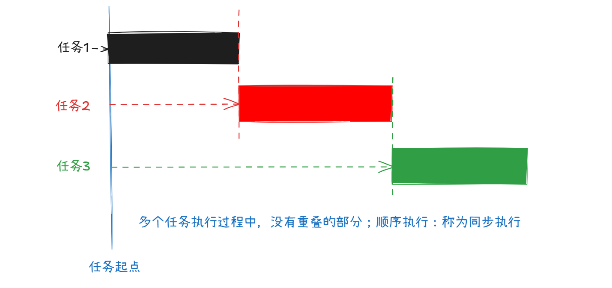
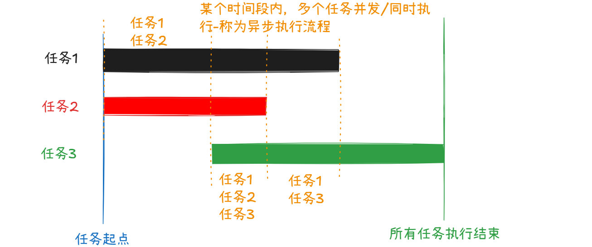
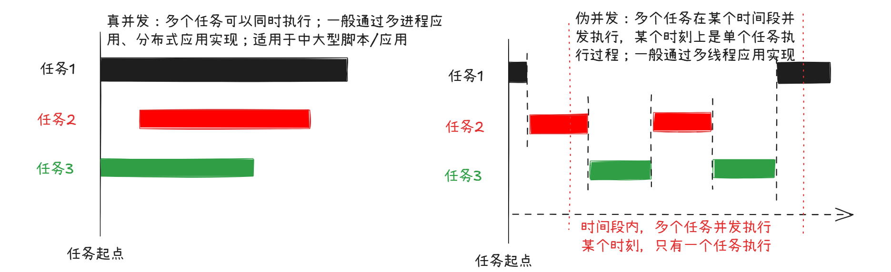
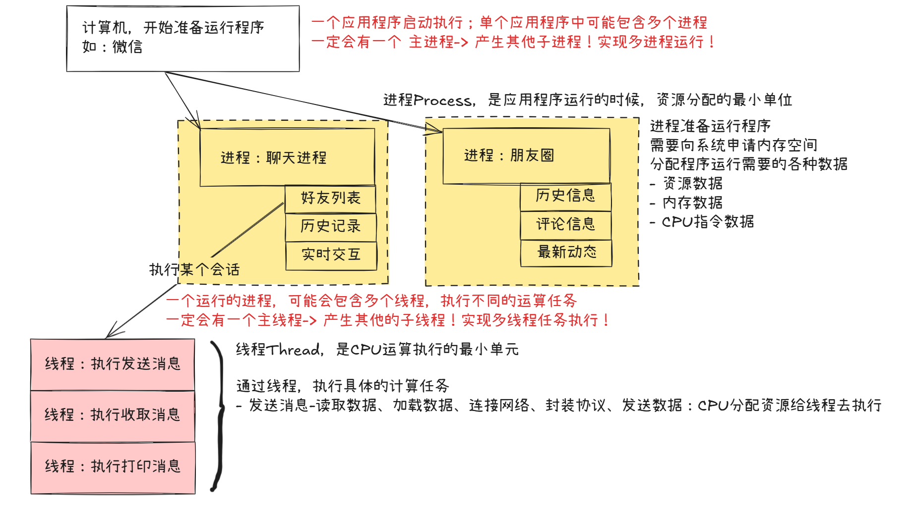
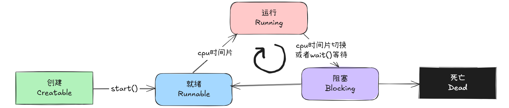
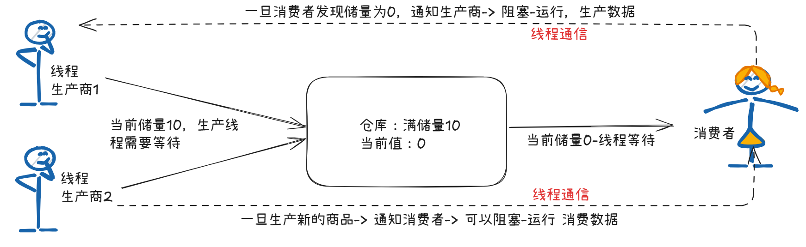
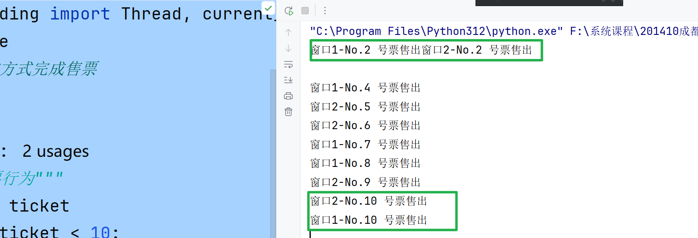
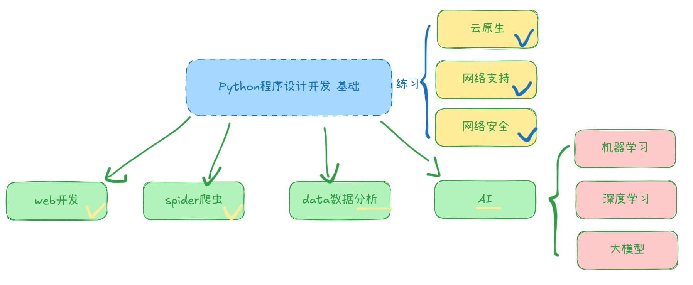

## 第十二章：并发编程

### 12.1、 同步和异步

并发任务中，经常提到的专业术语：同步、异步，描述了多个任务的执行方式和执行顺序！

#### （1） 同步执行

同步，英文单词$synchronize$，程序中一般简写为`sync`

描述了多个任务，顺序执行的过程！



#### （2） 异步执行

异步，英文单词$asynchronous$，程序中一般简写为`async`

异步执行，描述了多个任务可以同时执行！多个任务执行期间互相不会产生影响！




#### （3） 总结

思考：关于同步执行和异步执行，它们各自有什么优缺点？

|      | 同步                 | 异步                 |
| ---- | -------------------- | -------------------- |
| 特点 | 多个任务按照顺序执行 | 多个任务可以同时执行 |
| 优点 | 管理简单             | 执行效率高           |
| 缺点 | 执行效率低下         | 管理复杂             |

企业应用开发过程中，同步任务和异步任务都是使用比较频繁的任务处理方式

- 基础脚本功能，大部分都是同步任务：不需要考虑太多的时间效率问题
- 执行有效率性能要求的并发任务时，通常会考虑当前硬件资源（同时执行-真并发、切换执行-伪并发）



技术资料中，将多进程实现的真并发和多线程实现的伪并发，都称为 并发编程！它们都提升了程序执行效率！

### 12.2、 认识进程和线程

#### （1） 进程

进程，英文单词Process，描述了计算机中分配资源数据的最小单位！

#### （2） 线程

线程，英文单词Thread，描述了计算机中分配计算资源的最小单位！

#### （3） 进程和线程




### 12.3、 认识多线程

需求：火车站售票，一共10张票，每张票的售出平均时间1S；需要验证单线程和多线程的执行效率的差异！

> :memo: 关于资源抢占
>
> 为了避免多个线程之间出现资源抢占，需要有一个保护机制，同时只能允许一个线程获取数据；线程中提出了数据访问安全的概念，提供了线程安全的队列：queue.Queue，类似列表的方式存储数据(数据添加和删除都是线程安全)

#### （1） 单线程

执行售票任务：相当于火车站开了一个窗口售票

- 程序运行了10S，才将所有的票全部售出

```python
# 线程安全的队列，类似列表list
from queue import Queue
import time

# 创建一个队列，只能包含10个数据
# q.full()表示队列中已经满了
# q.empty() 表示队列中没有数据了
# q.put(dat) 表示向队列中存储数据
# q.get() 表示从队列中依次取出一个数据
q = Queue(10)
# 往队列中添加10个数据
for i in range(10):
    q.put(i) # 向队列中添加数据;获取数据q.get()

def sale():
    """售票函数"""
    while not q.empty():
        i = q.get()
        print(f"售出了:{i}号票")
        time.sleep(1)
    print("所有票已经售完")

sale()
```


#### （2） 多线程

执行售票任务：相当于火车站开了多个窗口售票

```python
# 线程安全的队列，类似列表list
from queue import Queue
import time

# 创建一个队列，只能包含10个数据
q = Queue(10)
# 往队列中添加10个数据
for i in range(10):
    q.put(i) # 向队列中添加数据;获取数据q.get()

def sale():
    """售票函数"""
    while not q.empty():
        i = q.get()
        print(f"售出了:{i}号票")
        time.sleep(1)
    print("所有票已经售完")


# 多线程售票
from threading import Thread
# 开设5个窗口
# Thread(target=sale, name="窗口1")
# Thread表示创建线程的功能函数
# 参数target：表示通过一个独立的线程执行的目标函数
# 参数name：表示给这个线程命名
t1 = Thread(target=sale, name="窗口1")
t2 = Thread(target=sale, name="窗口2")
t3 = Thread(target=sale, name="窗口3")
t4 = Thread(target=sale, name="窗口4")
t5 = Thread(target=sale, name="窗口5")
# 启动线程，开始售票
t1.start()
t2.start()
t3.start()
t4.start()
t5.start()
```

#### （3） 适用场景

程序应用或者脚本应用中，可以将所有的程序代码区分为两种类型：

- 计算密集型：程序代码中包含了大量的运算任务，需要频繁的和CPU进行交互，完成计算操作，如计算圆周率
  - 适用：多进程编程，节省CPU切换时间
- **IO密集型**：程序代码中包含了大量的读写任务，需要频繁的和磁盘进行交互，完成数据读写操作，如电商平台
  - 适用：多线程编程，节省多个线程频繁的IO操作，节省IO的抢占时间

### 12.4、 多线程基础语法

#### （1） 多线程的实现

Python中提供了一个模块threading模块，通过Thread类实现多线程应用

##### 函数式实现(重点)

基本语法

```python
# 创建一个独立的线程，指定目标函数
t = Thread(target=目标函数, args=(函数参数列表), name="线程名称")
```

线程启动：一个线程一旦启动(不能重复启动、不能手工停止，必须等待目标函数执行结束自动停止)

```python
# 启动线程，执行目标函数
t.start()
```

代码示例

```python
from threading import Thread, current_thread

def fn(n):
    """目标函数"""
    print(current_thread().name, "展示数据：", n)


# 创建线程，name默认Thread-(数字编号)
t = Thread(target=fn, args=(11, ), name="线程-1")
# 启动线程
t.start()

```


##### 面向对象实现(了解)

基本语法：通过继承关系实现多线程

```python
from threading import Thread

class 自定义线程类(Thread):
    
    def run():
        """线程执行的目标方法"""
        pass
```

创建线程实例

```python
t = 自定义线程类()
```

启动线程：自动执行线程类中的`run()方法`

- 不要自己调用`run()`方法，调用执行只是普通的成员方法的执行！并不是多线程！

```python
t.start()
```

代码示例

```python
############# 2. 面向对象实现
class MyThread(Thread):
    """自定义线程类"""

    def __init__(self, name):
        Thread.__init__(self, name=name)

    def run(self):
        """线程执行目标方法"""
        print(current_thread().name + ":线程执行")


# 创建线程实例
t = MyThread(name="线程-1")
# 启动线程
t.start()
```


#### （2） 多线程状态

Python中，创建的多线程实例，执行的过程中主要经历了五个阶段，如图所示：



注意事项

- 同一个线程，不能重复启动！
- 一个已经启动的线程，必须等待目标函数执行结束才能正常退出！
- 线程启动之后，会在 $运行-> 阻塞-> 就绪-> 运行$ 循环执行
- 一个线程一旦死亡，不能重启启动！

### 12.5、 线程通信

多个线程同时运行时，为了让多个线程之间可以协调使用进程中的资源，需要线程之间实现通信操作，调度多个线程正常的执行！



代码示例：生产者、消费者

- threading.Event：事件对象，实现线程通信
- 

```python
"""
生产者消费者模式-线程通信
线程通信实现方案很多：队列、事件、信号量....
"""
from threading import Thread, current_thread, Event
from queue import Queue
import time

# 准备事件对象(所有线程共用)
event = Event()

# 准备仓库
queue = Queue(10)

def producer(e):
    """生产者：向仓库中生产商品"""
    while True:
        # 通知其他线程开始工作：唤醒
        event.set()

        print(f"{current_thread().name}:生产商品，向仓库中加入商品")
        queue.put("x")
        if queue.full(): # 仓库满
            print(f"{current_thread().name}:等待")
            event.wait() # 当前线程等待（资源停滞）

        time.sleep(0.2)


def consumer(e):
    """消费者：从仓库中获取商品"""
    while True:
        # 通知其他线程开始工作：唤醒
        event.set()

        x = queue.get()
        print(f"{current_thread().name}:消费数据：" + x)
        if queue.empty(): # 仓库空
            print(f"{current_thread().name}:等待")
            event.wait() # 消费者等待
        time.sleep(0.2)


if __name__ == '__main__':
    # 创建5个生产者
    pt = []
    for i in range(5):
        pt.append(Thread(target=producer, args=(event,), name=f"生产商{i}"))
    # 启动5个生产者线程
    for t in pt:
        t.start()

    # 创建1个消费者
    ct = []
    for i in range(1):
        ct.append(Thread(target=consumer,args=(event,), name=f"消费者{i}"))
    # 启动消费者
    for t in ct:
        t.start()

```

### 12.6、 线程锁

线程、进程都描述了多个任务并发执行的操作；操作过程中就不可避免的出现一种问题：资源抢占问题！

#### （1） 资源抢占

模拟生活中，资源抢占的问题

每张票都有高额提升，当只有一个售票窗口，资源独占！不会发生抢占问题！

当售票窗口开始增多，为了获取更多的收益-每个窗口都会从票池中尽可能多的抢占票数，顺利的情况~多个窗口最终将票池 中所有的票瓜分完毕；特殊情况下多个窗口可能抢占到同一个数据 - 发生数据冲突！就是并发任务重的资源抢占问题！

代码示例：

```python
"""
火车站售票-10张票
"""
from threading import Thread, current_thread
import time
# 票：累加的方式完成售票
ticket = 0

def sale():
    """售票行为"""
    global ticket
    while ticket < 10:
        ticket += 1
        time.sleep(0.1)
        print(f"{current_thread().name}-No.{ticket} 号票售出")
# 单线程
# sale()
# 多线程抢占

Thread(target=sale, name="窗口1").start() # 窗口1
Thread(target=sale, name="窗口2").start() # 窗口2
```

代码运行结果



#### （2） 资源保护

生活中可以将票池交给独立的人员进行监管，所有窗口过来之后只能排队领取，当一个人在领取一张票的时候，其他窗口不能操作票池！保护当前数据安全性，不被多个线程同时抢占！代码中称为 **锁**

python语法中，提供了threading.Lock锁对象，可以针对可能访问冲突的数据进行加锁操作

- lock = Lock()：创建锁对象
- lock.acquire()：上锁，锁定当前数据
- lock.release()：开锁，将锁定的数据释放

代码示例：

```python
"""
火车站售票-10张票
"""
from threading import Thread, current_thread, Lock
import time
# 创建锁对象
lock = Lock()
# 票：累加的方式完成售票
ticket = 0

def sale():
    """售票行为"""
    global ticket
    while ticket < 10:
        # 锁定数据
        lock.acquire()
        ticket += 1
        time.sleep(0.1)
        print(f"{current_thread().name}-No.{ticket} 号票售出")
        # 解锁数据
        lock.release()
# 单线程
# sale()
# 多线程抢占

Thread(target=sale, name="窗口1").start() # 窗口1
Thread(target=sale, name="窗口2").start() # 窗口2
```

关于锁的简洁语法：with语句（文件IO中提到过with语句的简化语法）

```python
    while ticket < 10:
        # 锁定数据
        #lock.acquire()
        with lock: # 自动上锁，一旦内部代码执行完成后自动解锁
            ticket += 1
            time.sleep(0.1)
            print(f"{current_thread().name}-No.{ticket} 号票售出")
        # 解锁数据
        #lock.release()
```

> :warning: 关于 死锁！
>
> 锁，锁定了资源数据，不被多个并发任务抢占，但是锁-一定使用不当，就会造成死锁现象-经典的哲学家吃饭的问题！


课程收尾：Python AI程序设计开发结束，Python并没有结束



