# 鸥鹏AI教学资源调度中台

## 管理员-系统管理

### 1. 登录

使用管理员账号，直接输入账号密码登录

- 注意：支持账号、邮箱、手机号码登录
- 注意2：微信扫码登录待升级（公司营业执照还没有申请接入）
- 测试：已通过

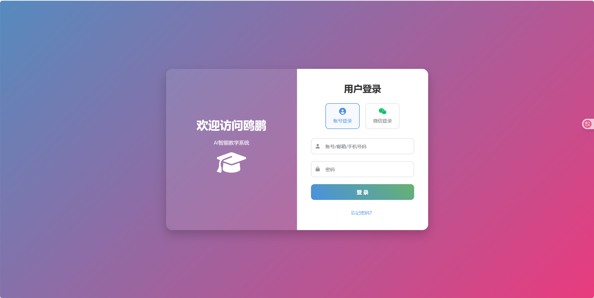

### 2、 LOGO设置

系统设置菜单 -> LOGO设置

- 业务：主要针对管理系统的LOGO进行实时更新操作
- 测试：已通过

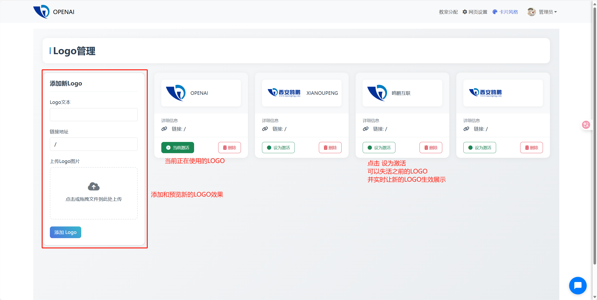

### 3、 管理员管理

系统设置菜单 -> 管理员管理

- 业务：添加新的管理员，配合主管理员对网站系统进行管理维护
- 测试：已通过

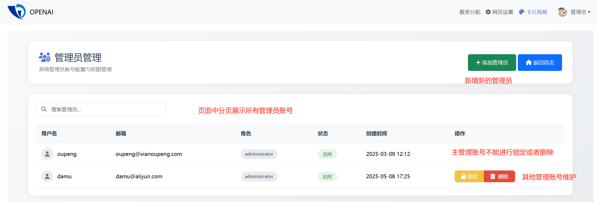

### 4、 角色管理

系统设置菜单 -> 角色管理

- 业务：结合当前系统中的所有账号进行角色分配，方便管理和操作不同的业务菜单
- 注意：权限采用粗粒度管理，目前只关联到不同角色对不同菜单的访问，具体数据的CRUD操作权限待升级
- 测试：已通过

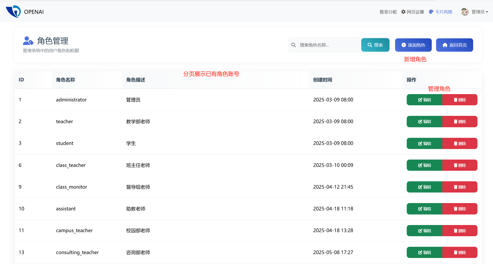

### 5、 菜单管理

系统设置菜单 -> 菜单管理

- 业务：结合已经开发的功能，通过访问路由关联到菜单，方便用户使用对应的功能
- 注意：菜单必须和已有功能进行结合，如果有新的需求，待功能开发完成后再进行新菜单的管理操作
- 测试：已通过

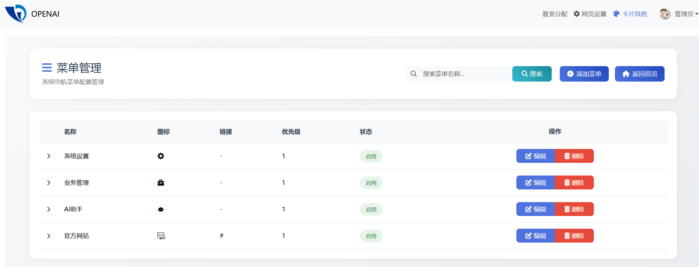

菜单新增/编辑时，可以结合角色实现权限隔离

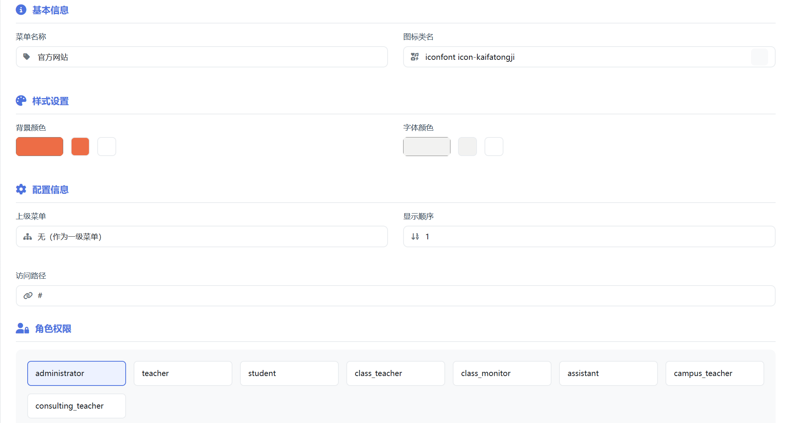

### 6、资源分类

系统管理菜单 -> 资源分类

- 业务：针对系统中管理的资源数据进行分类整理，方便用户使用
- 测试：已通过

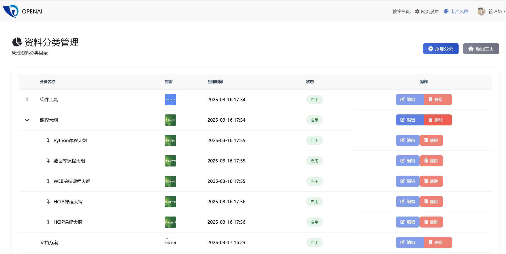

### 7、 项目分类

系统管理菜单 -> 项目分类

- 业务：针对系统中管理的各种类型的项目，提供项目仓库，方便用户进行检索和使用
- 测试：已通过

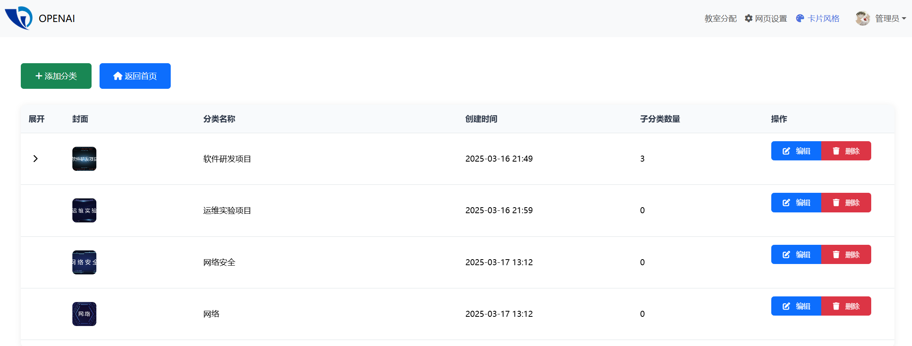

### 8、 教室管理

系统管理菜单 -> 教室管理

- 业务：录入和管理中心的教室使用情况，让每个使用平台的人可以第一时间了解中心教室占用情况
- 测试：已通过

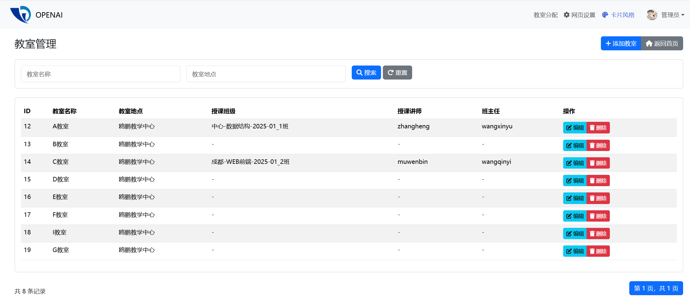

任何用户登录系统后，都可以在页头查看 **教室分配** 链接，弹窗侧边栏显示教室使用情况

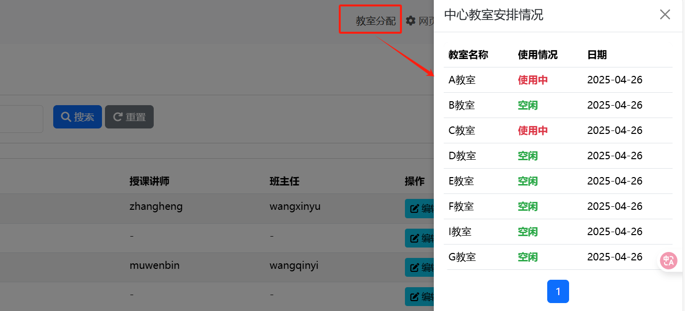

## 管理员-业务管理

### 1、 待办事项

业务管理菜单 -> 待办事项

- 作用：给系统中所有用户可以一对一发起待办事项，方便重点数据的管理；待办事项列表中可以查看自己接收到的待办、自己发送的所有待办事项
- 测试：已通过

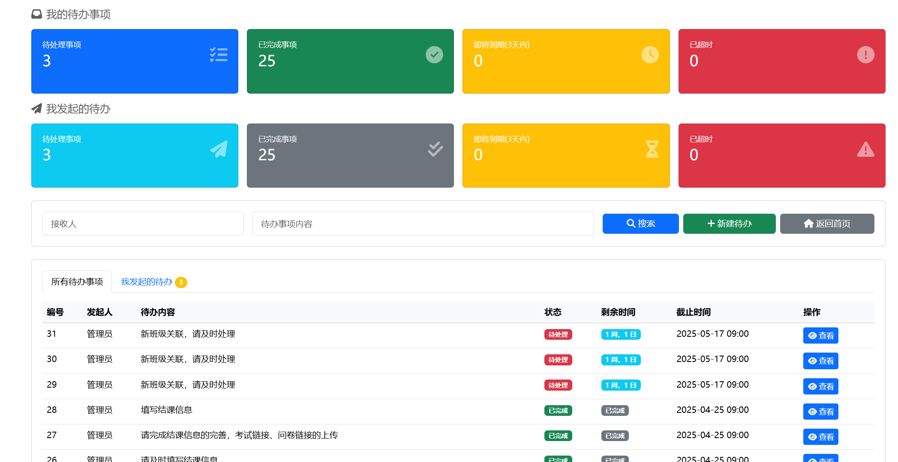

发起新的待办事项：

- 输入接收人账号或者姓名，自动检索符合条件的接收人
- 默认待办时间10天，可以按照需求自主修改

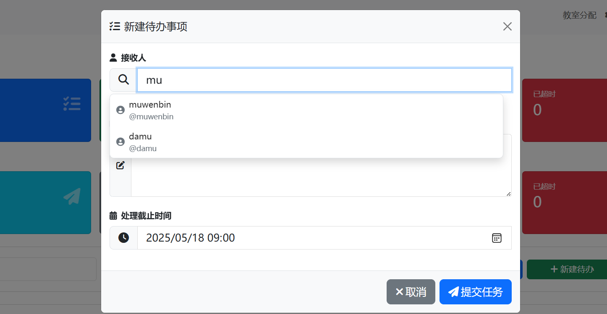

## 讲师操作

## 班主任操作

