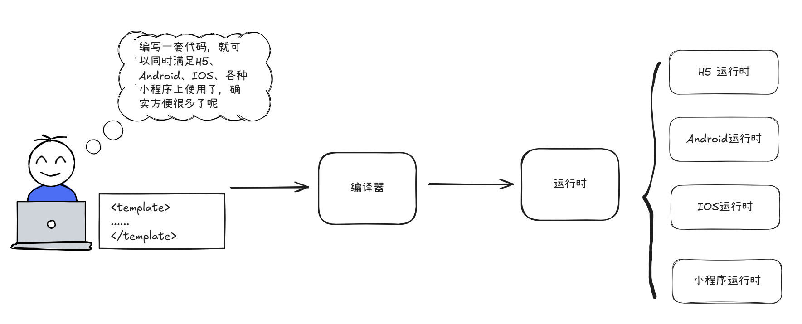
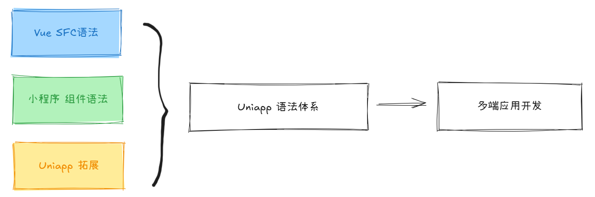
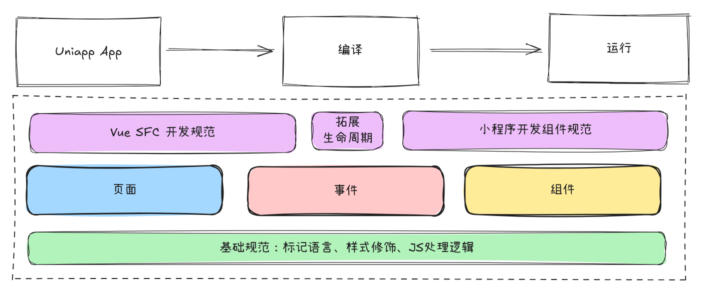

# `Uniapp`概述

## 01. 一套代码，多端运行

`Uniapp`是`Union Application`的缩写，字面意思多终端联合开发，旨在构建一种编写一套代码，可以运行在多种终端的技术`框架。

## 02. 基本语言，编码规范

`Uniapp`的出现，并不是尝试去重新设计一套新的编程语言体系，而是将现有的一些成熟的编程体系进行了综合构建

语法体系的整体架构如图：

