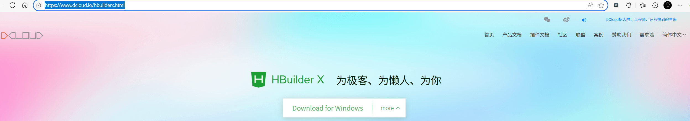
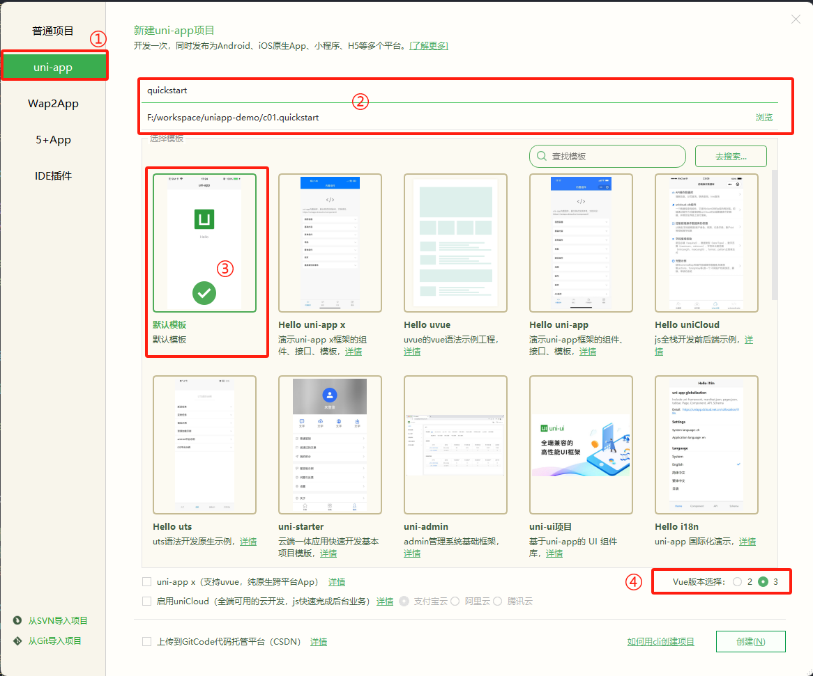
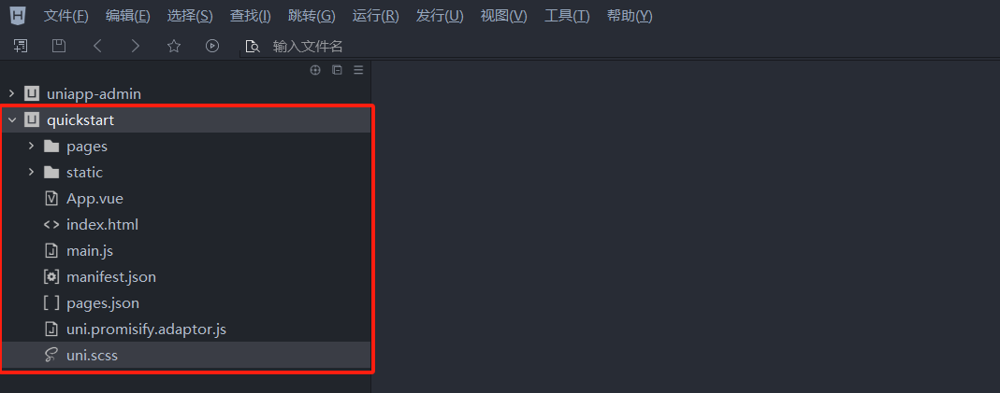

# 第一个`Uniapp`应用

## 开发工具

开发工具可以使用任意一款前端编码工具，如`VSCode`、`Atom`、`Sublime Text`等等，

基于开发效率的考虑，有限推荐官方开发工具：`HBuilderX`

官方网站：`https://www.dcloud.io/hbuilderx.html`



> [!note]
>
> `HBuilderX`下载解压后可以直接使用！

## 第一个应用

打开`HBuilderX`开发工具，选择新建项目：

- ① 选择新建`uni-app`项目
- ② 选择项目构建位置
- ③ 选择项目模板，基础应用开发推荐默认模版
- ④ 选择`Vue SFC`组件语法，推荐`3.x`版本



点击创建按钮，项目就会构建完成并出现在工具侧边栏导航中



## 目录结构

基础项目构建的目录结构并不完整，将上述项目中的已有文件和未来需要创建的文件进行整理：

```
┌─pages                 业务页面文件存放的目录
│  ├─index
│  │  └─index.vue       index页面
│  └─list
│     └─list.vue        list页面
├─static                存放应用引用的本地静态资源（如图片、视频等）的目录，注意：静态资源都应存放于此目录
├─App.vue               应用配置，用来配置App全局样式以及监听 应用生命周期
├─main.js               Vue初始化入口文件
├─pages.json            配置页面路由、导航条、选项卡等页面类信息，详见
├─manifest.json         配置应用名称、appid、logo、版本等打包信息，详见
└─uni.scss              内置的常用样式变量

┌─uniCloud              云空间目录，支付宝小程序云为uniCloud-alipay，阿里云为uniCloud-aliyun，腾讯云为uniCloud-tcb（详见uniCloud）
│─components            符合vue组件规范的uni-app组件目录
│  └─comp-a.vue         可复用的a组件
├─utssdk                存放uts文件（已废弃）
├─uni_modules           存放uni_module 详见
├─platforms             存放各平台专用页面的目录，详见
├─nativeplugins         App原生语言插件 详见
├─nativeResources       App端原生资源目录
│  ├─android            Android原生资源目录 详见
|  └─ios                iOS原生资源目录 详见
├─hybrid                App端存放本地html文件的目录，详见
├─wxcomponents          存放微信小程序、QQ小程序组件的目录，详见
├─mycomponents          存放支付宝小程序组件的目录，详见
├─swancomponents        存放百度小程序组件的目录，详见
├─ttcomponents          存放抖音小程序、飞书小程序组件的目录，详见
├─kscomponents          存放快手小程序组件的目录，详见
├─jdcomponents          存放京东小程序组件的目录，详见
├─unpackage             非工程代码，一般存放运行或发行的编译结果
├─AndroidManifest.xml   Android原生应用清单文件 详见
└─Info.plist            iOS原生应用配置文件 详见
```


