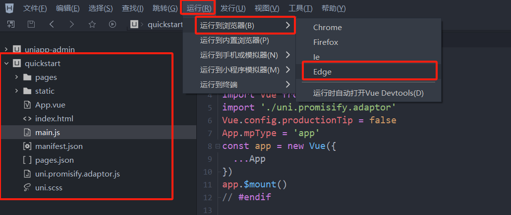
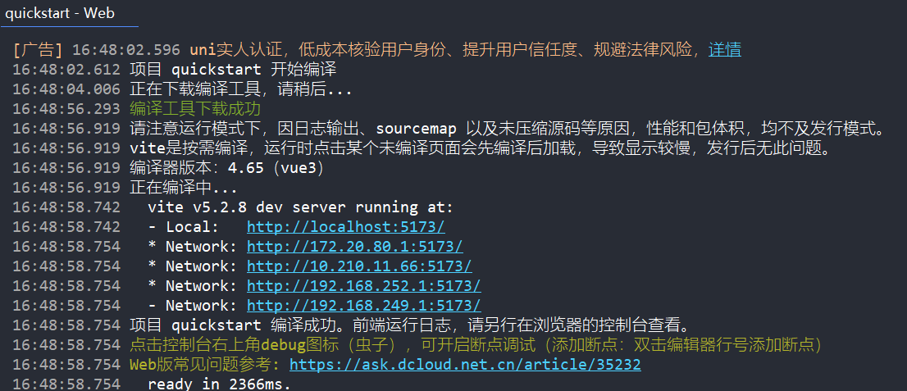
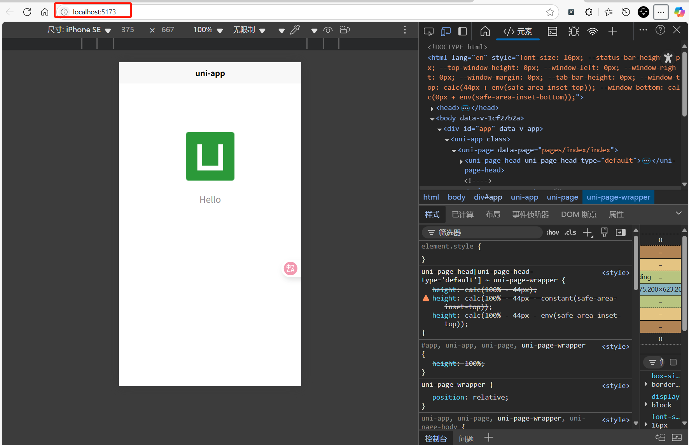
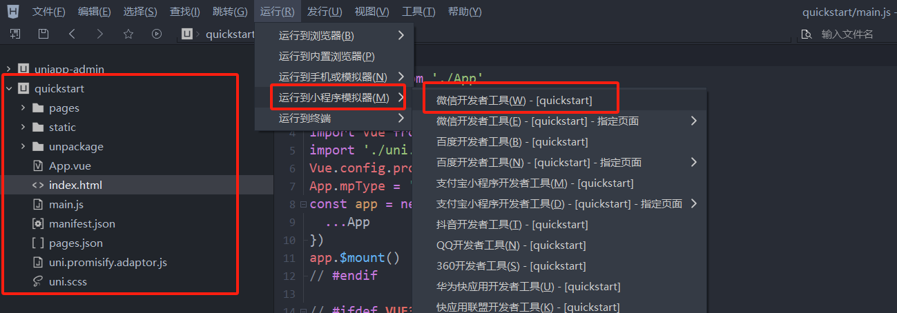
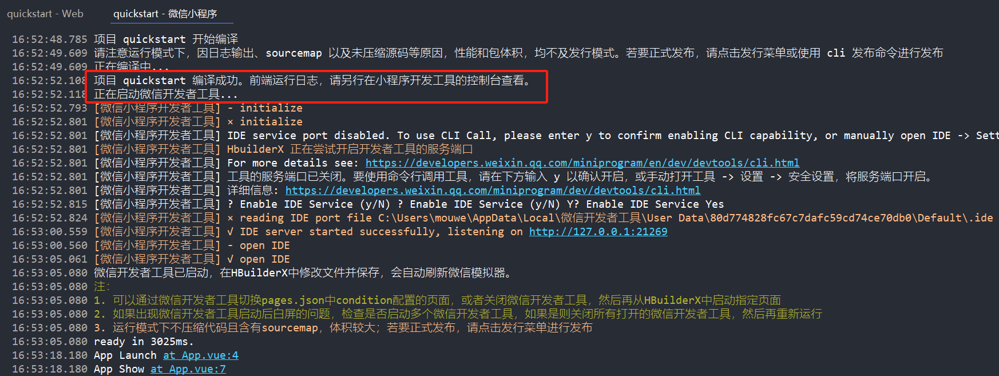
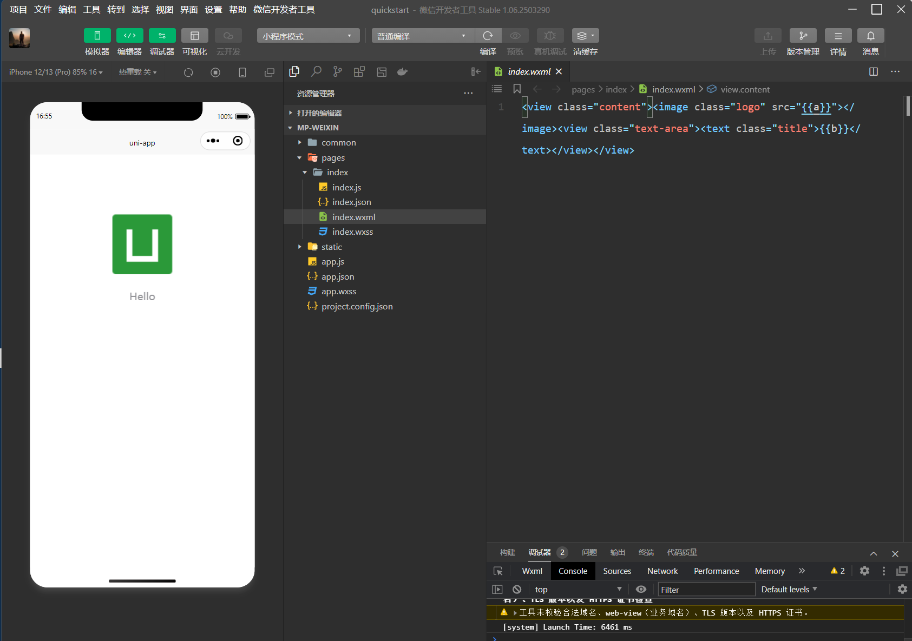
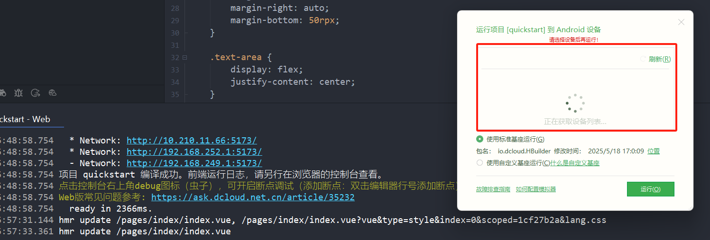

# 启动和访问

## 启动到H5端

`HBuilderX`中打开当前项目，点击`运行`菜单，选择`运行到浏览器`，选择自己计算机中已经安装的浏览器如**Edge**

项目会自动下载对应的编译器：

编译器对项目进行整体编译构建

启动后可以在浏览器中直接查看运行效果

> [!note]
>
> 如果要停止项目运行，在`HBuilderX`的运行控制台中点击鼠标右键，选择`停止运行`即可！

## 启动到小程序端

`HBuilderX`中打开当前项目，点击`运行`菜单，选择`运行到小程序模拟器`，选择自己计算机中已经安装的浏览器如**微信开发工具**

编译器编辑项目，并且会自动调用小程序**微信开发工具**

项目会自动调用和启动**微信开发工具**，并将项目编译成小程序版本的源代码进行编译运行

> [!note]
>
> 如果要停止项目运行，在`HBuilderX`的运行控制台中点击鼠标右键，选择`停止运行`即可！

## 运行到其他平台

`Uniapp`同样支持项目被编译运行到`Android`、`IOS`、`其他小程序`的运行时中

依据`Uniapp`的编译运行原理，需要对应目标平台的运行时支持！

如：运行到`Android`平台，会自动下载和安装`Android真机运行`插件，并运行到已经连接的`Android`真机上

